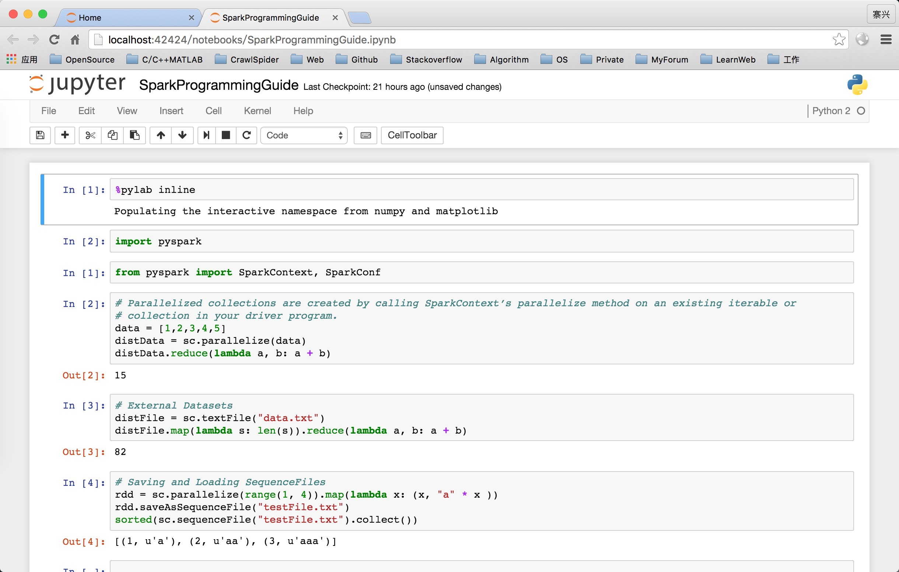

# Spark

### Install


```
    brew update
    brew install python
    brew install apache-spark
    pip install ipython
```


### Common sense

  * **HDFS** : Hadoop Distributed File System
  * **RDD** : Resilient Distributed Dataset


RDDs can be created from Hadoop InputFormats(such as **HDFS** files) or by transforming other RDDs.

> **PySpark** can create distributed datasets from any storage source supported by Hadoop, including your local file system, HDFS, Cassandra, HBase, Amazon S3, etc. Spark supports text files, SequenceFiles, and any other Hadoop InputFormat.

* * *

> RDDs support two types of operations: **transformations** , which create a new dataset from an existing one, and **actions** , which return a value to the driver program after running a computation on the dataset. 
>
>> For example, **map** is a **transformation** that passes each dataset element through a function and returns a new RDD representing the results. 
>> 
>> On the other hand, **reduce** is an **action** that aggregates all the elements of the RDD using some function and returns the final result to the driver program (although there is also a parallel reduceByKey that returns a distributed dataset).

### Use IPython notebook with Pylab

  1. `$ PYSPARK_DRIVER_PYTHON=ipython PYSPARK_DRIVER_PYTHON_OPTS="notebook" pyspark`
  2. **Files** tab **new** –>**Python2**
  3. `%pylab inline`
  4. `import pyspark`


### Result

