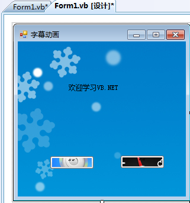

# VB学习第一周--概述

由于之前学习的是C++，从来没有接触过VB，而这学期又要做导师VB实验课的助教，只能硬着头学习一下了~~~

这一周主要看的是VB的发展以及基于VS2005的平台介绍，我用的是VS2008实现相关操作的。

1.1VB.NET概述

20世纪60年出现Basic语言；

20世纪80年代，TrueBasic、QuickBasic和TurboBasic等;

1991年Microsoft公司推出VisualBasic1.0，以可视化工具为界面设计、结构化Basic语言为基础，以事件驱动为运行机制。从1991年的VB1.0至1998年的VB6.0的多次版本升级，功能更强大、完善，应用面更广；

2002年正式发布VisualBasic.NET。

1.2Microsoft.NET概述

什么是.NET？

.NET代表了一个集合、一个环境、一个编程的基本结构，作为一个平台来支持下一代的Internet。

.NET也是一个用户环境，是一组基本的用户服务，可以作用于客户端、服务器或任何地方。

对初学VB的人来说，可以这样认为，.NET就是VisualStudio.NET。

  


```
    Public Class Form1

        Private Sub Button1_Click(ByVal sender As Object, ByVal e As System.EventArgs) Handles Button1.Click
            Timer1.Enabled = False '手动，定时器无效
            Call mymove()          '调用移动子过程
        End Sub

        Private Sub Button2_Click(ByVal sender As Object, ByVal e As System.EventArgs) Handles Button2.Click
            Timer1.Enabled = True  '自动，定时器有效，每隔Interval时间触发一次Tick事件
        End Sub

        Private Sub Timer1_Tick(ByVal sender As Object, ByVal e As System.EventArgs) Handles Timer1.Tick
            Call mymove()
        End Sub
        Sub mymove()
            Label1.Top = Label1.Top + 5
            If Label1.Top > Me.Height Then Label1.Top = 0

        End Sub
    End Class
```


  




编码规则：

(1)VB.NET代码不区分英文字母的大小写。为了提高程序的可读性，VB.NET对用户程序代码进行以下自动转换：

①对于VB.NET中的关键字，首字母总被转换成大写，其余字母被转换成小写。

②若关键字由多个英文单词组成，系统会将每个单词首字母自动转换成大写。

③对于用户自定义的变量、过程名，VB.NET以第一次定义的为准，以后输入的自动向首次定义的转换。

(2)语句书写自由

①同一行上可以书写多条语句，语句间用冒号“：”分隔，一行最多可达255个字符。

②单行语句可分若干行书写，在本行后加入续行符(下划线“_")。

(3)增加注释有利于程序的阅读、维护和调试

注释一般用竖撇号“’”引导注释内容，用竖撇号引导的注释可以直接出现在语句后面。也可以使用“文本编辑器”工具栏的“注释”、“取消对选定行的注释”按钮，使用选中的若干行语句增加注释或取消注释，十分方便。  