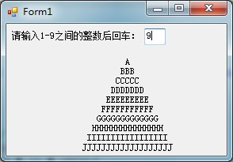
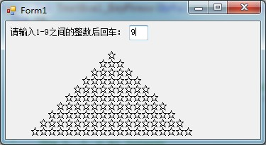
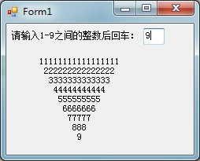

# VB学习第七周--图形打印

1.字母金字塔


```
    Public Class Form1


        Private Sub TextBox1_KeyPress(ByVal sender As Object, ByVal e As System.Windows.Forms.KeyPressEventArgs) Handles TextBox1.KeyPress
            Dim i%
            Dim s1 As String
            Label1.Text = ""
            For i = 1 To 10
                s1 = StrDup(2 * i - 1, Chr(Asc("A") + i - 1))
                Label1.Text &= Space(20 - i) & s1 & vbCrLf
            Next

        End Sub


        Private Sub TextBox1_TextChanged(ByVal sender As System.Object, ByVal e As System.EventArgs) Handles TextBox1.TextChanged

        End Sub

        Private Sub Form1_Load(ByVal sender As System.Object, ByVal e As System.EventArgs) Handles MyBase.Load

        End Sub
    End Class
```




  
2.五角星金字塔


```
    Public Class Form1


        Private Sub TextBox1_KeyPress(ByVal sender As Object, ByVal e As System.Windows.Forms.KeyPressEventArgs) Handles TextBox1.KeyPress
            Dim i%
            Dim s1 As String
            Label1.Text = ""
            For i = 1 To 10
                s1 = StrDup(2 * i - 1, "☆")
                Label1.Text &= Space(20 - 2 * i) & s1 & vbCrLf
            Next
        End Sub


        Private Sub TextBox1_TextChanged(ByVal sender As System.Object, ByVal e As System.EventArgs) Handles TextBox1.TextChanged

        End Sub

        Private Sub Form1_Load(ByVal sender As System.Object, ByVal e As System.EventArgs) Handles MyBase.Load

        End Sub
    End Class
```




  


3.数字倒金字塔

  


```
    Public Class Form1


        Private Sub TextBox1_KeyPress(ByVal sender As Object, ByVal e As System.Windows.Forms.KeyPressEventArgs) Handles TextBox1.KeyPress
            If Asc(e.KeyChar) = 13 Then
                Dim i, j, n As Integer
                n = TextBox1.Text
                Label1.Text = ""
                For i = 1 To n
                    Label1.Text &= Space(i)
                    For j = 1 To 2 * (n - i) + 1
                        Label1.Text &= i
                    Next
                    Label1.Text &= vbCrLf
                Next
            End If
        End Sub


        Private Sub TextBox1_TextChanged(ByVal sender As System.Object, ByVal e As System.EventArgs) Handles TextBox1.TextChanged

        End Sub

        Private Sub Form1_Load(ByVal sender As System.Object, ByVal e As System.EventArgs) Handles MyBase.Load

        End Sub
    End Class
```


  
  
  


  