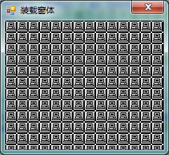

# VB学习第三周--窗体事件

窗体事件：

1.装载窗体

2.单击窗体

3.双击窗体

4.改变了窗体大小


```
    Public Class Form1

        Private Sub Form1_Click(ByVal sender As Object, ByVal e As System.EventArgs) Handles Me.Click
            Me.BackgroundImageLayout = ImageLayout.Tile '以平铺方式显示窗体背景
            Me.BackgroundImage = Image.FromFile("background.bmp") '装入相应图片
            Me.Text = "单击窗体"
            Me.Icon = New Icon("MONITR01.ico")    ' 改变窗体左上方的小图标
            Me.Cursor = New Cursor("KEY04.ICO")   ' 鼠标指针改为指定的文件名图标
            Me.MaximizeBox = True
            Me.MinimizeBox = True
        End Sub

        Private Sub Form1_DoubleClick(ByVal sender As Object, ByVal e As System.EventArgs) Handles Me.DoubleClick
            Me.BackgroundImageLayout = ImageLayout.Stretch  '以拉伸方式显示窗体背景
            Me.Text = "双击窗体"
        End Sub

        Private Sub Form1_Load(ByVal sender As System.Object, ByVal e As System.EventArgs) Handles MyBase.Load
            Me.BackgroundImage = Image.FromFile("PC01.ICO")
            Me.Text = "装载窗体"
        End Sub

        Private Sub Form1_Resize(ByVal sender As Object, ByVal e As System.EventArgs) Handles Me.Resize
            Me.BackgroundImage = Nothing  ' 卸掉图片，窗体无背景图片
            Me.MaximizeBox = False
            Me.MinimizeBox = False
            Me.Cursor = Cursors.Default  ' 鼠标指针恢复为默认值
            Me.Icon = Nothing
            Me.Text = "改变了窗体大小"
        End Sub
    End Class
```


  
  