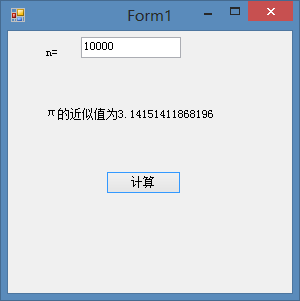

# VB学习第九周--计算π的近似值


```
    Public Class Form1

        Private Sub Button1_Click(ByVal sender As System.Object, ByVal e As System.EventArgs) Handles Button1.Click
            Dim n, t, s, m As Double
            m = Val(TextBox1.Text)
            s = 2.0#
            For n = 1 To m
                t = (2 * n) ^ 2 / ((2 * n - 1) * (2 * n + 1))
                s *= t
            Next
            Label2.Text = "π的近似值为" & s


        End Sub

        Private Sub Form1_Load(ByVal sender As System.Object, ByVal e As System.EventArgs) Handles MyBase.Load

        End Sub
    End Class
```


  


  