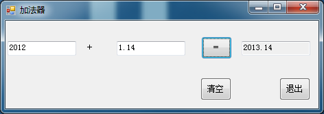

# VB学习第二周--加法器的实现

加法器的实现:


```
    Public Class Form1

        Private Sub TextBox1_TextChanged(ByVal sender As System.Object, ByVal e As System.EventArgs) Handles TextBox1.TextChanged
            If Not IsNumeric(TextBox1.Text) Then
                TextBox1.Text = ""
            End If
        End Sub

        Private Sub TextBox2_TextChanged(ByVal sender As System.Object, ByVal e As System.EventArgs) Handles TextBox2.TextChanged
            If Not IsNumeric(TextBox2.Text) Then
                TextBox2.Text = ""
            End If

        End Sub

        Private Sub Button1_Click(ByVal sender As System.Object, ByVal e As System.EventArgs) Handles Button1.Click
            TextBox3.Text = Val(TextBox1.Text) + Val(TextBox2.Text)
        End Sub

        Private Sub Button2_Click(ByVal sender As System.Object, ByVal e As System.EventArgs) Handles Button2.Click
            TextBox2.Text = ""
            TextBox1.Text = ""
            TextBox3.Text = ""
            TextBox1.Focus()
        End Sub

        Private Sub Button3_Click(ByVal sender As System.Object, ByVal e As System.EventArgs) Handles Button3.Click
            End
        End Sub

        Private Sub Form1_Load(ByVal sender As System.Object, ByVal e As System.EventArgs) Handles MyBase.Load

        End Sub
    End Class
```


  
  