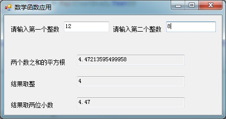

# VB学习第五周--数学函数应用

数学函数应用


```
    Public Class Form1

        Private Sub TextBox1_TextChanged(ByVal sender As System.Object, ByVal e As System.EventArgs) Handles TextBox1.TextChanged
            TextBox3.Text = Math.Sqrt(Val(TextBox1.Text) + Val(TextBox2.Text))
            TextBox4.Text = Fix(TextBox3.Text)
            TextBox5.Text = Math.Round(Val(TextBox3.Text), 2)
        End Sub

        Private Sub TextBox2_TextChanged(ByVal sender As System.Object, ByVal e As System.EventArgs) Handles TextBox2.TextChanged
            TextBox3.Text = Math.Sqrt(Val(TextBox1.Text) + Val(TextBox2.Text))
            TextBox4.Text = Fix(TextBox3.Text)
            TextBox5.Text = Math.Round(Val(TextBox3.Text), 2)
        End Sub

        Private Sub Form1_Load(ByVal sender As System.Object, ByVal e As System.EventArgs) Handles MyBase.Load

        End Sub
    End Class
```


  
  