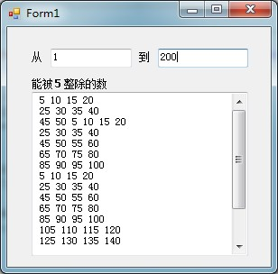

# VB学习第八周--特定范围内能被5整除的数


```
    Public Class Form1
        Private Sub TextBox2_KeyPress(ByVal sender As Object, ByVal e As System.Windows.Forms.KeyPressEventArgs) Handles TextBox2.KeyPress
            Dim n, m, i, s, z, nm As Integer
            n = Val(TextBox1.Text)
            m = Val(TextBox2.Text)
            If Asc(e.KeyChar) = 13 Then
                If n > m Then nm = n : n = m : m = nm
                For i = n To m
                    s = i
                    If s Mod 5 = 0 Then
                        TextBox3.Text &= " " & s
                        z = z + 1
                        If z Mod 4 = 0 Then
                            TextBox3.Text &= vbCrLf
                        End If
                    End If
                Next i
            End If
        End Sub

        Private Sub Form1_Load(ByVal sender As System.Object, ByVal e As System.EventArgs) Handles MyBase.Load

        End Sub
    End Class
```


  