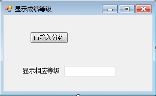
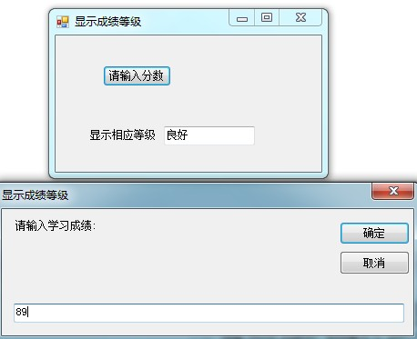

# VB学习第六周--显示成绩等级

显示成绩等级...


```
    Public Class Form1

        Private Sub Button1_Click(ByVal sender As System.Object, ByVal e As System.EventArgs) Handles Button1.Click
            Dim i As Integer
            i = Val(InputBox("请输入学习成绩:"))
            If i >= 100 Or i <= 0 Then
                MsgBox("成绩应该在0～100之间!", vbCritical)
            ElseIf i >= 90 Then
                TextBox1.Text = "优秀"
            ElseIf i >= 75 Then
                TextBox1.Text = "良好"
            ElseIf i >= 60 Then
                TextBox1.Text = "及格"
            Else
                TextBox1.Text = "不及格"
            End If
        End Sub

        Private Sub Form1_Load(ByVal sender As System.Object, ByVal e As System.EventArgs) Handles MyBase.Load

        End Sub
    End Class
```


  
  


  


  