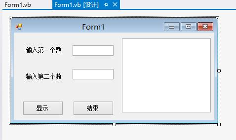
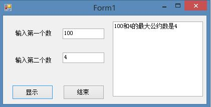

# VB学习第十一周求取输入两个整数的最大公约数


```
    Public Class Form1
        Sub proc(ByVal a%, ByVal b%, ByRef s%)
            Dim t%, r%
            If a < b Then t = a : a = b : b = t
            r = a Mod b
            Do While (r <> 0)
                a = b : b = r : r = a Mod b
            Loop
            s = b
        End Sub
        Private Sub Button1_Click(ByVal sender As System.Object, ByVal e As System.EventArgs) Handles Button1.Click
            Dim x%, y%, z%
            x = TextBox1.Text
            y = TextBox2.Text
            Call proc(x, y, z)
            TextBox3.Text &= x & "和" & y & "的最大公约数是" & z & vbCrLf

        End Sub

        Private Sub Button2_Click(ByVal sender As System.Object, ByVal e As System.EventArgs) Handles Button2.Click
            End
        End Sub

        Private Sub Form1_Load(sender As Object, e As EventArgs) Handles MyBase.Load

        End Sub
    End Class
```


  


  


  


  


  