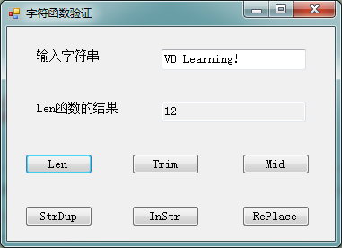

# VB学习第四周--字符函数验证

字符函数验证：


```
    Public Class Form1

        Private Sub Button1_Click(ByVal sender As System.Object, ByVal e As System.EventArgs) Handles Button1.Click
            TextBox2.Text = Len(TextBox1.Text)
            Label2.Text = Button1.Text & "函数的结果"
        End Sub

        Private Sub Button4_Click(ByVal sender As System.Object, ByVal e As System.EventArgs) Handles Button4.Click
            TextBox2.Text = Trim(TextBox1.Text)
            Label2.Text = Button4.Text & "函数的结果"
        End Sub

        Private Sub Button5_Click(ByVal sender As System.Object, ByVal e As System.EventArgs) Handles Button5.Click
            Dim a%
            a = InputBox("请输入重复出现的次数（必须为数字）", "StrDup函数")
            TextBox2.Text = StrDup(a, TextBox1.Text)
            Label2.Text = Button5.Text & "函数的结果"
        End Sub

        Private Sub Button6_Click(ByVal sender As System.Object, ByVal e As System.EventArgs) Handles Button6.Click
            Dim b$
            b = InputBox("输入查找字串", "InStr函数")
            TextBox2.Text = InStr(TextBox1.Text, b)
            Label2.Text = Button6.Text & "函数的结果"
        End Sub

        Private Sub Button7_Click(ByVal sender As System.Object, ByVal e As System.EventArgs) Handles Button7.Click
            Dim c$, d$
            c = InputBox("输入需要替换的字符串", "Replace函数")
            d = InputBox("输入替换后的字符串", "Replace函数")
            TextBox2.Text = Replace(TextBox1.Text, c, d)
            Label2.Text = Button7.Text & "函数的结果"
        End Sub

        Private Sub Button8_Click(ByVal sender As System.Object, ByVal e As System.EventArgs) Handles Button8.Click
            Dim m%, n%
            m = InputBox("输入从左开始取得位置(必须为数字）", "Mid函数")
            n = InputBox("输入要取得字符数（必须为数字）", "Mid函数")
            TextBox2.Text = Mid(TextBox1.Text, m, n)
            Label2.Text = Button8.Text & "函数的结果"
        End Sub

        Private Sub Form1_Load(ByVal sender As System.Object, ByVal e As System.EventArgs) Handles MyBase.Load

        End Sub
    End Class
```


  
  