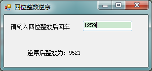

# VB学习第四周续--四位整数逆序

四位整数逆序：


```
    Public Class Form1

        Private Sub TextBox1_KeyPress(ByVal sender As Object, ByVal e As System.Windows.Forms.KeyPressEventArgs) Handles TextBox1.KeyPress
            Dim n, a, b, c, d, m As Integer

            If Asc(e.KeyChar) = 13 Then
                n = Val(TextBox1.Text)
                a = n Mod 10 '个位
                b = n \ 10 Mod 10 '十位
                c = n \ 100 Mod 10 '百位
                d = n \ 1000
                m = a * 1000 + b * 100 + c * 10 + d
                Label2.Text = "逆序后整数为：" & m
            End If


        End Sub

        Private Sub TextBox1_TextChanged(ByVal sender As System.Object, ByVal e As System.EventArgs) Handles TextBox1.TextChanged
            If Not IsNumeric(TextBox1.Text) Then
                MsgBox("输入有非数字字符,请重新输入", , "数据检验")
                TextBox1.Text = ""
                TextBox1.Focus()
            End If
        End Sub

        Private Sub Form1_Load(ByVal sender As System.Object, ByVal e As System.EventArgs) Handles MyBase.Load

        End Sub
    End Class
```


  
  