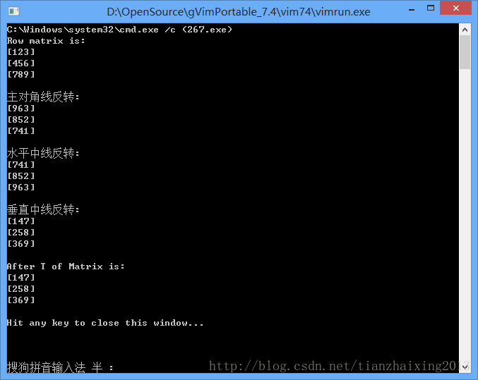

# VIM--矩阵转置运算


```cpp
    #include<iostream>
    #include<vector>
    using namespace std;

    void PrintMatrix(vector<vector<int> >& Matrix)
    {
         int n = Matrix.size();
        for(int i = 0; i < n; ++i)
        {
             cout << "[" ;
            for(int j = 0; j < n; ++j)
            {
                cout << Matrix[i][j] ;
            }
            cout << "]";
            cout << '\n';
        }
    }

    void TofArray(vector<vector<int> >& matrix)
    {
        const int n = matrix.size();

        // 主对角线反转
        for(int i = 0; i < n; ++i)
        {
            for(int j = 0; j < n-i; ++j)
                swap(matrix[i][j], matrix[n-1-j][n-1-i]);
        }
        cout << "主对角线反转: " << '\n';
        PrintMatrix(matrix);
        cout << '\n';

        // 水平中线反转
        for(int i = 0; i < n/2; ++i)
        {
            for(int j = 0; j < n; ++j)
            {
                swap(matrix[i][j], matrix[n-1-i][j]);
            }
        }
        cout << "水平中线反转: " << '\n';
        PrintMatrix(matrix);
        cout << '\n';

        // 垂直中线反转
        for(int i = 0; i < n; ++i)
        {
            for(int j = 0; j < n/2; ++j)
            {
                swap(matrix[i][j], matrix[i][n-1-j]);
            }
        }
        cout << "垂直中线反转: " << '\n';
        PrintMatrix(matrix);
        cout << '\n';
    }


    int main(int argc, char* argv[])
    {
        vector<int> row1;
        row1.push_back(1), row1.push_back(2), row1.push_back(3);

        vector<int> row2;
        row2.push_back(4), row2.push_back(5), row2.push_back(6);

        vector<int> row3;
        row3.push_back(7), row3.push_back(8), row3.push_back(9);

        vector<vector<int> > Matrix(3);
        Matrix[0] = row1;
        Matrix[1] = row2;
        Matrix[2] = row3;

        cout << "Row matrix is: " << '\n';
        PrintMatrix(Matrix);
        cout << '\n';

        TofArray(Matrix);
        cout << "After T of Matrix is: " << '\n';
        PrintMatrix(Matrix);
        cout << '\n';
        return 0;
    }
```


  



```