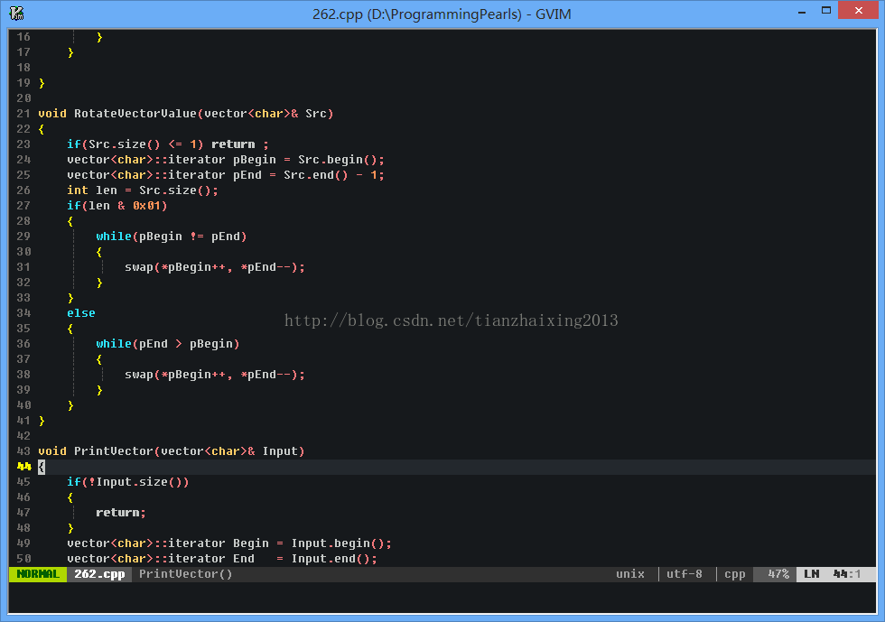
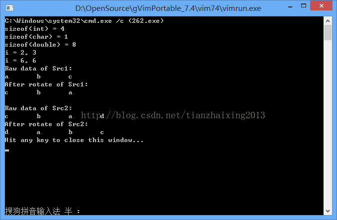

# Vim--编程珠玑向量翻转


```cpp
    #include<iostream>
    #include<vector>

    using namespace std;

    void FindNumberOfMoreTwoTimesAppear(int pInt[], int length)
    {
        // pInt 所指数组为有序数组,
        // length 数组长度
        if(pInt == NULL || length <= 0) return;
        for(int i = 0; i < length; i++)
        {
            if((pInt[i] == pInt[i+1]) && (i < length -1))
            {
                std::cout << "i = " << i << ", " << pInt[i] << std::endl;
            }
        }

    }

    void RotateVectorValue(vector<char>& Src)
    {
        if(Src.size() <= 1) return ;
        vector<char>::iterator pBegin = Src.begin();
        vector<char>::iterator pEnd = Src.end() - 1;
        int len = Src.size();
        if(len & 0x01)
        {
            while(pBegin != pEnd)
            {
                swap(*pBegin++, *pEnd--);
            }
        }
        else
        {
            while(pEnd > pBegin)
            {
                swap(*pBegin++, *pEnd--);
            }
        }
    }

    void PrintVector(vector<char>& Input)
    {
        if(!Input.size())
        {
            return;
        }
        vector<char>::iterator Begin = Input.begin();
        vector<char>::iterator End   = Input.end();
        vector<char>::iterator it = Begin;
        for(it = Begin; it != End; it++)
        {
            std::cout << *it << '\t';
        }
        std::cout << std::endl;
    }

    int main()
    {
        std::cout << "sizeof(int) = " << sizeof(int) << std::endl;
        std::cout << "sizeof(char) = " << sizeof(char) << std::endl;
        std::cout << "sizeof(double) = " << sizeof(double) << std::endl;

        int a[10] = {1,2,3,3,4,5,6,6,8,9};
        FindNumberOfMoreTwoTimesAppear(a, 10);

        vector<char> Src1, Src2;
        Src1.push_back('a');
        Src1.push_back('b');
        Src1.push_back('c');

        std::cout << "Raw data of Src1: " << '\n';
        PrintVector(Src1);

        RotateVectorValue(Src1);
        std::cout << "After rotate of Src1: " << '\n';
        PrintVector(Src1);
        std::cout << std::endl;


        Src2 = Src1;
        Src2.push_back('d');
        std::cout << "Raw data of Src2: " << '\n';
        PrintVector(Src2);

        RotateVectorValue(Src2);
        std::cout << "After rotate of Src2: " << '\n';
        PrintVector(Src2);
        return 0;
    }
```


  



```