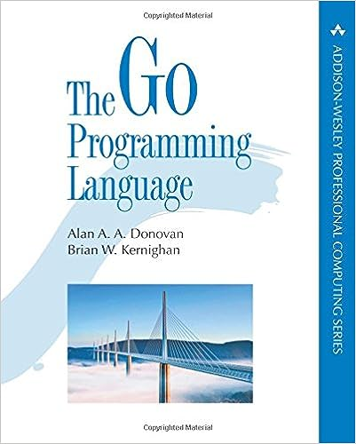

# go-tour (1)

在强哥的推荐下，这周利用业余时间看了一些go的tour教程，还没有看完。目前，个人整体感觉go的这个tour教程写的真心不错哦，go语言的语法要不要太简洁哈。

我把go-tour教程web版本的文字说明和相应的代码进行了规整，方便以后查阅。顺便说一下，go语言圣经也真心不错哦，抽空再系统学习下。

  * 英文原版



[亚马逊购买通道](https://www.amazon.cn/The-Go-Programming-Language-Donovan-Alan-A-A/dp/0134190440/ref=sr_1_9?ie=UTF8&qid=1477488249&sr=8-9&keywords=golang)

[中文翻译gitbook](http://shinley.com/)

### 1 欢迎

> 安装离线版本   
>  \+ [Go](https://go-zh.org/doc/install)   
>  \+ `$ go get github.com/Go-zh/tour/gotour`   
>  \+ `$ cd $GOPATH/bin`   
>  \+ `$ ./gotour`

  * hello.go


```go
    package main

    import "fmt"

    func main() {
        fmt.Println("Hello, 世界")
    }
```
go


  * sandbox.go


```go
    package main

    import (
        "fmt"
        "time"
    )

    func main() {
        fmt.Println("Welcome to the playground!")

        fmt.Println("The time is", time.Now())
    }
```


### 2 基础

#### 2.1 包、变量和函数

##### 2.1.1 包

每个Go程序都是由包组成的1。   
程序运行的入口是包`main`。   
这个程序使用并导入了包`"fmt"` 和 `"math/rand"`。   
按照惯例，包名与导入路径的最后一个目录一致。例如，`"math/rand"` 包由`package rand`语句开始。

  * packages.go


```go
    package main

    import (
        "fmt"
        "math/rand"
    )

    func main() {
        fmt.Println("My favorite number is", rand.Intn(10))
    }
```
go


###### 2.1.1.1 包导入

这个代码用圆括号组合了导入，这是“打包”导入语句。   
同样可以编写多个导入语句，例如：   
`import "fmt"`   
`import "math`

  * imports.go


```go
    package main

    import (
        "fmt"
        "math"
    )

    func main() {
        fmt.Printf("Now you have %g problems.", math.Sqrt(7))
    }
```


###### 2.1.1.2 包导出

在 Go 中，首字母大写的名称是被导出的。   
在导入包之后，你只能访问包所导出的名字，任何未导出的名字是不能被包外的代码访问的。   
Foo 和 FOO 都是被导出的名称。名称 foo 是不会被导出的。

  * exported-names.go


```go
    package main

    import (
        "fmt"
        "math"
    )

    func main() {
        fmt.Println(math.Pi)
    }
```
go


##### 2.1.2 变量

var 语句定义了一个变量的列表；跟函数的参数列表一样，类型在后面。   
就像在这个例子中看到的一样， var 语句可以定义在包或函数级别。

  * variables.go


```go
    package main

    import "fmt"

    var c, python, java bool

    func main() {
        var i int
        fmt.Println(i, c, python, java)
    }
```


###### 2.1.2.1 初始化变量

变量定义可以包含初始值，每个变量对应一个。   
如果初始化是使用表达式，则可以省略类型；变量从初始值中获得类型。

  * variables-with-initializers.go


```go
    package main

    import "fmt"

    var i, j int = 1, 2

    func main() {
        var c, python, java = true, false, "no!"
        fmt.Println(i, j, c, python, java)
    }
```
go


###### 2.1.2.2 短声明变量

在函数中， `:=` 简洁赋值语句在明确类型的地方，可以用于替代 var 定义。   
函数外的每个语句都必须以关键字开始（ `var` 、 `func` 、等等），**`:=` 结构不能使用在函数外**。

  * short-variable-declarations.go


```go
    package main

    import "fmt"

    func main() {
        var i, j int = 1, 2
        k := 3
        c, python, java := true, false, "no!"

        fmt.Println(i, j, k, c, python, java)
    }
```


###### 2.1.2.3 基本类型

Go 的基本类型有Basic types


```
    bool
    string
    int  int8  int16  int32  int64
    uint uint8 uint16 uint32 uint64 uintptr
    byte // uint8 的别名
    rune // int32 的别名
         // 代表一个Unicode码
    float32 float64
    complex64 complex128
```


这个例子演示了具有不同类型的变量。 同时与导入语句一样，变量的定义“打包”在一个语法块中。   
`int`，`uint` 和 `uintptr`类型在32位的系统上一般是32位，而在64位系统上是64位。当你需要使用一个整数类型时，你应该首选 `int`，仅当有特别的理由才使用定长整数类型或者无符号整数类型。

  * basic-types.go


```go
    package main

    import (
        "fmt"
        "math/cmplx"
    )

    var (
        ToBe   bool       = false
        MaxInt uint64     = 1<<64 - 1
        z      complex128 = cmplx.Sqrt(-5 + 12i)
    )

    func main() {
        const f = "%T(%v)\n"
        fmt.Printf(f, ToBe, ToBe)
        fmt.Printf(f, MaxInt, MaxInt)
        fmt.Printf(f, z, z)
    }
```
go


###### 2.1.2.4 零值

变量在定义时没有明确的初始化时会赋值为**零值** 。   
零值是:   
\+ 数值类型为 0 ，   
\+ 布尔类型为 false ，   
\+ 字符串为 “” （空字符串）。

  * zero.go


```go
    package main

    import "fmt"

    func main() {
        var i int
        var f float64
        var b bool
        var s string
        fmt.Printf("%v %v %v %q\n", i, f, b, s)
    }
```


###### 2.1.2.5 类型转换

表达式 `T(v)` 将值 `v` 转换为类型 `T` 。

一些关于数值的转换：


```
    var i int = 42
    var f float64 = float64(i)
    var u uint = uint(f)
```


或者，更加简单的形式：


```
    i := 42
    f := float64(i)
    u := uint(f)
```


与C不同的是Go的在不同类型之间的项目赋值时需要显式转换。

  * type-conversions.go


```go
    package main

    import (
        "fmt"
        "math"
    )

    func main() {
        var x, y int = 3, 4
        var f float64 = math.Sqrt(float64(x*x + y*y))
        var z uint = uint(f)
        fmt.Println(x, y, z)
    }
```


###### 2.1.2.6 类型推导

在定义一个变量却并不显式指定其类型时（使用 `:=` 语法或者 `var =` 表达式语法）， 变量的类型由（等号）右侧的值推导得出。

当右值定义了类型时，新变量的类型与其相同：


```
    var i int
    j := i // j 也是一个 int
```


但是当右边包含了未指名类型的数字常量时，新的变量就可能是 `int` 、 `float64` 或 `complex128` 。 这取决于常量的精度：


```
    i := 42           // int
    f := 3.142        // float64
    g := 0.867 + 0.5i // complex128
```
go


  * type-inference.go


```go
    package main

    import "fmt"

    func main() {
        v := 42 // change me!
        fmt.Printf("v is of type %T\n", v)
    }
```


###### 2.1.2.7 常量

常量的定义与变量类似，只不过使用 `const` 关键字。   
常量可以是字符、字符串、布尔或数字类型的值。   
**常量不能使用`:=` 语法定义**。

  * constants.go


```go
    package main

    import "fmt"

    const Pi = 3.14

    func main() {
        const World = "世界"
        fmt.Println("Hello", World)
        fmt.Println("Happy", Pi, "Day")

        const Truth = true
        fmt.Println("Go rules?", Truth)
    }
```
go


###### 2.1.2.8 数值常量

数值常量是高精度的值。   
一个未指定类型的常量由上下文来决定其类型。   
也尝试一下输出`needInt(Big)`吧。   
（int可以存放最大64位的整数，根据平台不同有时会更少。）

  * numeric-constants.go


```go
    package main

    import "fmt"

    const (
        Big   = 1 << 100
        Small = Big >> 99
    )

    func needInt(x int) int { return x*10 + 1 }
    func needFloat(x float64) float64 {
        return x * 0.1
    }

    func main() {
        fmt.Println(needInt(Small))
        fmt.Println(needFloat(Small))
        fmt.Println(needFloat(Big))
    }
```


##### 2.1.3 函数

函数可以没有参数或接受多个参数。注意类型在变量名之后。   
[Go 语法](https://blog.go-zh.org/gos-declaration-syntax)

  * functions.go


```go
    package main

    import "fmt"

    func add(x int, y int) int {
        return x + y
    }

    func main() {
        fmt.Println(add(42, 13))
    }
```
go


当两个或多个连续的函数命名参数是同一类型，则除了最后一个类型之外，其他都可以省略。   
`x int, y int` 可以写为 `x, y int`

  * functions-continued.go


```go
    package main

    import "fmt"

    func add(x, y int) int {
        return x + y
    }

    func main() {
        fmt.Println(add(42, 13))
    }
```


###### 2.1.3.1 函数多值返回

函数可以返回任意数量的返回值。

  * multiple-results.go


```go
    package main

    import "fmt"

    func swap(x, y string) (string, string) {
        return y, x
    }

    func main() {
        a, b := swap("hello", "world")
        fmt.Println(a, b)
    }
```
go


###### 2.1.3.2 命名返回值

Go 的返回值可以被命名，并且就像在函数体开头声明的变量那样使用。   
返回值的名称应当具有一定的意义，可以作为文档使用。   
没有参数的 return 语句返回各个返回变量的当前值。这种用法被称作“裸”返回。   
直接返回语句仅应当用在像下面这样的短函数中。在长的函数中它们会影响代码的可读性。

  * named-results.go


```go
    package main

    import "fmt"

    func split(sum int) (x, y int) {
        x = sum * 4 / 9
        y = sum - x
        return
    }

    func main() {
        fmt.Println(split(17))
    }
```


* * *

#### 2.2 流程控制语句

##### 2.2.1 for

Go 只有一种循环结构： for 循环。   
基本的 for 循环由三部分组成，它们用分号隔开：   
初始化语句：在第一次迭代前执行   
条件表达式：在每次迭代前求值   
后置语句：在每次迭代的结尾执行   
初始化语句通常为一句短变量声明，该变量声明仅在 for 语句的作用域中可见。

**注意** ：和 C、Java、JavaScript 之类的语言不同，Go 的 for 语句后面没有小括号，大括号 { } 则是必须的。

  * for.go


```go
    package main

    import "fmt"

    func main() {
        sum := 0
        for i := 0; i < 10; i++ {
            sum += i
        }
        fmt.Println(sum)
    }
```
go


初始化语句和后置语句是可选的。

  * for-continued.go


```go
    package main

    import "fmt"

    func main() {
        sum := 1
        for ; sum < 1000; {
            sum += sum
        }
        fmt.Println(sum)
    }
```


###### 2.2.1.1 for 是 Go 中的 “while”

此时你可以去掉分号：C 的 while 在 Go 中叫做 for 。

  * for-is-gos-while.go


```go
    package main

    import "fmt"

    func main() {
        sum := 1
        for sum < 1000 {
            sum += sum
        }
        fmt.Println(sum)
    }
```
go


###### 2.2.1.2 无限循环

如果省略循环条件，该循环就不会结束，因此无限循环可以写得很紧凑。

  * forever.go


```go
    package main

    func main() {
        for {
        }
    }
```


##### 2.2.2 if

Go 的 if 语句与 for 循环类似，表达式外无需小括号 ( ) ，而大括号 { } 则是必须的。

  * if.go


```go
    package main

    import (
        "fmt"
        "math"
    )

    func sqrt(x float64) string {
        if x < 0 {
            return sqrt(-x) + "i"
        }
        return fmt.Sprint(math.Sqrt(x))
    }

    func main() {
        fmt.Println(sqrt(2), sqrt(-4))
    }
```
go


###### 2.2.2.1 if的简短语句

同 for 一样， if 语句可以在条件表达式前执行一个简单的语句。   
该语句声明的变量作用域仅在 if 之内。   
（在最后的 return 语句处使用 v 看看。）

  * if-with-a-short-statement.go


```go
    package main

    import (
        "fmt"
        "math"
    )

    func pow(x, n, lim float64) float64 {
        if v := math.Pow(x, n); v < lim {
            return v
        }
        return lim
    }

    func main() {
        fmt.Println(
            pow(3, 2, 10),
            pow(3, 3, 20),
        )
    }
```


###### 2.2.2.2 if 和 else

在 if 的简短语句中声明的变量同样可以在任何对应的 else 块中使用。   
（在 main 的 fmt.Println 调用开始前，两次对 pow 的调用均已执行并返回。）

  * if-and-else.go


```go
    package main

    import (
        "fmt"
        "math"
    )

    func pow(x, n, lim float64) float64 {
        if v := math.Pow(x, n); v < lim {
            return v
        } else {
            fmt.Printf("%g >= %g\n", v, lim)
        }
        // 这里开始就不能使用 v 了
        return lim
    }

    func main() {
        fmt.Println(
            pow(3, 2, 10),
            pow(3, 3, 20),
        )
    }
```
go


###### 2.2.2.3 练习：循环与函数

我们来简单练习一下函数和循环：用牛顿法实现平方根函数2。   
在本例中，牛顿法是通过选择一个起点 z 然后重复以下过程来求 Sqrt(x) 的近似值：

zn+1=zn−z2n−x2zn

为此只需重复计算 10 次，并且观察不同的值（1，2，3，……）是如何逐步逼近结果的。 然后，修改循环条件，使得当值停止改变（或改变非常小）的时候退出循环。观察迭代次数是否变化。结果与 math.Sqrt 接近吗？   
提示：用类型转换或浮点数语法来声明并初始化一个浮点数值：   
z := float64(1)   
z := 1.0

  * exercise-loops-and-functions.go


```go
    package main

    import (
        "fmt"
    )

    func Sqrt(x float64) float64 {
        const E = 0.00000001
        z := 1.0
        k := 0.0
        for ; ; z = z - (z*z - x) / (2*z) {
            if z - k <= E && z - k >= -E {
                return z
            }
            k = z
        }
    }

    func main() {
        fmt.Println(Sqrt(2))
    }
```


##### 2.2.3 switch

除非以 fallthrough 语句结束，否则分支会自动终止。

  * switch.go


```go
    package main

    import (
        "fmt"
        "runtime"
    )

    func main() {
        fmt.Print("Go runs on ")
        switch os := runtime.GOOS; os {
        case "darwin":
            fmt.Println("OS X.")
        case "linux":
            fmt.Println("Linux.")
        default:
            // freebsd, openbsd,
            // plan9, windows...
            fmt.Printf("%s.", os)
        }
    }
```


###### 2.2.3.1 switch 的求值顺序

switch 的 case 语句从上到下顺次执行，直到匹配成功时停止。   
例如


```
    switch i {
    case 0:
    case f():
    }
```
go


在 i==0 时 f 不会被调用。

  * switch-evaluation-order.go


```go
    package main

    import (
        "fmt"
        "time"
    )

    func main() {
        fmt.Println("When's Saturday?")
        today := time.Now().Weekday()
        switch time.Saturday {
        case today + 0:
            fmt.Println("Today.")
        case today + 1:
            fmt.Println("Tomorrow.")
        case today + 2:
            fmt.Println("In two days.")
        default:
            fmt.Println("Too far away.")
        }
    }
```


###### 2.2.3.2 没有条件的 switch

没有条件的 switch 同 switch true 一样。   
这种形式能将一长串 if-then-else 写得更加清晰。

  * switch-with-no-condition.go


```go
    package main

    import (
        "fmt"
        "time"
    )

    func main() {
        t := time.Now()
        switch {
        case t.Hour() < 12:
            fmt.Println("Good morning!")
        case t.Hour() < 17:
            fmt.Println("Good afternoon.")
        default:
            fmt.Println("Good evening.")
        }
    }
```
go


##### 2.2.4 defer

defer3语句会将函数推迟到外层函数返回之后执行。   
推迟调用的函数其参数会立即求值，但直到外层函数返回前该函数都不会被调用。

  * defer.go


```go
    package main

    import "fmt"

    func main() {
        defer fmt.Println("world")

        fmt.Println("hello")
    }
```


###### 2.2.4.1 defer 栈

推迟的函数调用会被压入一个栈中。 当外层函数返回时，被推迟的函数会按照后进先出的顺序调用。

  * defer-multi.go


```go
    package main

    import "fmt"

    func main() {
        fmt.Println("counting")

        for i := 0; i < 10; i++ {
            defer fmt.Println(i)
        }

        fmt.Println("done")
    }
```


* * *

#### 2.3 复杂类型

Go 具有指针。 指针保存了变量的内存地址。   
类型 *T 是指向 T 类型值的指针。其零值为 nil 。   
`var p *int`   
`&` 操作符会生成一个指向其操作数的指针。


```
    i := 42
    p = &i
```


`*` 操作符表示指针指向的底层值。


```
    fmt.Println(*p) // 通过指针 p 读取 i
    *p = 21         // 通过指针 p 设置 i
```
go


这也就是通常所说的“间接引用”或“重定向”。   
与 C 不同，Go 没有指针运算。

  * pointers.go


```go
    package main

    import "fmt"

    func main() {
        i, j := 42, 2701

        p := &i         // point to i
        fmt.Println(*p) // read i through the pointer
        *p = 21         // set i through the pointer
        fmt.Println(i)  // see the new value of i

        p = &j         // point to j
        *p = *p / 37   // divide j through the pointer
        fmt.Println(j) // see the new value of j
    }
```


##### 2.3.1 struct

一个结构体（ struct ）就是一个字段的集合。   
（而 type 声明就是定义类型的。）

  * structs.go


```go
    package main

    import "fmt"

    type Vertex struct {
        X int
        Y int
    }

    func main() {
        fmt.Println(Vertex{1, 2})
    }
```
go


###### 2.3.1.1 结构体字段

结构体字段使用点号来访问。

  * struct-fields.go


```go
    package main

    import "fmt"

    type Vertex struct {
        X int
        Y int
    }

    func main() {
        v := Vertex{1, 2}
        v.X = 4
        fmt.Println(v.X)
    }
```


###### 2.3.1.2 结构体指针

结构体字段可以通过**结构体指针** 来访问。   
如果我们有一个指向结构体的指针 p ，那么可以通过 (*p).X 来访问其字段 X 。 不过这么写太啰嗦了，所以语言也允许我们使用隐式间接引用，直接写 p.X 就可以。

  * struct-pointers.go


```go
    package main

    import "fmt"

    type Vertex struct {
        X int
        Y int
    }

    func main() {
        v := Vertex{1, 2}
        p := &v
        p.X = 1e9
        fmt.Println(v)
    }
```
go


###### 2.3.1.3 结构体文法

结构体文法通过直接列出字段的值来新分配一个结构体。   
使用 Name: 语法可以仅列出部分字段。（字段名的顺序无关。）   
特殊的前缀 & 返回一个指向结构体的指针。

  * struct-literals.go


```go
    package main

    import "fmt"

    type Vertex struct {
        X, Y int
    }

    var (
        v1 = Vertex{1, 2}  // has type Vertex
        v2 = Vertex{X: 1}  // Y:0 is implicit
        v3 = Vertex{}      // X:0 and Y:0
        p  = &Vertex{1, 2} // has type *Vertex
    )

    func main() {
        fmt.Println(v1, p, v2, v3)
    }
```


##### 2.3.2 数组

类型 [n]T 表示拥有 n 个 T 类型的值的数组。   
表达式

> var a [10]int

会将变量 a 声明为拥有有 10 个整数的数组。

数组的长度是其类型的一部分，因此数组不能改变大小。 这看起来是个限制，不过没关系， Go提供了更加便利的方式来使用数组。

  * array.go


```go
    package main

    import "fmt"

    func main() {
        var a [2]string
        a[0] = "Hello"
        a[1] = "World"
        fmt.Println(a[0], a[1])
        fmt.Println(a)

        primes := [6]int{2, 3, 5, 7, 11, 13}
        fmt.Println(primes)
    }
```
go


##### 2.3.3 slice

每个数组的大小都是固定的。而切片则为数组元素提供动态大小的、灵活的视角。在实践中，切片比数组更常用。

> 类型 []T 表示一个元素类型为 T 的切片。

以下表达式为数组 a 的前五个元素创建了一个切片。   
`a[0:5]`

  * slices.go


```go
    package main

    import "fmt"

    func main() {
        primes := [6]int{2, 3, 5, 7, 11, 13}

        var s []int = primes[1:4]
        fmt.Println(s) // [3 5 7]
    }
```


###### 2.3.3.1 切片就像数组的引用

切片并不存储任何数据， 它只是描述了底层数组中的一段。   
更改切片的元素会修改其底层数组中对应的元素。与它共享底层数组的切片都会观测到这些修改。

  * slices-pointers.go


```go
    package main

    import "fmt"

    func main() {
        names := [4]string{
            "John",
            "Paul",
            "George",
            "Ringo",
        }
        fmt.Println(names) // [John Paul George Ringo]

        a := names[0:2]
        b := names[1:3]
        fmt.Println(a, b) // [John Paul] [Paul George]

        b[0] = "XXX"
        fmt.Println(a, b) // [John XXX] [XXX George]
        fmt.Println(names)// [John XXX George Ringo]
    }
```
go


###### 2.3.3.2 切片文法

切片文法类似于没有长度的数组文法。   
这是一个数组文法：   
`[3]bool{true, true, false}`   
下面这样则会创建一个和上面相同的数组，然后构建一个引用了它的切片：   
`[]bool{true, true, false}`

  * slice-literals.go


```go
    package main

    import "fmt"

    func main() {
        q := []int{2, 3, 5, 7, 11, 13}
        fmt.Println(q) // [2 3 5 7 11 13]

        r := []bool{true, false, true, true, false, true}
        fmt.Println(r) // [true false true true false true]

        s := []struct {
            i int
            b bool
        }{
            {2, true},
            {3, false},
            {5, true},
            {7, true},
            {11, false},
            {13, true},
        }
        fmt.Println(s) // [{2 true} {3 false} {5 true} {7 true} {11 false} {13 true}]
    }
```


###### 2.3.3.3 切片的默认行为

在进行切片时，你可以利用它的默认行为来忽略上下界。   
切片下界的默认值为0，上界则是该切片的长度。   
对于数组   
`var a [10]int`   
来说，以下切片是等价的：


```
    a[0:10]
    a[:10]
    a[0:]
    a[:]
```


  * slice-bounds.go


```go
    package main

    import "fmt"

    func main() {
        s := []int{2, 3, 5, 7, 11, 13}

        s = s[1:4]
        fmt.Println(s)

        s = s[:2]
        fmt.Println(s)

        s = s[1:]
        fmt.Println(s)
    }
```
go


###### 2.3.3.4 切片的长度与容量

切片拥有 长度 和 容量 。   
切片的长度就是它所包含的元素个数。   
切片的容量是从它的第一个元素开始数，到其底层数组元素末尾的个数。   
切片 s 的长度和容量可通过表达式 len(s) 和 cap(s) 来获取。   
你可以通过重新切片来扩展一个切片，给它提供足够的容量。 试着修改示例程序中的切片操作，向外扩展它的容量，看看会发生什么。

  * slice-cap.go


```go
    package main

    import "fmt"

    func main() {
        s := []int{2, 3, 5, 7, 11, 13}
        printSlice(s)

        // Slice the slice to give it zero length.
        s = s[:0]
        printSlice(s)

        // Extend its length.
        s = s[:4]
        printSlice(s)

        // Drop its first two values.
        s = s[2:]
        printSlice(s)
    }

    func printSlice(s []int) {
        fmt.Printf("len=%d cap=%d %v\n", len(s), cap(s), s)
    }
```


###### 2.3.3.5 nil 切片

切片的零值是 nil 。   
nil 切片的长度和容量为 0 且没有底层数组。

  * nil-slices.go


```go
    package main

    import "fmt"

    func main() {
        var s []int
        fmt.Println(s, len(s), cap(s))
        if s == nil {
            fmt.Println("nil!")
        }
    }
```


###### 2.3.3.6 用 make 创建切片

切面可以用内建函数 make 来创建，这也是你创建动态数组的方式。   
make 函数会分配一个元素为零值的数组并返回一个引用了它的切片：   
`a := make([]int, 5) // len(a)=5`   
要指定它的容量，需向 make 传入第三个参数：


```
    b := make([]int, 0, 5) // len(b)=0, cap(b)=5
    b = b[:cap(b)] // len(b)=5, cap(b)=5
    b = b[1:]      // len(b)=4, cap(b)=4
```
go


  * making-slices.go


```go
    package main

    import "fmt"

    func main() {
        a := make([]int, 5)
        printSlice("a", a)

        b := make([]int, 0, 5)
        printSlice("b", b)

        c := b[:2]
        printSlice("c", c)

        d := c[2:5]
        printSlice("d", d)
    }

    func printSlice(s string, x []int) {
        fmt.Printf("%s len=%d cap=%d %v\n",
            s, len(x), cap(x), x)
    }
```


###### 2.3.3.7 切片的切片

切片可包含任何类型，甚至包括其它的切片。

  * slices-of-slice.go


```go
    package main

    import (
        "fmt"
        "strings"
    )

    func main() {
        // Create a tic-tac-toe board.
        board := [][]string{
            []string{"_", "_", "_"},
            []string{"_", "_", "_"},
            []string{"_", "_", "_"},
        }

        // The players take turns.
        board[0][0] = "X"
        board[2][2] = "O"
        board[1][2] = "X"
        board[1][0] = "O"
        board[0][2] = "X"

        for i := 0; i < len(board); i++ {
            fmt.Printf("%s\n", strings.Join(board[i], " "))
        }
    }
```
go


###### 2.3.3.8 向切片追加元素

为切片追加新的元素是种常用的操作，为此 Go 提供了内建的 append 函数。 内建函数的文档4对此函数有详细的介绍。   
`func append(s []T, vs ...T) []T`   
append 的第一个参数 s 是一个元素类型为 T 的切片， 其余类型为 T 的值将会追加到该切片的末尾。

append 的结果是一个包含原切片所有元素加上新添加元素的切片。   
当 s 的底层数组太小，不足以容纳所有给定的值时，它就会分配一个更大的数组。 返回的切片会指向这个新分配的数组。   
(要了解关于切片的更多内容，请阅读文章Go 切片：用法和本质5。)

  * append.go


```go
    package main

    import "fmt"

    func main() {
        var s []int
        printSlice(s)

        // append works on nil slices.
        s = append(s, 0)
        printSlice(s)

        // The slice grows as needed.
        s = append(s, 1)
        printSlice(s)

        // We can add more than one element at a time.
        s = append(s, 2, 3, 4)
        printSlice(s)
    }

    func printSlice(s []int) {
        fmt.Printf("len=%d cap=%d %v\n", len(s), cap(s), s)
    }
```


##### 2.3.4 Range

for 循环的 range 形式可遍历切片或映射。   
当使用 for 循环遍历切片时，每次迭代都会返回两个值。 第一个值为当前元素的下标，第二个值为该下标所对应元素的一份副本。

  * range.go


```go
    package main

    import "fmt"

    var pow = []int{1, 2, 4, 8, 16, 32, 64, 128}

    func main() {
        for i, v := range pow {
            fmt.Printf("2**%d = %d\n", i, v)
        }
    }
```
go


可以将下标或值赋予 `_` 来忽略它。   
若你只需要索引，去掉`, value`的部分即可。

  * range-continued.go


```go
    package main

    import "fmt"

    func main() {
        pow := make([]int, 10)
        for i := range pow {
            pow[i] = 1 << uint(i) // == 2**i
        }
        for _, value := range pow {
            fmt.Printf("%d\n", value)
        }
    }
```


  * exercise-slice.go


```go
    package main

    import "golang.org/x/tour/pic"

    func Pic(dx, dy int) [][]uint8 {
         res := make([][]uint8, dy)
         for i:=0; i<dy; i++ {
              res[i] = make([]uint8, dx)
              for j:=0; j<dx; j++ {
                   res[i][j] = uint8(i^j)
              }
         }
         return res
    }

    func main() {
        pic.Show(Pic)
    }
```
go


##### 2.3.5 map

映射   
映射将键映射到值。   
映射的零值为 nil 。`nil` 映射既没有键，也不能添加键。   
make 函数会返回给定类型的映射，并将其初始化备用。

  * maps.go


```go
    package main

    import "fmt"

    type Vertex struct {
        Lat, Long float64
    }

    var m map[string]Vertex

    func main() {
        m = make(map[string]Vertex)
        m["Bell Labs"] = Vertex{
            40.68433, -74.39967,
        }
        fmt.Println(m["Bell Labs"])
    }
```


###### 2.3.5.1 映射的文法

映射的文法与结构体相似，不过必须有键名。

  * map-literals.go


```go
    package main

    import "fmt"

    type Vertex struct {
        Lat, Long float64
    }

    var m = map[string]Vertex{
        "Bell Labs": Vertex{
            40.68433, -74.39967,
        },
        "Google": Vertex{
            37.42202, -122.08408,
        },
    }

    func main() {
        fmt.Println(m)
    }
```
go


若顶级类型只是一个类型名，你可以在文法的元素中省略它。

  * map-literals-continued.go


```go
    package main

    import "fmt"

    type Vertex struct {
        Lat, Long float64
    }

    var m = map[string]Vertex{
        "Bell Labs": {40.68433, -74.39967},
        "Google":    {37.42202, -122.08408},
    }

    func main() {
        fmt.Println(m)
    }
```


###### 2.3.5.2 修改映射

在映射 m 中插入或修改元素：`m[key] = elem`   
获取元素：`elem = m[key]`   
删除元素：`delete(m, key)`   
通过双赋值检测某个键是否存在：`elem, ok = m[key]`   
若 key 在 m 中， ok 为 true ；否则， ok 为 false 。   
若 key 不在映射中，那么 elem 是该映射元素类型的零值。   
同样的，当从映射中读取某个不存在的键时，结果是映射的元素类型的零值。   
注 ：若 elem 或 ok 还未声明，你可以使用短变量声明：`elem, ok := m[key]`

  * mutating-maps.go


```go
    package main

    import "fmt"

    func main() {
        m := make(map[string]int)

        m["Answer"] = 42
        fmt.Println("The value:", m["Answer"])

        m["Answer"] = 48
        fmt.Println("The value:", m["Answer"])

        delete(m, "Answer")
        fmt.Println("The value:", m["Answer"]) // The value: 0

        v, ok := m["Answer"]
        fmt.Println("The value:", v, "Present?", ok) // The value: 0 Present? false
    }
```
go


练习：map   
实现 WordCount。它应当返回一个含有 s 中每个 “词” 个数的 map。函数 wc.Test 针对这个函数执行一个测试用例，并输出成功还是失败。   
你会发现 strings.Fields 很有帮助。

  * exercise-maps.go


```go
    package main

    import (
        "golang.org/x/tour/wc"
        "strings"
    )

    func WordCount(s string) map[string]int {
        var res = make(map[string]int)
        fields := strings.Fields(s)
        for _, v := range fields {
            res[v]++
        }
        return res
    }

    func main() {
        wc.Test(WordCount)
    }
```


##### 2.3.6 函数值

函数也是值。它们可以像其它值一样传递。   
函数值可以用作函数的参数或返回值。

  * function-values.go


```go
    package main

    import (
        "fmt"
        "math"
    )

    func compute(fn func(float64, float64) float64) float64 {
        return fn(3, 4)
    }

    func main() {
        hypot := func(x, y float64) float64 {
            return math.Sqrt(x*x + y*y)
        }
        fmt.Println(hypot(5, 12))  // 13
        fmt.Println(compute(hypot)) // 5
        fmt.Println(compute(math.Pow)) // 81
    }
```
go


##### 2.3.7 函数的闭包

Go 函数可以是一个闭包。闭包是一个函数值，它引用了其函数体之外的变量。 该函数可以访问并赋予其引用的变量的值，换句话说，该函数被“绑定”在了这些变量上。   
例如，函数 adder 返回一个闭包。每个闭包都被绑定在其各自的 sum 变量上。

  * function-closures.go


```go
    package main

    import "fmt"

    func adder() func(int) int {
        sum := 0
        return func(x int) int {
            sum += x
            return sum
        }
    }

    func main() {
        pos, neg := adder(), adder()
        for i := 0; i < 4; i++ {
            fmt.Println(
                pos(i),
                neg(-2*i),
            )
        }
    }
```


  * 输出结果：


```
    0 0
    1 -2
    3 -6
    6 -12
```


练习：斐波纳契闭包   
让我们用函数做些好玩的事情。   
实现一个 fibonacci 函数，它返回一个函数（闭包）， 该闭包返回一个斐波纳契数列 `(0, 1, 1, 2, 3, 5, ...)`


```go
    package main

    import "fmt"

    // fibonacci is a function that returns
    // a function that returns an int.
    func fibonacci() func() int {
         num1 := 0
         num2 := 1
         return func() int{
              out := num1 + num2
              num1 = num2
              num2 = out
              return out
         }
    }
    func main() {
        f := fibonacci()
        for i := 0; i < 10; i++ {
            fmt.Println(f())
        }
    }
```


### 参考

[go-tour 练习解答](http://www.cnblogs.com/yjf512/archive/2012/12/09/2810302.html)

* * *

  1. [Go 指南](https://tour.go-zh.org/list) ↩
  2. [循环和函数](http://studygolang.com/articles/3449) ↩
  3. [defer](https://blog.go-zh.org/defer-panic-and-recover) ↩
  4. <https://go-zh.org/pkg/builtin/#append> ↩
  5. [Go切片：用法和本质](https://blog.go-zh.org/go-slices-usage-and-internals) ↩

```