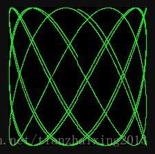
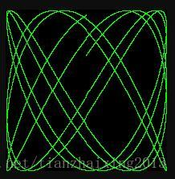
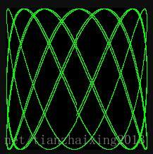
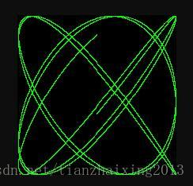
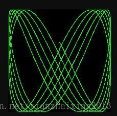
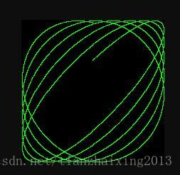
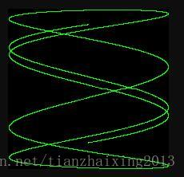

# gopl-Exercise1.5: Animated GIFs

本文主要用来记录Golang学习中，Animated GIFs的小节作业。

### 源码


```go
    // Copyright © 2016 Alan A. A. Donovan & Brian W. Kernighan.
    // License: https://creativecommons.org/licenses/by-nc-sa/4.0/

    // Run with "web" command-line argument for web server.
    // See page 13.
    //!+main

    // Lissajous generates GIF animations of random Lissajous figures.
    package main

    import (
        "image"
        "image/color"
        "image/gif"
        "io"
        "math"
        "math/rand"
        "os"
    )

    //!-main
    // Packages not needed by version in book.
    import (
        "log"
        "net/http"
        "time"
    )

    //!+main

    // var palette = []color.Color{color.White, color.Black}
    var palette = []color.Color{color.Black, color.RGBA{0x00, 0xff, 0x00, 0xff}}

    const (
        // whiteIndex = 0 // first color in palette
        // blackIndex = 1 // next color in palette
        blackIndex = 0
        greenIndex = 1
    )

    func main() {
        //!-main
        // The sequence of images is deterministic unless we seed
        // the pseudo-random number generator using the current time.
        // Thanks to Randall McPherson for pointing out the omission.
        rand.Seed(time.Now().UTC().UnixNano())

        if len(os.Args) > 1 && os.Args[1] == "web" {
            //!+http
            handler := func(w http.ResponseWriter, r *http.Request) {
                lissajous(w)
            }
            http.HandleFunc("/", handler)
            //!-http
            log.Fatal(http.ListenAndServe("localhost:8000", nil))
            return
        }
        //!+main
        lissajous(os.Stdout)
    }

    func lissajous(out io.Writer) {
        const (
            cycles  = 5     // number of complete x oscillator revolutions
            res     = 0.001 // angular resolution
            size    = 100   // image canvas covers [-size..+size]
            nframes = 64    // number of animation frames
            delay   = 8     // delay between frames in 10ms units
        )
        freq := rand.Float64() * 3.0 // relative frequency of y oscillator
        anim := gif.GIF{LoopCount: nframes}
        phase := 0.0 // phase difference
        for i := 0; i < nframes; i++ {
            rect := image.Rect(0, 0, 2*size+1, 2*size+1)
            img := image.NewPaletted(rect, palette)
            for t := 0.0; t < cycles*2*math.Pi; t += res {
                x := math.Sin(t)
                y := math.Sin(t*freq + phase)
                // img.SetColorIndex(size+int(x*size+0.5), size+int(y*size+0.5),
                // blackIndex)
                img.SetColorIndex(size+int(x*size+0.5), size+int(y*size+0.5),
                    greenIndex)
            }
            phase += 0.1
            anim.Delay = append(anim.Delay, delay)
            anim.Image = append(anim.Image, img)
        }
        gif.EncodeAll(out, &anim) // NOTE: ignoring encoding errors
    }

    //!-main
```


### 运行


```
    $ go build
    $ ./lissajous.exe web
```


### 浏览器查看效果

在浏览器的地址栏中输入`localhost:8000`，并回车。

> 每次刷新网页，将看到不同样式的利萨茹曲线。















### 参考

  1. [利萨茹曲线](https://zh.wikipedia.org/zh-hans/%E5%88%A9%E8%90%A8%E8%8C%B9%E6%9B%B2%E7%BA%BF)
  2. [golang-image-color-palette](https://golang.org/pkg/image/color/palette/)

```