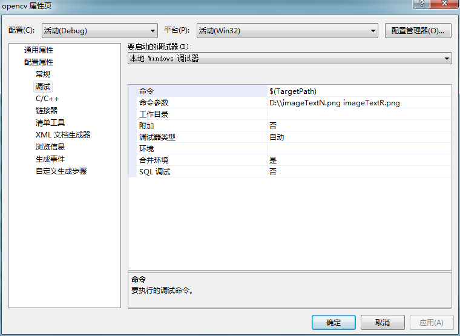
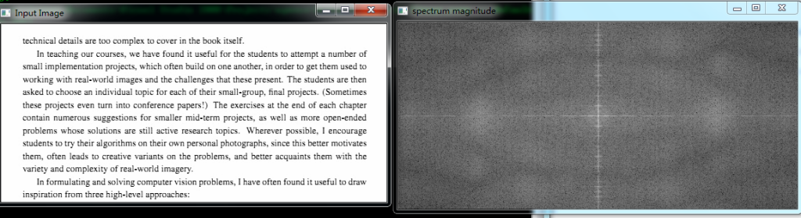
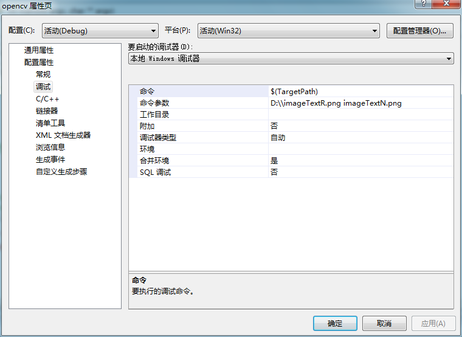
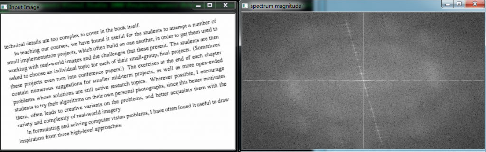

# opencv - DFT

**本文主要使用DFT相关函数实现对水平文本和旋转文本的DFT变换，在幅度谱中识别文本的变换，从而为图像旋转的检测和校正做准备。**


```cpp
****


    #include "opencv2/core/core.hpp"
    #include "opencv2/imgproc/imgproc.hpp"
    #include "opencv2/highgui/highgui.hpp"
    #include <iostream>

    using namespace cv;
    using namespace std;

    void help(char* progName)
    {
        cout << endl
            <<  "This program demonstrated the use of the discrete Fourier transform (DFT). " << endl
            <<  "The dft of an image is taken and it's power spectrum（功率谱) is displayed."          << endl
            <<  "Usage:"                                                                      << endl
            << progName << " [image_name -- default lena.jpg] "                       << endl << endl;
    }

    int main(int argc, char ** argv)
    {
        help(argv[0]);
        const char* filename = argc >=2 ? argv[1] : "lena.jpg";

      /*  Mat I = imread(filename, CV_LOAD_IMAGE_GRAYSCALE);*/
          Mat I = imread(filename, 0);
        if( I.empty())
        {
            cout<<"Can't load image!"<<endl;
            return -1;
        }
        //填充输入图像到最优大小一般是2，3，5的倍数
        Mat padded;
        int m = getOptimalDFTSize( I.rows );
        int n = getOptimalDFTSize( I.cols );

        //把填充边界置0
        copyMakeBorder(I, padded, 0, m - I.rows, 0, n - I.cols, BORDER_CONSTANT, Scalar::all(0));

        //因为图像的频域比空域范围更大，故把输入图像转换到浮点类型，
        //并用另一个通道扩展它。这样才可以存储复数值(实部和虚部)
        Mat planes[] = {Mat_<float>(padded), Mat::zeros(padded.size(), CV_32F)};
        Mat complexI;
        merge(planes, 2, complexI);//把0值添加到另一个扩充的平面


        //这样处理的结果可以适合原来的矩阵
        dft(complexI, complexI);


        //计算这个幅度并转换到log领域
        //log(1 + sqrt(Re(DFT(I))^2 + Im(DFT(I))^2))
        //planes[0] = Re(DFT(I)）实部, planes[1] = Im(DFT(I))虚部
        split(complexI, planes);

        //planes[0] = magnitude幅度值
        magnitude(planes[0], planes[1], planes[0]);
        Mat magI = planes[0];

        //转换到log运算
        magI += Scalar::all(1);
        log(magI, magI);

        //如果它由奇数个行或奇数个列，截取频谱
        magI = magI(Rect(0, 0, magI.cols & -2, magI.rows & -2));

        //重新分配傅里叶变换后图像的象限从而让图像原始(0，0)位置在图像中心
        int cx = magI.cols/2;
        int cy = magI.rows/2;

        Mat q0(magI, Rect(0, 0, cx, cy));   // Top-Left -每个象限创建一个感兴趣区域
        Mat q1(magI, Rect(cx, 0, cx, cy));  // Top-Right
        Mat q2(magI, Rect(0, cy, cx, cy));  // Bottom-Left
        Mat q3(magI, Rect(cx, cy, cx, cy)); // Bottom-Right

        //交换Ⅱ和Ⅳ象限位置(Top-Left with Bottom-Right)
        Mat tmp;
        q0.copyTo(tmp);
        q3.copyTo(q0);
        tmp.copyTo(q3);

        //交换Ⅰ和Ⅲ象限位置(Top-Right with Bottom-Left)
        q1.copyTo(tmp);
        q2.copyTo(q1);
        tmp.copyTo(q2);

        // Transform the matrix with float values into a
        // viewable image form (float between values 0 and 1).
        normalize(magI, magI, 0, 1, CV_MINMAX);

        imshow("Input Image"       , I   );
        imshow("spectrum magnitude", magI);
        waitKey();

        return 0;
    }
```


**
**

**
**

**
**

**
**

**
**

**
**

**
**

  
  
```