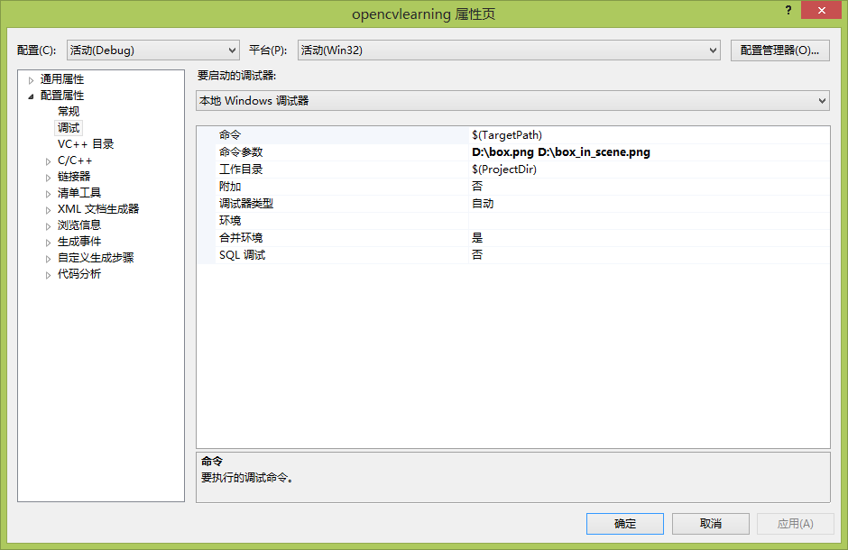
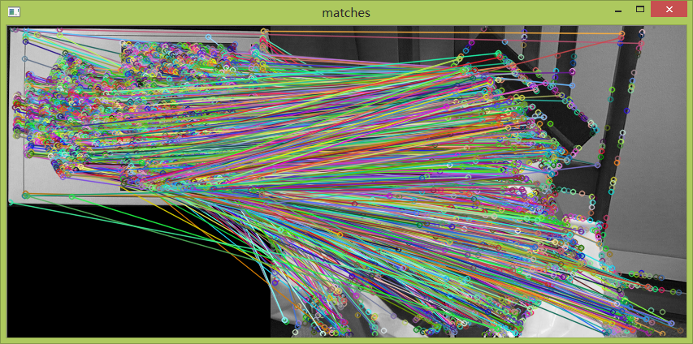

# opencv-Detection of planar objects(待完善)


```cpp
    #include <stdio.h>
    #include <iostream>
    #include "opencv2/core/core.hpp"
    #include "opencv2/features2d/features2d.hpp"
    #include "opencv2/highgui/highgui.hpp"
    #include "opencv2/nonfree/features2d.hpp"
    #include "opencv2/legacy/legacy.hpp"

    using namespace std;
    using namespace cv;

    int main( int argc, char** argv )
    {
        if( argc != 3 )
        { cout<<"Please input again"<<endl; return -1; }

        Mat img1 = imread( argv[1], CV_LOAD_IMAGE_GRAYSCALE );
        Mat img2 = imread( argv[2], CV_LOAD_IMAGE_GRAYSCALE );

        if( !img1.data || !img2.data )
        { cout<< " --(!) Error reading images " <<endl; return -1; }

        //Detecting Key point
        FastFeatureDetector detector(15);
        vector<KeyPoint> KeyPoints1;
        detector.detect(img1,KeyPoints1);

        vector<KeyPoint> KeyPoints2;
        detector.detect(img2,KeyPoints2);

        //compute descriptors for each of the keypoints
        SurfDescriptorExtractor extractor;

        Mat descriptors1;
        extractor.compute(img1,KeyPoints1,descriptors1);

        Mat descriptors2;
        extractor.compute(img2,KeyPoints2,descriptors2);

        //matching descriptors
        BruteForceMatcher <L2<float> >matcher;
        vector<DMatch> matches;
        matcher.match(descriptors1,descriptors2,matches);

        //drawing the results
        namedWindow("matches",1);
        Mat img_matches;
        drawMatches(img1,KeyPoints1,img2,KeyPoints2,matches,img_matches);
        imshow("matches",img_matches);
        waitKey(0);
    }
```


  


  


  


  


  


  
```