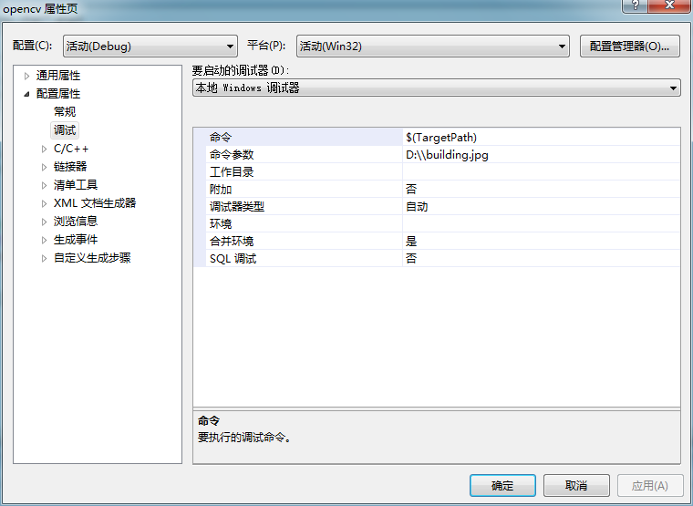
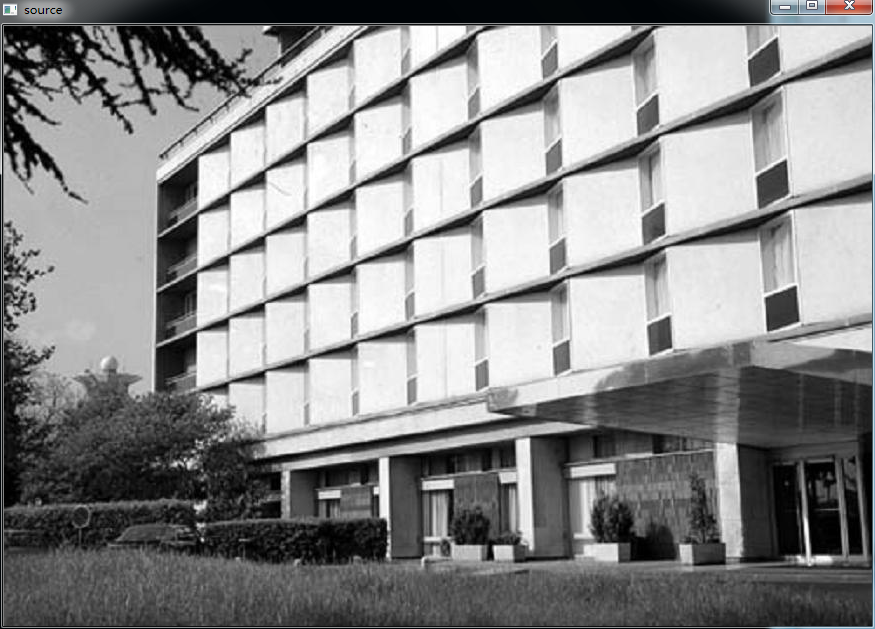
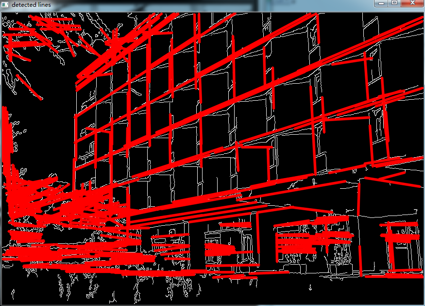

# opencv-Hough变换


```cpp
    #include "opencv2/highgui/highgui.hpp"
    #include "opencv2/imgproc/imgproc.hpp"

    #include <iostream>

    using namespace cv;
    using namespace std;

    static void help()
    {
        cout << "\nThis program demonstrates line finding with the Hough transform.\n"
                "Usage:\n"
                "./houghlines <image_name>, Default is pic1.png\n" << endl;
    }

    int main(int argc, char** argv)
    {
        const char* filename = argc >= 2 ? argv[1] : "pic1.png";

        Mat src = imread(filename, 0);
        if(src.empty())
        {
            help();
            cout << "can not open " << filename << endl;
            return -1;
        }

        Mat dst, cdst;
        Canny(src, dst, 50, 200, 3);
        cvtColor(dst, cdst, CV_GRAY2BGR);

    #if 0
        vector<Vec2f> lines;
        //dst:canny边缘检测输出图像；line:用于存储参数的矢量；
        //1：一个像素点；CV_PI/180:1弧度；100:检测线上面最小点数；0,0:默认设置
        HoughLines(dst, lines, 1, CV_PI/180, 100, 0, 0 );

        for( size_t i = 0; i < lines.size(); i++ )
        {
            float rho = lines[i][0], theta = lines[i][1];
            Point pt1, pt2;
            double a = cos(theta), b = sin(theta);
            double x0 = a*rho, y0 = b*rho;
            pt1.x = cvRound(x0 + 1000*(-b));
            pt1.y = cvRound(y0 + 1000*(a));
            pt2.x = cvRound(x0 - 1000*(-b));
            pt2.y = cvRound(y0 - 1000*(a));
            line( cdst, pt1, pt2, Scalar(0,0,255), 3, CV_AA);
        }
    #else
        vector<Vec4i> lines;
        //50:最小阈值；50:一条检测线最小长度；10:两点之间最大点数
        HoughLinesP(dst, lines, 1, CV_PI/180, 50, 50, 10 );
        for( size_t i = 0; i < lines.size(); i++ )
        {
            Vec4i l = lines[i];
            line( cdst, Point(l[0], l[1]), Point(l[2], l[3]), Scalar(0,0,255), 3, CV_AA);
        }
    #endif
        imshow("source", src);
        imshow("detected lines", cdst);

        waitKey();

        return 0;
    }
```


  


  


  


  


  


  


`


`
```