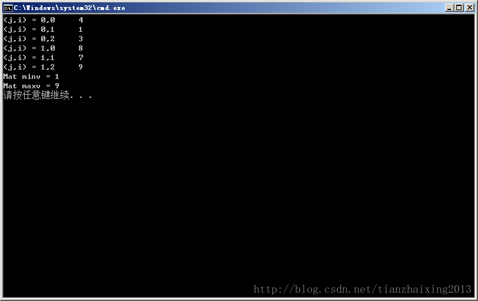

# opencv Mat 数据 最大值和最小值

由于之前写的一些程序好多都是基于opencv中的Mat类型的，现在，需要对其中的数据求取最大值和最小值。感觉opencv应该有STL中类似的sort函数...后来，google了一下，发现还真的确实有的。

  


```
    //! finds global minimum and maximum array elements and returns their values and their locations
    CV_EXPORTS_W void minMaxLoc(InputArray src, CV_OUT double* minVal,
                               CV_OUT double* maxVal=0, CV_OUT Point* minLoc=0,
                               CV_OUT Point* maxLoc=0, InputArray mask=noArray());
    CV_EXPORTS void minMaxIdx(InputArray src, double* minVal, double* maxVal,
                              int* minIdx=0, int* maxIdx=0, InputArray mask=noArray());
```


  
实现代码如下所示： 


```cpp
    #include <iostream>
    #include <cstdlib>
    #include <cmath>
    #include <iomanip>
    #include <algorithm>

    #include "opencv2/core/core.hpp"
    #include "opencv2/highgui/highgui.hpp"
    #include "opencv2/imgproc/imgproc.hpp"
    #include "opencv2/contrib/contrib.hpp"

    using namespace std;
    using namespace cv;

    int main(int argc, char* argv[])
    {
    #pragma region min_max

        float Tval = 0.0;
        float RawData[2][3] = {{4.0,1.0,3.0},{8.0,7.0,9.0}};
        Mat RawDataMat(2,3,CV_32FC1,RawData);

        for (int j = 0; j < 2; j++)
        {
            for (int i = 0; i < 3; i++)
            {
                //Tval = RawData[j][i];             //No problem !!!
                Tval = RawDataMat.at<float>(j,i);
                cout << "(j,i) = "<<j<<","<<i<<"\t"<<Tval<<endl;
            }
        }

        double minv = 0.0, maxv = 0.0;
        double* minp = &minv;
        double* maxp = &maxv;

        minMaxIdx(RawDataMat,minp,maxp);

        cout << "Mat minv = " << minv << endl;
        cout << "Mat maxv = " << maxv << endl;

    #pragma endregion

        return 0;
    }
```


  
  


附图：

  


  
```