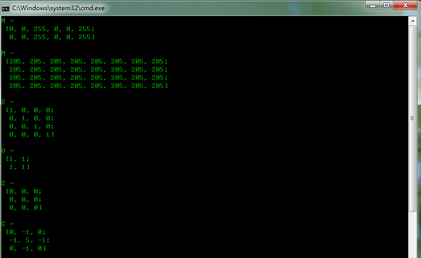
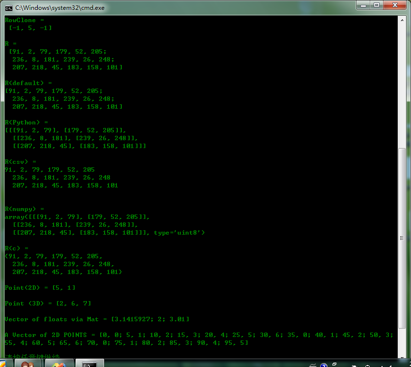

# opencv-Mat

Mat应用：


```cpp
    #include <opencv2/core/core.hpp>
    #include <opencv2/highgui/highgui.hpp>
    #include <cv.h>
    #include <iostream>

    using namespace std;
    using namespace cv;

    int main()
    {

            //Mat() Constructor
            Mat M(2,2,CV_8UC3,Scalar(0,0,255));
            cout<<"M = "<<endl<<" "<<M<<endl<<endl;

            //C/C++ arrays and initialize via constructor
            int sz[3]={2,2,2};//创建一个三维矩阵
            Mat L(3,sz,CV_8UC1,Scalar::all(0));
            //cout<<"L = "<<endl<<" "<<L<<endl<<endl;


            //create a header for an already existing IplImage pointer
            IplImage* img = cvLoadImage("D:\\lena.bmp",1);
            Mat mtx(img);//把IplImage*转换为Mat

            //create()函数
            M.create(4,4,CV_8UC(2));
            cout<<"M = "<<endl<<" "<<M<<endl<<endl;

            //MATLAB风格初始化:zero(),ones(),:eyes().
            Mat E = Mat::eye(4,4,CV_64F);
            cout<<"E = "<<endl<<" "<<E<<endl<<endl;
            Mat O = Mat::ones(2,2,CV_32F);
            cout<<"O = "<<endl<<" "<<O<<endl<<endl;
            Mat Z = Mat::zeros(3,3,CV_8UC1);
            cout<<"Z = "<<endl<<" "<<Z<<endl<<endl;

            //小矩阵用逗号初始化
            Mat C = ( Mat_<double>(3,3)<< 0,-1,0,-1,5,-1,0,-1,0);
            cout<<"C = "<<endl<<" "<<C<<endl<<endl;


            //对已经存在的Mat对象创建新的头，并克隆或复制
            Mat RowClone = C.row(1).clone();
            cout<<"RowClone = "<<endl<<" "<<RowClone<<endl<<endl;

            //利用随机函数创建Mat矩阵
            Mat R = Mat(3,2,CV_8UC3);
            randu(R,Scalar::all(0),Scalar::all(255));
            cout<<"R = "<<endl<<" "<<R<<endl<<endl;

            //打印输出格式化
            //default格式
            cout<<"R(default) = "<<endl<<R<<endl<<endl;
            //Python格式
            cout<<"R(Python) = "<<endl<<format(R,"python")<<endl<<endl;
            //comma separated values(CSV)
            cout<<"R(csv) = "<<endl<<format(R,"csv")<<endl<<endl;
            //numpy
            cout<<"R(numpy) = "<<endl<<format(R,"numpy")<<endl<<endl;
            //C
            cout<<"R(c) = "<<endl<<format(R,"C")<<endl<<endl;

            //2D Point
            Point2f p(5,1);
            cout<<"Point(2D) = "<<p<<endl<<endl;
            //3D Point
            Point3f P3f(2,6,7);
            cout<<"Point (3D) = "<<P3f<<endl<<endl;
            //std::vector via cv::Mat
            vector<float> v;
            v.push_back((float)CV_PI);
            v.push_back(2);
            v.push_back(3.01f);
            cout<<"Vector of floats via Mat = "<<Mat(v)<<endl<<endl;
            //std::vector of points
            vector<Point2f> vPoints(20);
            for(size_t E=0;E<vPoints.size();++E)
            vPoints[E] = Point2f((float)(E*5),(float)(E%7));
            cout<<"A Vector of 2D POINTS = "<<vPoints<<endl<<endl;
            return 0;
    }
```


  
  


  
  
```