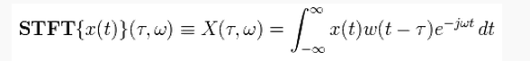
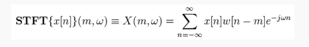

# opencv-SURF和STFT

1.SURF: Speeded Up Robust Features" is a performant scale- and rotation-invariant interest point detector and descriptor.  

函数surf的作用：画三维曲面（色）图，起作用与mesh相似

surf(X,Y,Z) X、Y、Z中Z通常是X,Y的函数，即Z(X,Y)。X、Y通常是通过调用meshgrid函数生成的数据网格（具体参见meshgrid）。 surf(Z) surf(...,C) surf(...,'PropertyName',PropertyValue,...) surf(axes_handles,...) 相关函数：mesh，meshc, meshz 

2.短时傅里叶变换（STFT，short-time Fourier transform，或 short-term Fourier transform)）是和傅里叶变换相关的一种数学变换，用以确定时变信号其局部区域正弦波的频率与相位。

起初，在信号学里面，为了简化运算，尤其是在线性时不变系统（LTI，linear time invariance system）中的运算，从而引入了傅里叶变换的概念。然而傅里叶变换只能够给出信号的频域性质。也就是说频率并没有对应到时间上。这对于一个稳定信号是没有什么影响的，因为信号的频率永远都是一种分布。然而对于一个非稳定的信号，由于频率随时间在变化，那么使用傅里叶变换就无法完整的描述这种变化的性质。为了更好地表达这种变化的特点，短时傅里叶变换（STFT）被引入并且很快得到了推广。短时傅里叶变换分为两种，分别对应到连续时间和离散时间上。

###  短时傅里叶变换公式

####  连续时间短时傅里叶变换：

  

x（t）代表信号，w（t）是窗函数。

####  离散时间短时傅里叶变换：

  

x(n)代表信号，w(n)是窗函数。

事实上，离散的形式是连续的一种采样方式。

此外，我们常见的声音频谱图就是使用stft绘制而成的，其实质就是stft的能量，也就是模值的平方。

STFT的使用范围受其变换性质的局限。STFT是一种基于窗函数的变换，一般来说，短窗能够提供较好的时域解析度，长窗能够提供较好的频域解析度。这导致其实在研究过程中，还是只能侧重一种研究角度，或称一种侧重的分辨率。所以这并不是多分辨率分析。这也是为什么之后又提出了小波变换的原因之一。  

不过，总体来说，STFT对于大部分音频信号都能够有较好的的分析效果，所以还是一种在使用的分析方法。