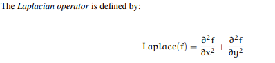
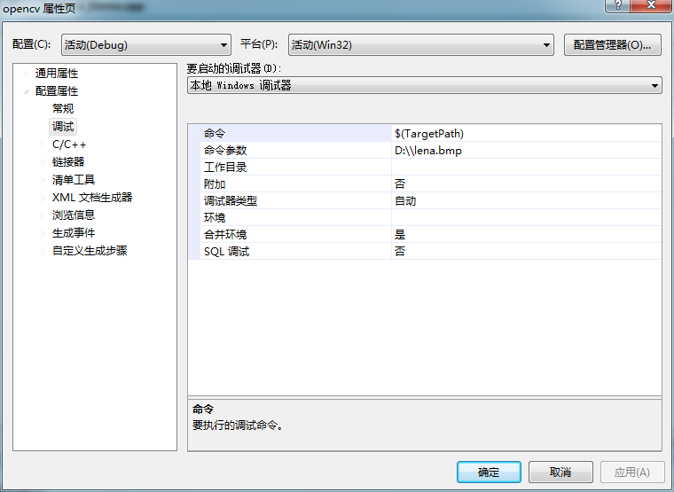
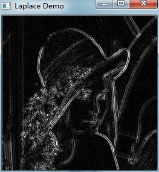

# opencv-laplace算子




```cpp
    #include "opencv2/imgproc/imgproc.hpp"
    #include "opencv2/highgui/highgui.hpp"
    #include <stdlib.h>
    #include <stdio.h>

    using namespace cv;

    int main( int argc, char** argv )
    {

      Mat src, src_gray, dst;
      int kernel_size = 3;
      int scale = 1;
      int delta = 0;
      int ddepth = CV_16S;
      char* window_name = "Laplace Demo";

      int c;

      //加载图像
      src = imread( argv[1] );

      if( !src.data )
        { return -1; }

      //高斯滤波去除噪声
      GaussianBlur( src, src, Size(3,3), 0, 0, BORDER_DEFAULT );

      //变换为灰度图
      cvtColor( src, src_gray, CV_RGB2GRAY );

      //创建窗口
      namedWindow( window_name, CV_WINDOW_AUTOSIZE );

      //应用拉普拉斯函数
      Mat abs_dst;

      Laplacian( src_gray, dst, ddepth, kernel_size, scale, delta, BORDER_DEFAULT );
      convertScaleAbs( dst, abs_dst );

      //输出结果显示
      imshow( window_name, abs_dst );

      waitKey(0);

      return 0;
    }
```


  
  


  


  
```