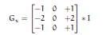
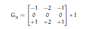
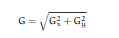
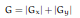
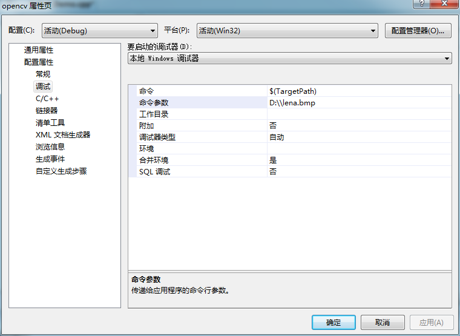
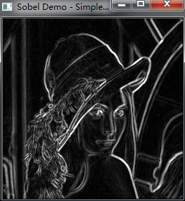

# opencv-sobel算子

sobel边界检测步骤：

1.计算水平和垂直方向的变化：

  


  


2.计算图像上每个像素点的近似梯度：

  


或者有时候简化计算为：

  


```cpp
    #include "opencv2/imgproc/imgproc.hpp"
    #include "opencv2/highgui/highgui.hpp"
    #include <stdlib.h>
    #include <stdio.h>

    using namespace cv;

    int main( int argc, char** argv )
    {

      Mat src, src_gray;
      Mat grad;
      char* window_name = "Sobel Demo - Simple Edge Detector";
      int scale = 1;//默认值
      int delta = 0;//默认值
      int ddepth = CV_16S;//防止输出图像深度溢出

      int c;

      //加载图像
      src = imread( argv[1] );

      if( !src.data )
        { return -1; }

      //高斯模糊
      GaussianBlur( src, src, Size(3,3), 0, 0, BORDER_DEFAULT );

      //变换为灰度图
      cvtColor( src, src_gray, CV_RGB2GRAY );

      //创建窗口
      namedWindow( window_name, CV_WINDOW_AUTOSIZE );

      //生成 grad_x and grad_y
      Mat grad_x, grad_y;
      Mat abs_grad_x, abs_grad_y;

      // Gradient X x方向梯度 1,0：x方向计算微分即导数
      //Scharr( src_gray, grad_x, ddepth, 1, 0, scale, delta, BORDER_DEFAULT );
      Sobel( src_gray, grad_x, ddepth, 1, 0, 3, scale, delta, BORDER_DEFAULT );
      convertScaleAbs( grad_x, abs_grad_x );

      // Gradient Y y方向梯度 0，1：y方向计算微分即导数
      //Scharr( src_gray, grad_y, ddepth, 0, 1, scale, delta, BORDER_DEFAULT );
      Sobel( src_gray, grad_y, ddepth, 0, 1, 3, scale, delta, BORDER_DEFAULT );
      convertScaleAbs( grad_y, abs_grad_y );

      //近似总的梯度
      addWeighted( abs_grad_x, 0.5, abs_grad_y, 0.5, 0, grad );

      imshow( window_name, grad );

      waitKey(0);

      return 0;
    }
```


  
  


  


  
```