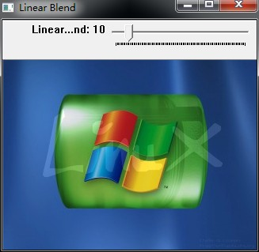
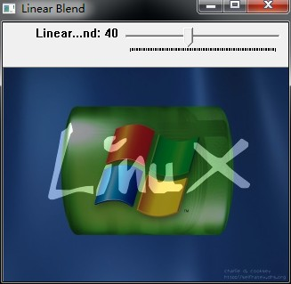

# opencv-创建跟踪条


```cpp
    #include <cv.h>
    #include <highgui.h>

    using namespace cv;

    const int alpha_slider_max=100;
    int alpha_slider;
    double alpha;
    double beta;

    Mat src1,src2,dst;

    void on_tracker(int,void* )
    {
        alpha = (double)alpha_slider/alpha_slider_max;
        beta  = ( 1.0 - alpha );

        addWeighted( src1,alpha,src2,beta,0.0,dst);

        imshow("Linear Blend",dst);
    }

    int main( int argc, char** argv )
    {

       //读取图像大小和类型
       src1 = imread("D:\\LinuxLogo.jpg");
       src2 = imread("D:\\WindowsLogo.jpg");

       if( !src1.data ) { printf("Error loading src1 \n"); return -1; }
       if( !src2.data ) { printf("Error loading src2 \n"); return -1; }

       alpha_slider =0;

       //创建窗口
       namedWindow("Linear Blend", 1);

       //创建跟踪条
       char TrackbarName[50];
       sprintf(TrackbarName,"Linear Blend",alpha_slider_max);

       createTrackbar(TrackbarName,"Linear Blend",&alpha_slider,alpha_slider_max,on_tracker);

       //显示一些内容
       on_tracker(alpha_slider,0);

       waitKey(0);
       return 0;
    }
```


  


  


  


  


  


  
```