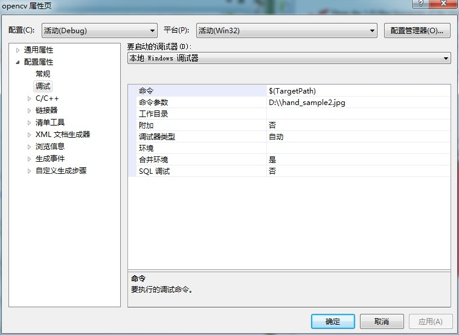
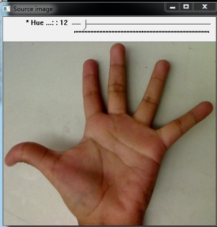
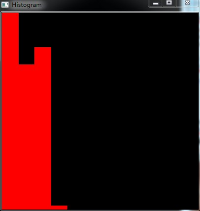
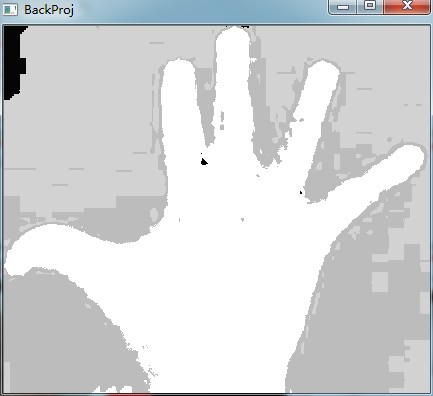

# opencv-反投影


```cpp
    #include "opencv2/imgproc/imgproc.hpp"
    #include "opencv2/highgui/highgui.hpp"

    #include <iostream>

    using namespace cv;
    using namespace std;

    //全局变量
    Mat src; Mat hsv; Mat hue;
    int bins = 12;

    //函数声明
    void Hist_and_Backproj(int, void* );

    int main( int argc, char** argv )
    {
      //读取彩色图像
      src = imread( argv[1], 1 );
      //把读入图像转换为HSV
      cvtColor( src, hsv, CV_BGR2HSV );

      //只使用色度值
      hue.create( hsv.size(), hsv.depth() );
      int ch[] = { 0, 0 };
      //&hsv：原数组；1：原数组数目；&hue：目标数组；1：目标数组数目；
      //ch:索引对数组，只复制原数组的色度通道；1：索引对数组数目
      mixChannels( &hsv, 1, &hue, 1, ch, 1 );

      //创建跟踪条输入箱子数目
      char* window_image = "Source image";
      namedWindow( window_image, CV_WINDOW_AUTOSIZE );
      createTrackbar("* Hue  bins: ", window_image, &bins, 180, Hist_and_Backproj );
      Hist_and_Backproj(0, 0);

      //显示图像
      imshow( window_image, src );

      //等待
      waitKey(0);
      return 0;
    }


    void Hist_and_Backproj(int, void* )
    {//初始化计算直方图的参数
      MatND hist;
      int histSize = MAX( bins, 2 );

      float hue_range[] = { 0, 180 };
      const float* ranges = { hue_range };//色度值变化范围

      //获取直方图并归一化
      calcHist( &hue, 1, 0, Mat(), hist, 1, &histSize, &ranges, true, false );
      normalize( hist, hist, 0, 255, NORM_MINMAX, -1, Mat() );//归一化范围到[0,255]

      //获取反投影
      MatND backproj;
      //参数设置和calcHist函数类似
      calcBackProject( &hue, 1, 0, hist, backproj, &ranges, 1, true );

      //显示反投影
      imshow( "BackProj", backproj );

      //画出直方图
      int w = 400; int h = 400;
      int bin_w = cvRound( (double) w / histSize );
      Mat histImg = Mat::zeros( w, h, CV_8UC3 );

      for( int i = 0; i < bins; i ++ )
         { rectangle( histImg, Point( i*bin_w, h ), Point( (i+1)*bin_w, h - cvRound( hist.at<float>(i)*h/255.0 ) ), Scalar( 0, 0, 255 ), -1 ); }

      imshow( "Histogram", histImg );

    }
```


  


  


  


  


  


  


  


  


  


  
```