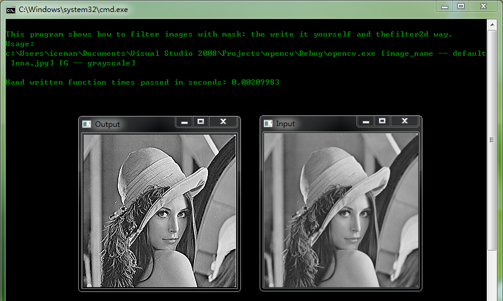
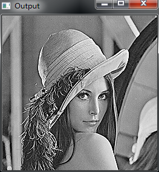
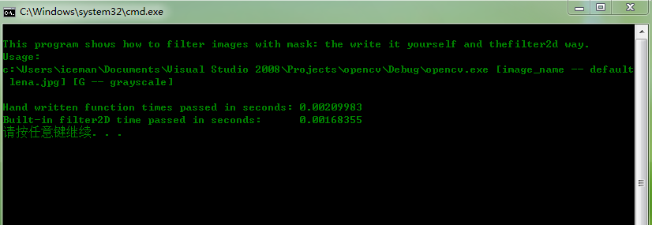

# opencv-图像像素值矩阵掩膜操作之锐化滤波

利用掩膜和滤波函数对输入图像进行操作，并比较处理时间。


```cpp
    #include <opencv2/core/core.hpp>
    #include <opencv2/highgui/highgui.hpp>
    #include <opencv2/imgproc/imgproc.hpp>
    #include <iostream>

    using namespace std;
    using namespace cv;

    void help(char* progName)
    {
        cout << endl
            <<  "This program shows how to filter images with mask: the write it yourself and the"
            << "filter2d way. " << endl
            <<  "Usage:"                                                                        << endl
            << progName << " [image_name -- default lena.jpg] [G -- grayscale] "        << endl << endl;
    }


    void Sharpen(const Mat& myImage,Mat& Result);

    int main( int argc, char* argv[])
    {
        help(argv[0]);
       // const char* filename = argc >=2 ? argv[1] : "lena.jpg";
        const char* filename = argc >=2 ? "D:\\原始lena图像.bmp" : "D:\\lena.bmp";

        Mat I, J, K;

        if (argc >= 3 && !strcmp("G", argv[2]))
            I = imread( filename, CV_LOAD_IMAGE_GRAYSCALE);
        else
            I = imread( filename, CV_LOAD_IMAGE_COLOR);

        namedWindow("Input", CV_WINDOW_AUTOSIZE);
        namedWindow("Output", CV_WINDOW_AUTOSIZE);

        imshow("Input", I);
        double t = (double)getTickCount();//锐化计时开始

        Sharpen(I, J);//锐化操作

        t = ((double)getTickCount() - t)/getTickFrequency();//锐化计时结束
        cout << "Hand written function times passed in seconds: " << t << endl;

        imshow("Output", J);
        cvWaitKey(0);

        Mat kern = (Mat_<char>(3,3) <<  0, -1,  0,
                                       -1,  5, -1,
                                        0, -1,  0);
        t = (double)getTickCount();
        filter2D(I, K, I.depth(), kern );//2D滤波操作
        t = ((double)getTickCount() - t)/getTickFrequency();
        cout << "Built-in filter2D time passed in seconds:      " << t << endl;

        imshow("Output", K);

        cvWaitKey(0);
        return 0;
    }
    void Sharpen(const Mat& myImage,Mat& Result)
    {
        CV_Assert(myImage.depth() == CV_8U);  // accept only uchar images

        const int nChannels = myImage.channels();//每个像素值所含通道，灰色图像单通道，RGB三通道
        Result.create(myImage.size(),myImage.type());

        for(int j = 1 ; j < myImage.rows-1; ++j)
        {
            const uchar* previous = myImage.ptr<uchar>(j - 1);
            const uchar* current  = myImage.ptr<uchar>(j    );
            const uchar* next     = myImage.ptr<uchar>(j + 1);

            uchar* output = Result.ptr<uchar>(j);

            for(int i= nChannels;i < nChannels*(myImage.cols-1); ++i)
            {
                *output++ = saturate_cast<uchar>(5*current[i]
                             -current[i-nChannels] - current[i+nChannels] - previous[i] - next[i]);
            }
        }

        //图像顶行和底行，首列和末列不做处理均置零
        Result.row(0).setTo(Scalar(0));
        Result.row(Result.rows-1).setTo(Scalar(0));
        Result.col(0).setTo(Scalar(0));
        Result.col(Result.cols-1).setTo(Scalar(0));
    }
```






  
  
```