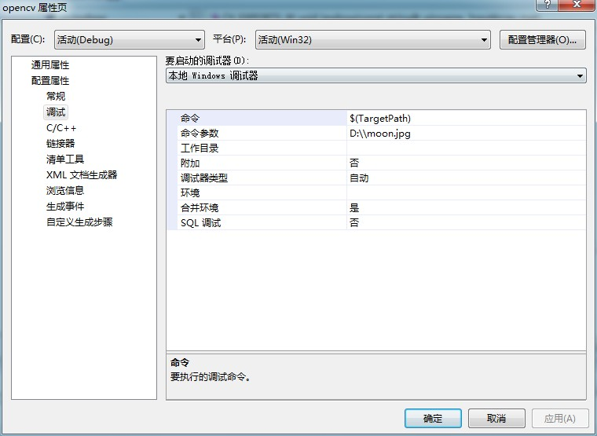
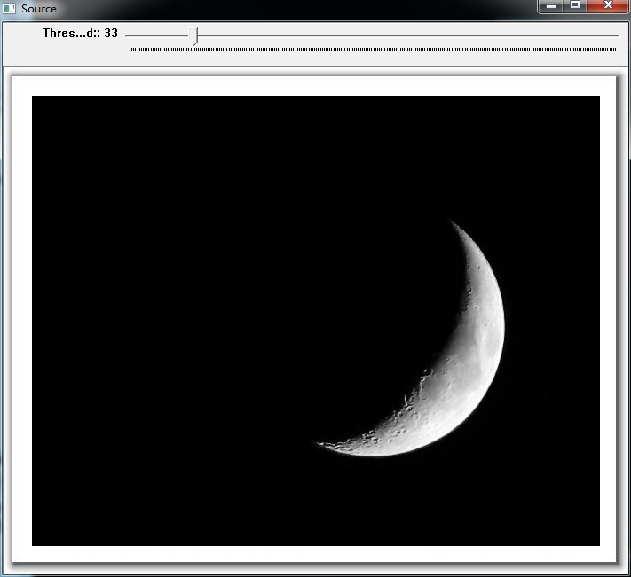
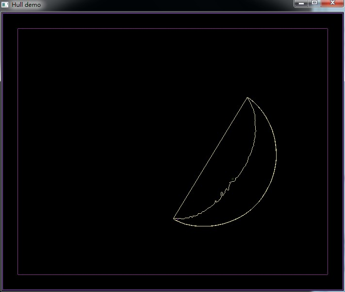

# opencv-图像凸壳


```cpp
    #include "opencv2/highgui/highgui.hpp"
    #include "opencv2/imgproc/imgproc.hpp"
    #include <iostream>
    #include <stdio.h>
    #include <stdlib.h>

    using namespace cv;
    using namespace std;

    Mat src; Mat src_gray;
    int thresh = 100;
    int max_thresh = 255;
    RNG rng(12345);

    //函数声明
    void thresh_callback(int, void* );


    int main( int argc, char** argv )
    {
      //加载彩色图像
      src = imread( argv[1], 1 );

      //转换为灰度图并模糊处理
      cvtColor( src, src_gray, CV_BGR2GRAY );
      blur( src_gray, src_gray, Size(3,3) );

      //创建窗口
      char* source_window = "Source";
      namedWindow( source_window, CV_WINDOW_AUTOSIZE );
      imshow( source_window, src );

      createTrackbar( " Threshold:", "Source", &thresh, max_thresh, thresh_callback );
      thresh_callback( 0, 0 );

      waitKey(0);
      return(0);
    }


    void thresh_callback(int, void* )
    {
      Mat src_copy = src.clone();
      Mat threshold_output;
      vector<vector<Point> > contours;
      vector<Vec4i> hierarchy;

      //阈值检测边界
      threshold( src_gray, threshold_output, thresh, 255, THRESH_BINARY );

      //查找轮廓
      findContours( threshold_output, contours, hierarchy, CV_RETR_TREE, CV_CHAIN_APPROX_SIMPLE, Point(0, 0) );

      //查找每一个轮廓的凸壳
     vector<vector<Point> >hull( contours.size() );
      for( int i = 0; i < contours.size(); i++ )
         {   convexHull( Mat(contours[i]), hull[i], false ); }

      //画图
      Mat drawing = Mat::zeros( threshold_output.size(), CV_8UC3 );
      for( int i = 0; i< contours.size(); i++ )
         {
           Scalar color = Scalar( rng.uniform(0, 255), rng.uniform(0,255), rng.uniform(0,255) );
           drawContours( drawing, contours, i, color, 1, 8, vector<Vec4i>(), 0, Point() );
           drawContours( drawing, hull, i, color, 1, 8, vector<Vec4i>(), 0, Point() );
         }

      //显示
      namedWindow( "Hull demo", CV_WINDOW_AUTOSIZE );
      imshow( "Hull demo", drawing );

    }
```


  


  


  


  


  


  


  


  
```