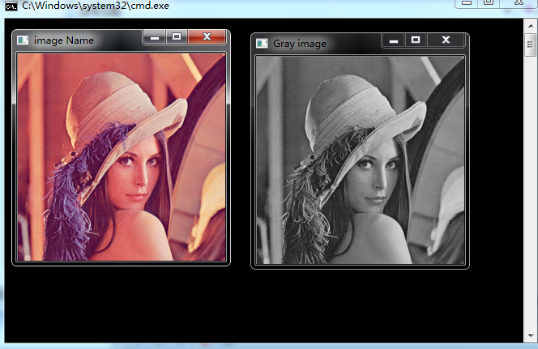

# opencv-图像加载，修改和保存

imread用于加载图像；

cvtColor用于实现图像的转换，由RGB→Grascale；

imwrite用于实现对变换后的图像进行存储；

具体实现程序如下：

```cpp
    #include <cv.h>
    #include <highgui.h>
    using namespace cv;
    using namespace std;
    int main( int argc, char**argv )
    {

        Mat image;
        image = imread("D:\\lena.bmp");

        Mat gray_image;
        cvtColor( image, gray_image, CV_RGB2GRAY );

        imwrite( "D:\\lena_gray.bmp", gray_image );

        namedWindow( "image Name", CV_WINDOW_AUTOSIZE );
        namedWindow( "Gray image", CV_WINDOW_AUTOSIZE );

        imshow( "image Name", image );
        imshow( "Gray image", gray_image );

        waitKey(0);

        return 0;
    }
```



```

```
