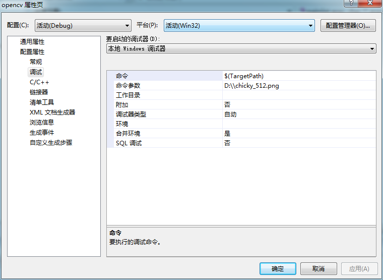
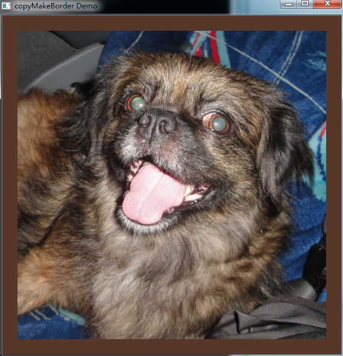
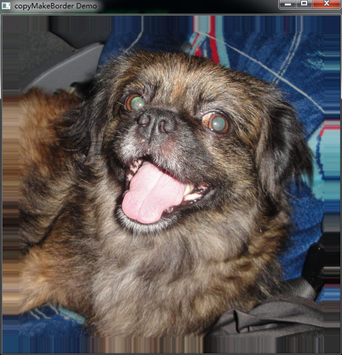

# opencv-图像添加边界（填充）

为图像填充边界，以便进行滤波，卷积等有关图像边界处理的操作。


```cpp
    #include "opencv2/imgproc/imgproc.hpp"
    #include "opencv2/highgui/highgui.hpp"
    #include <stdlib.h>
    #include <stdio.h>

    using namespace cv;

    //全局变量
    Mat src, dst;
    int top, bottom, left, right;//定义边界大小
    int borderType;//边界处理类型
    Scalar value;
    char* window_name = "copyMakeBorder Demo";
    RNG rng(12345);


    int main( int argc, char** argv )
    {

      int c;

      //加载图像
      src = imread( argv[1] );

      if( !src.data )
        { return -1;
          printf(" No data entered, please enter the path to an image file \n");
        }

      /// Brief how-to for this program
      printf( "\n \t copyMakeBorder Demo: \n" );
      printf( "\t -------------------- \n" );
      printf( " ** Press 'c' to set the border to a random constant value \n");
      printf( " ** Press 'r' to set the border to be replicated \n");
      printf( " ** Press 'ESC' to exit the program \n");

      //创建窗口
      namedWindow( window_name, CV_WINDOW_AUTOSIZE );

      //初始化滤波参数
      top = (int) (0.05*src.rows); bottom = (int) (0.05*src.rows);
      left = (int) (0.05*src.cols); right = (int) (0.05*src.cols);
      dst = src;

      imshow( window_name, dst );

      while( true )
           {
             c = waitKey(500);

             if( (char)c == 27 )//按ESC退出程序
               { break; }
             else if( (char)c == 'c' )
               { borderType = BORDER_CONSTANT; }
             else if( (char)c == 'r' )
               { borderType = BORDER_REPLICATE; }

             value = Scalar( rng.uniform(0, 255), rng.uniform(0, 255), rng.uniform(0, 255) );
             copyMakeBorder( src, dst, top, bottom, left, right, borderType, value );

             imshow( window_name, dst );
           }

      return 0;
    }
```


  
  


  


  


  


  


  
```