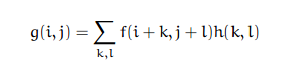
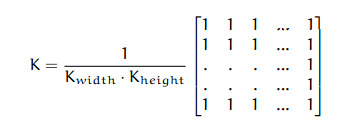
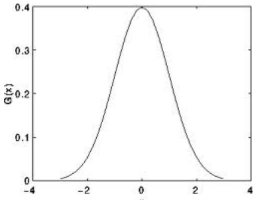
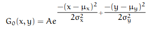
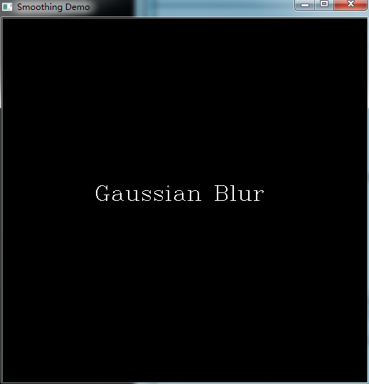
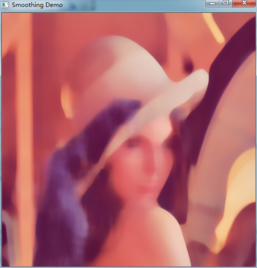

# opencv-图像滤波

在今后的几篇文章中，我将重点针对图像处理过程的一些常用操作，用opencv2.4.3代码实现。

本文主要讨论图像的滤波处理过程，即图像的模糊；主要用于去除图像上面的噪声。

1.线性滤波器

  


  


这是最常见的线性滤波等式，其中，f(i+k,j+l)为对应图像像素点的像素值，h(k,l)为窗口系数组成的核，它主要用于对图像像素点进行加权操作。

  


2.归一化块滤波器

  


这个是最简单的滤波器，即均值滤波器。它将预处理像素点周围[Kwidh,Kheight]区域求和取均值，作为预处理像素点的值。

  


3.高斯滤波器

高斯滤波器是最有用的滤波器，尽管它的处理速度不是最快的。高斯滤波器通过对输入数组进行卷积操作，输出结果作为新的数组来实现对图像的滤波处理。



一维高斯核如上图所示，在中间点的值最大。

  


二维高斯表达式如上所示，它由均值，方差，对应点坐标x，y四种参数组成。

附图为运行高斯滤波的时候的截图！！！

4.中值滤波器

中值滤波器用处理核窗口(方形)内的中间像素点的像素值，作为预计算的像素点的像素值。预计算的像素点位于处理核窗口中心。

  


5.双边滤波器

以上滤波器在平衡图像的噪声同时，也把图像的边缘信息进行了模糊处理。因此，我们引入了双边滤波器来解决这个问题。

双边滤波器的处理过程和高斯滤波器很类似，但是，它还对预处理像素点周围的像素值进行了加权处理。这个权重值由两部分组成，第一部分和高斯滤波器一样的权重，第二部分它还考虑了预处理像素点和其周围像素点的强度值的不同。

实现代码如下所示:


```cpp
    #include <iostream>
    #include <vector>

    #include "opencv2/imgproc/imgproc.hpp"
    #include "opencv2/highgui/highgui.hpp"
    #include "opencv2/features2d/features2d.hpp"

    using namespace std;
    using namespace cv;//命名空间

    //全局变量
    int DELAY_CAPTION = 1500;
    int DELAY_BLUR = 100;
    int MAX_KERNEL_LENGTH = 31;

    Mat src; Mat dst;
    char window_name[] = "Smoothing Demo";

    //函数头
    int display_caption( char* caption );
    int display_dst( int delay );

    int main( int argc, char** argv )
    {
      namedWindow( window_name, CV_WINDOW_AUTOSIZE );

      //装载源图像
      //src = imread( "../images/lena.png", 1 );
      src = imread( argv[1], 1 );

      if( display_caption( "Original Image" ) != 0 ) { return 0; }

      dst = src.clone();
      if( display_dst( DELAY_CAPTION ) != 0 ) { return 0; }


      //相似模糊
      if( display_caption( "Homogeneous Blur" ) != 0 ) { return 0; }

      for ( int i = 1; i < MAX_KERNEL_LENGTH; i = i + 2 )
      {
          //src:原始图像；dst：处理结果图像；Size(i,i)处理核窗口大小
          //point(-1,-1)处理位置起点，有效位置点。
            blur( src, dst, Size( i, i ), Point(-1,-1) );
            if( display_dst( DELAY_BLUR ) != 0 ) { return 0; }
      }


      //高斯模糊
      if( display_caption( "Gaussian Blur" ) != 0 ) { return 0; }

      for ( int i = 1; i < MAX_KERNEL_LENGTH; i = i + 2 )
       {
           //Size(i,i)处理核窗口大小，i必须为奇数正值，否则用标准差值表示
            GaussianBlur( src, dst, Size( i, i ), 0, 0 );
            if( display_dst( DELAY_BLUR ) != 0 ) { return 0; }
      }


      //中值模糊
      if( display_caption( "Median Blur" ) != 0 ) { return 0; }

      for ( int i = 1; i < MAX_KERNEL_LENGTH; i = i + 2 )
      {
          //i对于正方形窗口只用一个值表示中点
            medianBlur ( src, dst, i );
            if( display_dst( DELAY_BLUR ) != 0 ) { return 0; }
      }


      //双边滤波器
      if( display_caption( "Bilateral Blur" ) != 0 ) { return 0; }

      for ( int i = 1; i < MAX_KERNEL_LENGTH; i = i + 2 )
      {
           //i表示每个像素相邻直径，i*2表示彩色空间的标准差，i/2表示在相应坐标空间的标准差
            bilateralFilter ( src, dst, i, i*2, i/2 );
            if( display_dst( DELAY_BLUR ) != 0 ) { return 0; }
      }

      //延迟等待
      display_caption( "End: Press a key!" );

      waitKey(0);

      return 0;
    }

    //显示处理滤波器名字
    int display_caption( char* caption )
    {
      dst = Mat::zeros( src.size(), src.type() );

      putText( dst, caption, Point( src.cols/4, src.rows/2),CV_FONT_HERSHEY_COMPLEX, 1, Scalar(255, 255, 255) );

      imshow( window_name, dst );
      int c = waitKey( DELAY_CAPTION );
      if( c >= 0 ) { return -1; }
      return 0;
    }

    //延迟程序
    int display_dst( int delay )
    {
      imshow( window_name, dst );
      int c = waitKey ( delay );
      if( c >= 0 ) { return -1; }
      return 0;
    }
```


  


  


  
  


  


  


  
```