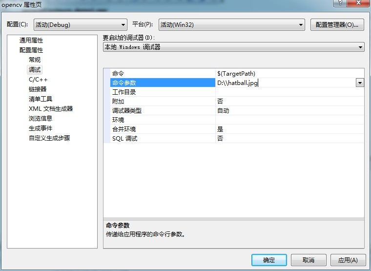
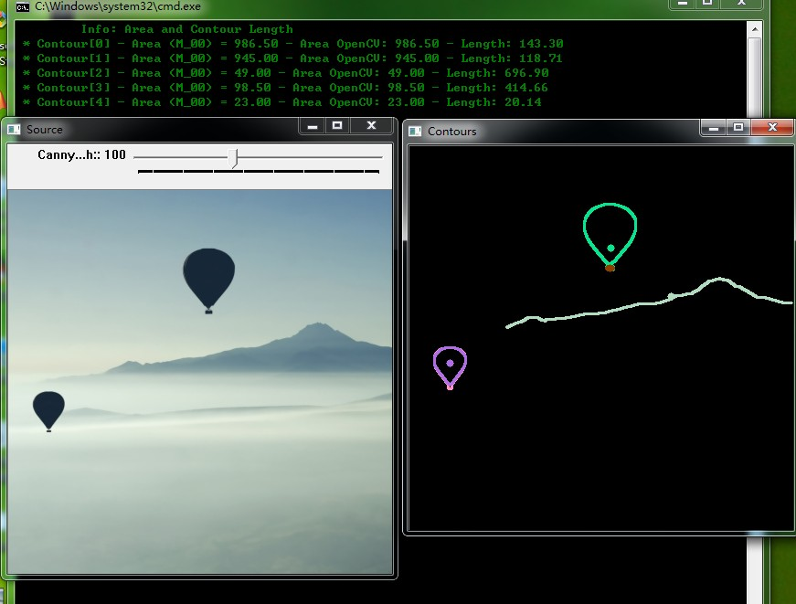

# opencv-图像组件


```cpp
    #include "opencv2/highgui/highgui.hpp"
    #include "opencv2/imgproc/imgproc.hpp"
    #include <iostream>
    #include <stdio.h>
    #include <stdlib.h>

    using namespace cv;
    using namespace std;

    Mat src; Mat src_gray;
    int thresh = 100;
    int max_thresh = 255;
    RNG rng(12345);

    //函数声明
    void thresh_callback(int, void* );

    int main( int argc, char** argv )
    {
      //加载彩色图像，转换为灰度图并模糊
      src = imread( argv[1], 1 );
      cvtColor( src, src_gray, CV_BGR2GRAY );
      blur( src_gray, src_gray, Size(3,3) );

      //创建窗口
      char* source_window = "Source";
      namedWindow( source_window, CV_WINDOW_AUTOSIZE );
      imshow( source_window, src );

      createTrackbar( " Canny thresh:", "Source", &thresh, max_thresh, thresh_callback );
      thresh_callback( 0, 0 );

      waitKey(0);
      return(0);
    }


    void thresh_callback(int, void* )
    {
      Mat canny_output;
      vector<vector<Point> > contours;
      vector<Vec4i> hierarchy;

      //canny边界检测
      Canny( src_gray, canny_output, thresh, thresh*2, 3 );
      //查找图像轮廓
      findContours( canny_output, contours, hierarchy, CV_RETR_TREE, CV_CHAIN_APPROX_SIMPLE, Point(0, 0) );

      //获得组件
      vector<Moments> mu(contours.size() );
      for( int i = 0; i < contours.size(); i++ )
         { mu[i] = moments( contours[i], false ); }

      //获得mass中心
      vector<Point2f> mc( contours.size() );
      for( int i = 0; i < contours.size(); i++ )
         { mc[i] = Point2f( mu[i].m10/mu[i].m00 , mu[i].m01/mu[i].m00 ); }

      //画轮廓
      Mat drawing = Mat::zeros( canny_output.size(), CV_8UC3 );
      for( int i = 0; i< contours.size(); i++ )
         {
           Scalar color = Scalar( rng.uniform(0, 255), rng.uniform(0,255), rng.uniform(0,255) );
           drawContours( drawing, contours, i, color, 2, 8, hierarchy, 0, Point() );
           circle( drawing, mc[i], 4, color, -1, 8, 0 );
         }

      //显示结果
      namedWindow( "Contours", CV_WINDOW_AUTOSIZE );
      imshow( "Contours", drawing );

      // Calculate the area with the moments 00 and compare with the result of the OpenCV function
      printf("\t Info: Area and Contour Length \n");
      for( int i = 0; i< contours.size(); i++ )
         {
           printf(" * Contour[%d] - Area (M_00) = %.2f - Area OpenCV: %.2f - Length: %.2f \n", i, mu[i].m00, contourArea(contours[i]), arcLength( contours[i], true ) );
           Scalar color = Scalar( rng.uniform(0, 255), rng.uniform(0,255), rng.uniform(0,255) );
           drawContours( drawing, contours, i, color, 2, 8, hierarchy, 0, Point() );
           circle( drawing, mc[i], 4, color, -1, 8, 0 );
         }
    }
```




  


  


  


  
```