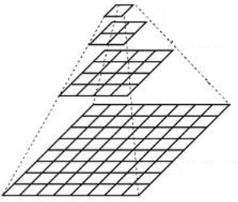
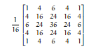
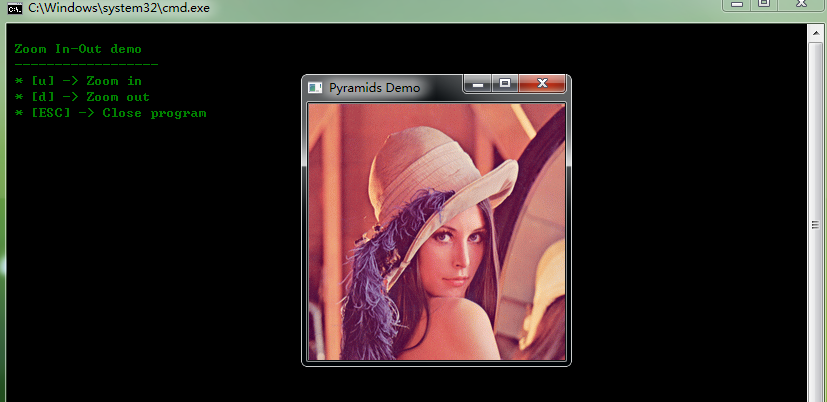
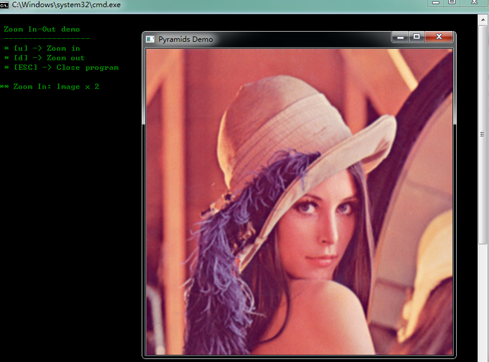
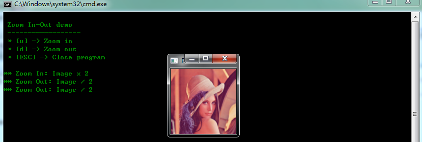
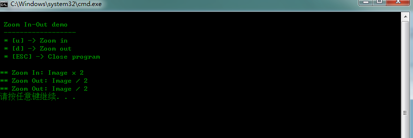

# opencv-图像金字塔-上采样-下采样

本文主要实现对输入图像的上采样和下采样操作，使用到pyrUP和pyrDown两个函数来对分别对图像进行上采样和下采样。

图像金字塔是一系列图像集合，它们从源图像连续的进行下采样，直到需要的位置才停止操作。

两种常见的图像金子塔如下所述：

1.高斯金字塔：用于下采样图像。

2.拉普拉斯金字塔：用于把下层低分辨率的图像进行上采样重建。

本文用到的是高斯金字塔。

1）高斯金字塔图形如下所示，越往上，图像的分辨率（大小）越小。

  


2）每层的计数从底层开始，即（i+1），注：Gi+1要比Gi层分辨率小！

3）产生i+1层的操作如下所述：

首先，用高斯核和Gi层进行卷积，高斯核大小为16*16；

  


然后，移走每个偶数行和列。

4）很容易观测到处理的结果即是前一层的1/4。从G0(原始输入图像)递归这个处理过程，就可以产生整个金字塔。

5）上面所述的处理过程很适合应用到对图像的下采样操作。

如果我们想使图像变的大一些，怎么办呢？

首先，增大图像的每个维度（一般为高度和宽度）为原来的两倍。把新的偶数行和列置零。

然后，用上面使用的高斯核进行卷积操作，记得要乘以4，以此来逼近丢失的像素值。

上面所述的两个处理过程，即对图像的下采样和上采样，本文用pyrUp和pyrDown两个函数来实现。

具体实现代码如下所示：


```cpp
    #include "opencv2/imgproc/imgproc.hpp"
    #include "opencv2/highgui/highgui.hpp"
    #include <math.h>
    #include <stdlib.h>
    #include <stdio.h>

    using namespace cv;

    //全局变量
    Mat src, dst, tmp;

    const char* window_name = "Pyramids Demo";

    int main( void )
    {
      //函数功能信息
      printf( "\n Zoom In-Out demo  \n " );
      printf( "------------------ \n" );
      printf( " * [u] -> Zoom in  \n" );
      printf( " * [d] -> Zoom out \n" );
      printf( " * [ESC] -> Close program \n \n" );

      //测试图像必须是2^(n)
      src = imread("D:\\lena.bmp");
      if( !src.data )
        { printf(" No data! -- Exiting the program \n");
          return -1; }

      tmp = src;
      dst = tmp;//交换图像信息

      //创建输出显示窗口
      namedWindow( window_name, CV_WINDOW_AUTOSIZE );
      imshow( window_name, dst );

      //循环操作
      for(;;)
      {
        int c;
        c = waitKey(10);

        if( (char)c == 27 )//按下键盘的"ESC"退出程序
          { break; }


        if( (char)c == 'u' )//按下键盘的"u"进行上采样操作
          {
              //tmp:原图像 ，dst:输出图像，是原图像的两倍，
              //Size:dst图像的大小,行和列扩大2倍
              pyrUp( tmp, dst, Size( tmp.cols*2, tmp.rows*2 ) );
              printf( "** Zoom In: Image x 2 \n" );
          }

        else if( (char)c == 'd' )//按下键盘的"d"进行下采样操作
          {
              pyrDown( tmp, dst, Size( tmp.cols/2, tmp.rows/2 ) );
              printf( "** Zoom Out: Image / 2 \n" );
          }

        //创建输出显示窗口
        imshow( window_name, dst );
        tmp = dst;//更新temp值为了更好的递归操作
       }
       return 0;
    }
```


  
  


  


  


  


  


  


  


  


  
```