# opencv-基础阈值操作

opencv带有阈值函数threshold。主要完成5种类型的阈值操作。

1.Threshold Binary

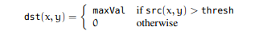

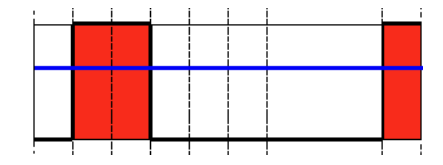

蓝线为阈值

2.Threshold Binary, Inverted

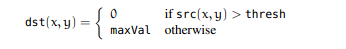

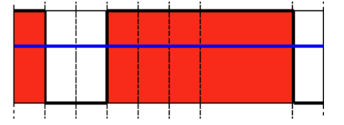

3.Truncate

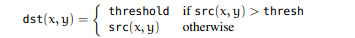

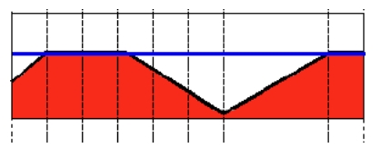

4.Threshold to Zero

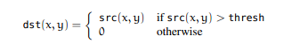

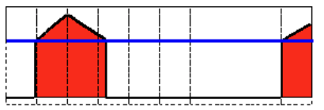

5.Threshold to Zero, Inverted

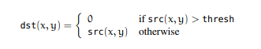

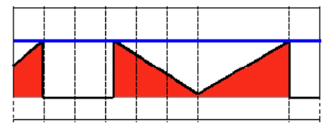

实现代码如下所示：

```cpp
    #include "opencv2/imgproc/imgproc.hpp"
    #include "opencv2/highgui/highgui.hpp"
    #include <stdlib.h>
    #include <stdio.h>

    using namespace cv;

    //全局变量

    int threshold_value = 0;
    int threshold_type = 3;;
    int const max_value = 255;
    int const max_type = 4;
    int const max_BINARY_value = 255;

    Mat src, src_gray, dst;
    char* window_name = "Threshold Demo";

    char* trackbar_type = "Type: \n 0: Binary \n 1: Binary Inverted \n 2: Truncate \n 3: To Zero \n 4: To Zero Inverted";
    char* trackbar_value = "Value";
    //函数声明
    void Threshold_Demo( int, void* );

    int main( int argc, char** argv )
    {
      //加载彩色图像
      src = imread( argv[1], 1 );

      //将彩色图像转变为灰度图
      cvtColor( src, src_gray, CV_RGB2GRAY );

      //创建用于显示结果的窗口
      namedWindow( window_name, CV_WINDOW_AUTOSIZE );

      //创建两个跟踪条分别用于选择阈值处理类型和阈值大小
      createTrackbar( trackbar_type,
              window_name, &threshold_type,
              max_type, Threshold_Demo );

      createTrackbar( trackbar_value,
              window_name, &threshold_value,
              max_value, Threshold_Demo );

      //调用函数进行初始化
      Threshold_Demo( 0, 0 );

      //等待用户按键‘ESC'结束程序
      while(true)
        {
          int c;
          c = waitKey( 20 );
          if( (char)c == 27 )
        { break; }
        }

    }

    //初始化程序
    void Threshold_Demo( int, void* )
    {
      /* 0: Binary
         1: Binary Inverted
         2: Threshold Truncated
         3: Threshold to Zero
         4: Threshold to Zero Inverted
       */

      threshold( src_gray, dst, threshold_value, max_BINARY_value,threshold_type );
      //显示处理结果
      imshow( window_name, dst );
    }
```

实验结果：

配置如图所示，同时给出了原始图像。

阈值为100,5种阈值处理类型的结果如下图所示。

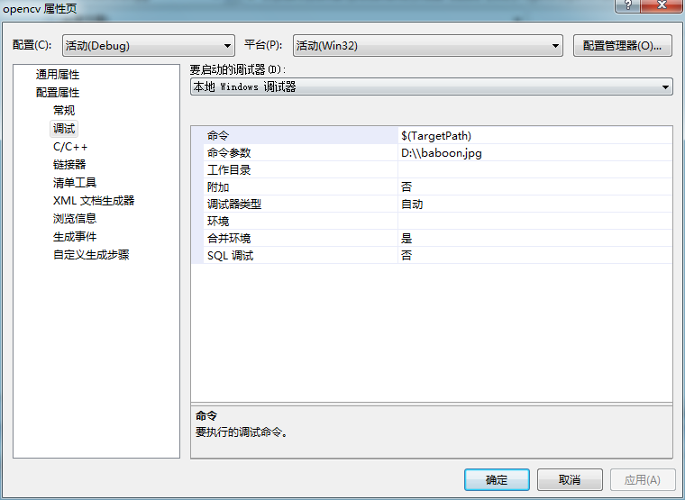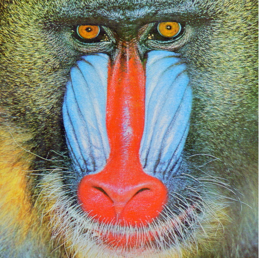

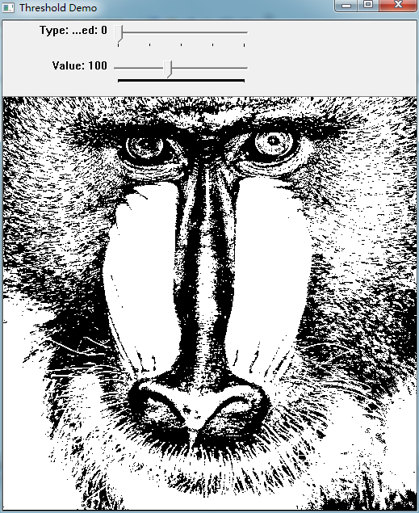

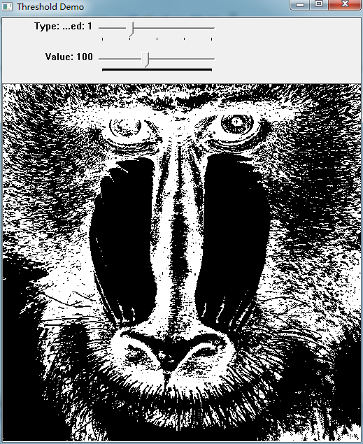

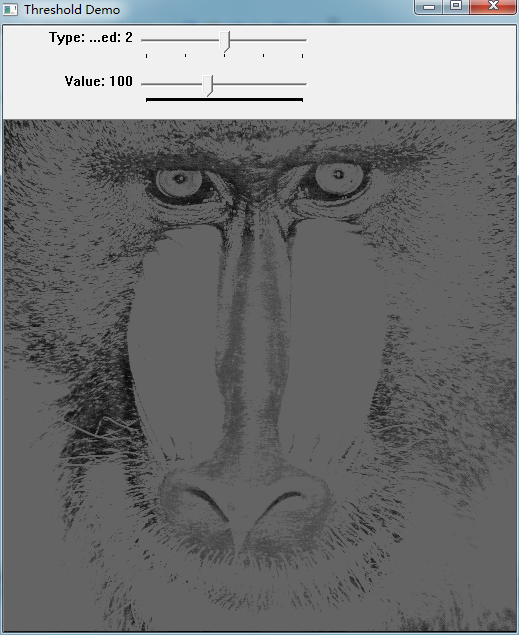

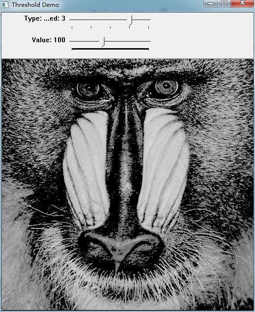

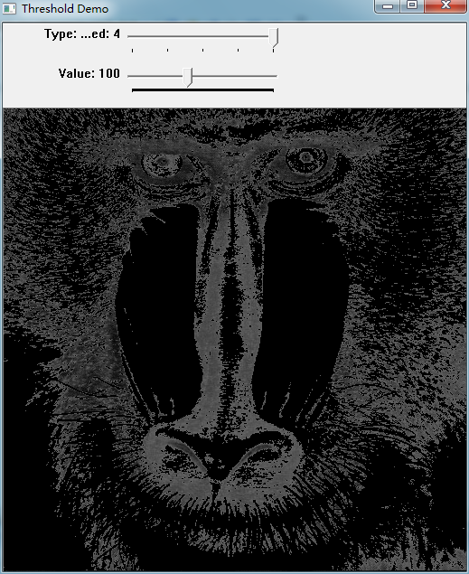

```

```
