# opencv-形态学组合运算

上一篇文章实现了图像形态学的两个基本操作：腐蚀和膨胀。本文则主要基于上文进行图像形态学的组合运算。

1.开运算

对图像进行先腐蚀后膨胀的操作就是图像的开运算。

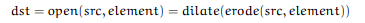  


它的功能是有利于移走黑色前景下的白色小物体。

2.闭运算

对图像进行先膨胀后腐蚀的操作就是图像的闭运算。

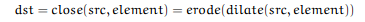  


它的功能是有利于移走黑色区域小洞。

3.形态学梯度

形态学梯度是一幅图像腐蚀和膨胀的差值。

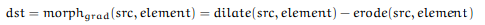  


它有利于查找图像的轮廓。

4.Top Hat

Top Hat是输入图像和它开运算的差值。

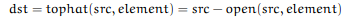  


5.Black Hat

Black Hat是输入图像和它闭运算的差值。

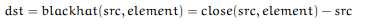  


实现代码如下所示：


```cpp
    #include "opencv2/imgproc/imgproc.hpp"
    #include "opencv2/highgui/highgui.hpp"
    #include <stdlib.h>
    #include <stdio.h>

    using namespace cv;

    //全局变量
    Mat src, dst;

    int morph_elem = 0;
    int morph_size = 0;
    int morph_operator = 0;
    int const max_operator = 4;
    int const max_elem = 2;
    int const max_kernel_size = 21;

    char* window_name = "Morphology Transformations Demo";

    //函数头文件
    void Morphology_Operations( int, void* );

    int main( int argc, char** argv )
    {
      //加载图像
      src = imread( argv[1] );

      if( !src.data )
        { return -1; }

      //创建窗口
      namedWindow( window_name, CV_WINDOW_AUTOSIZE );

      //创建跟踪条选择形态学操作
      createTrackbar("Operator:\n 0: Opening - 1: Closing  \n 2: Gradient - 3: Top Hat \n 4: Black Hat", window_name, &morph_operator, max_operator, Morphology_Operations );

      //创建跟踪条选择处理核类型
      createTrackbar( "Element:\n 0: Rect - 1: Cross - 2: Ellipse", window_name,
              &morph_elem, max_elem,
              Morphology_Operations );

      //创建跟踪条选择处理核大小
      createTrackbar( "Kernel size:\n 2n +1", window_name,
              &morph_size, max_kernel_size,
              Morphology_Operations );

      //默认配置开始复位
      Morphology_Operations( 0, 0 );

      waitKey(0);
      return 0;
    }

    void Morphology_Operations( int, void* )
    {

      // Since MORPH_X : 2,3,4,5 and 6
      //2:开运算；3:闭运算；4:梯度；5:tophat；6:blackhat
      int operation = morph_operator + 2;

      Mat element = getStructuringElement( morph_elem, Size( 2*morph_size + 1, 2*morph_size+1 ), Point( morph_size, morph_size ) );

      //应用选择的形态学操作
      morphologyEx( src, dst, operation, element );
      imshow( window_name, dst );
    }
```


图1 配置argv[1]  
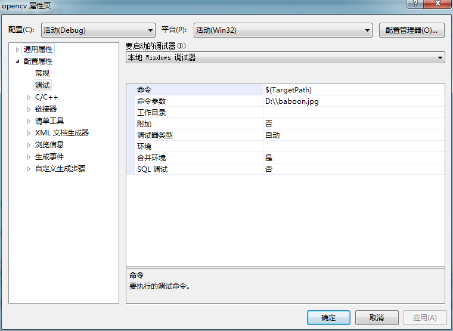  


图二原始图像

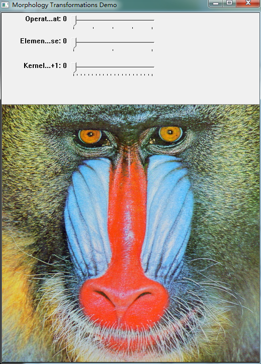  


图三 开运算结果 处理核十字形 大小设置6

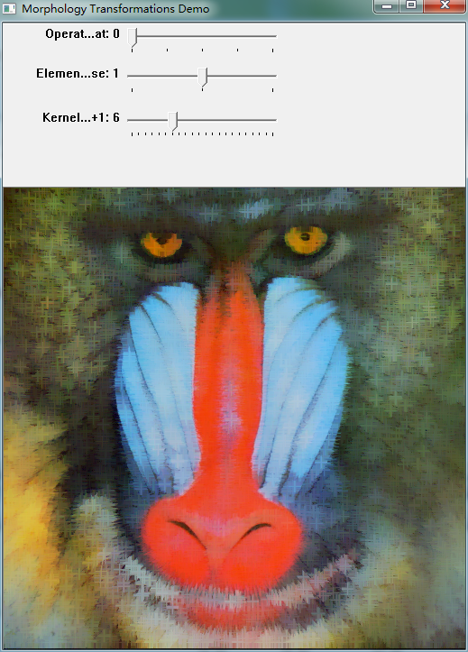  


图4 闭运算结果 处理核十字形 大小设置6

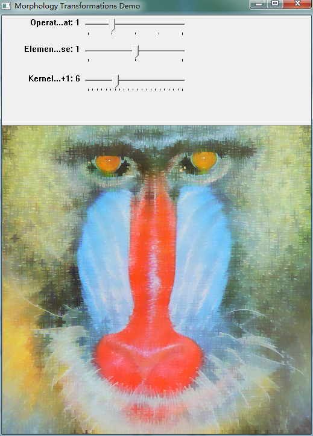  


图5 梯度运算结果 处理核十字形 大小设置6

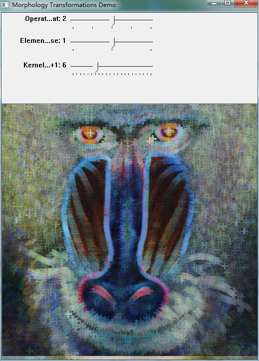  


图6 Top Hat运算结果 处理核十字形 大小设置6

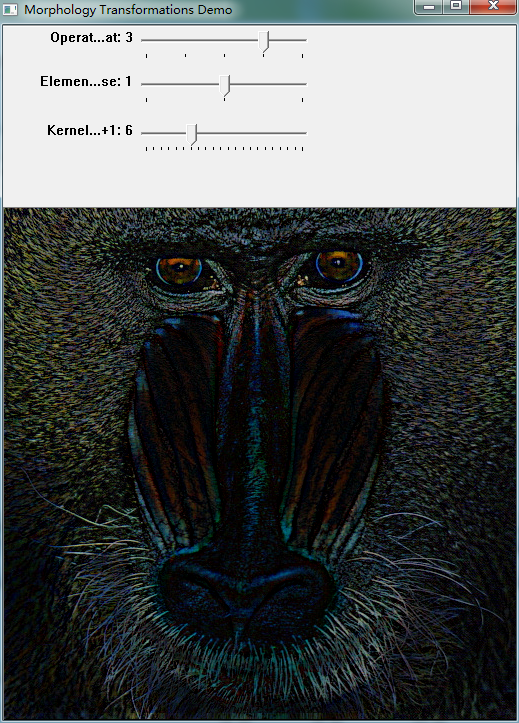  


图7 Black Hat运算结果 处理核十字形 大小设置6

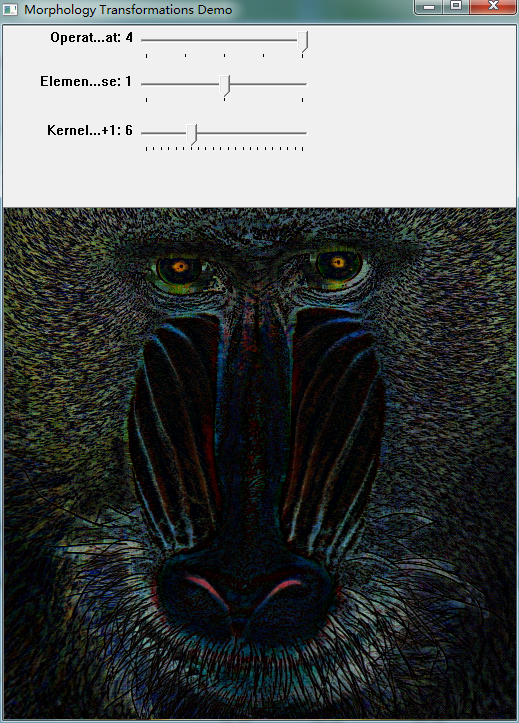  
```