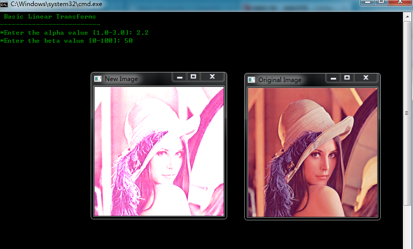

# opencv-改变图像的对比度和亮度


```cpp
    #include <cv.h>
    #include <highgui.h>
    #include <iostream>
    using namespace cv;
    using namespace std;


    double alpha; /**< Simple contrast control*/
    int beta; /**< Simple brightness control*/
    int main( int argc, char**argv )
    {
        /// Read image given by user
        Mat image = imread( "D:\\lena.bmp" );
        Mat new_image = Mat::zeros( image.size(), image.type() );
        /// Initialize values std::cout可以用cout表示，因为引入了C++的命名空间using namespace std;
        std::cout<<" Basic Linear Transforms "<<std::endl;
        std::cout<<"-------------------------"<<std::endl;
        std::cout<<"*Enter the alpha value [1.0-3.0]: ";std::cin>>alpha;
        std::cout<<"*Enter the beta value [0-100]: "; std::cin>>beta;

        /// Do the operation new_image(i,j) = alpha*image(i,j) + beta
        //方法一
        //for( int y = 0; y < image.rows; y++ )
        //{
        //    for( int x = 0; x < image.cols; x++ )
        //    {
        //        for( int c = 0; c < 3; c++ )
        //        {new_image.at<Vec3b>(y,x)[c] =saturate_cast<uchar>( alpha*( image.at<Vec3b>(y,x)[c] ) + beta );}
        //    }
        //}
        //方法二
        image.convertTo(new_image,-1,alpha,beta);

        /// Create Windows
        namedWindow("Original Image", 1);
        namedWindow("New Image", 1);
        /// Show stuff
        imshow("Original Image", image);
        imshow("New Image", new_image);
        /// Wait until user press some key
        waitKey();
        return 0;
    }
```


  
```