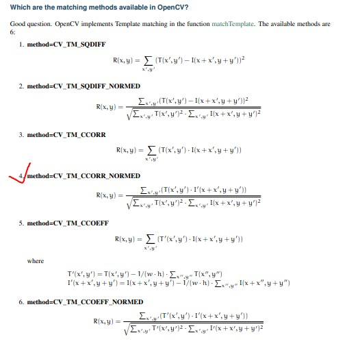
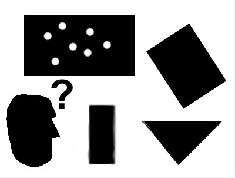
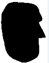
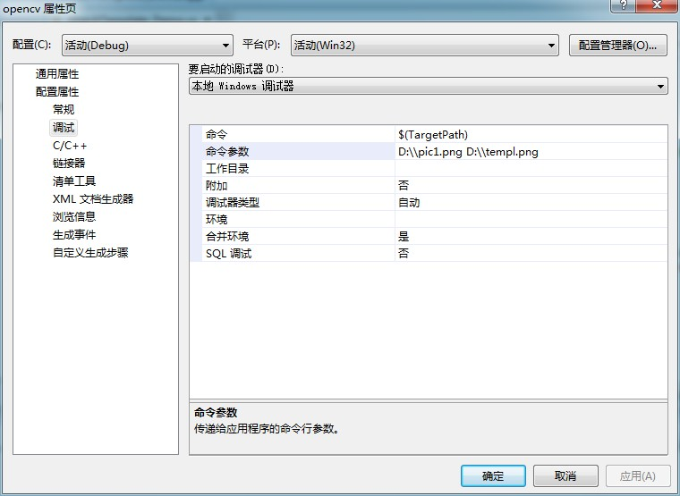
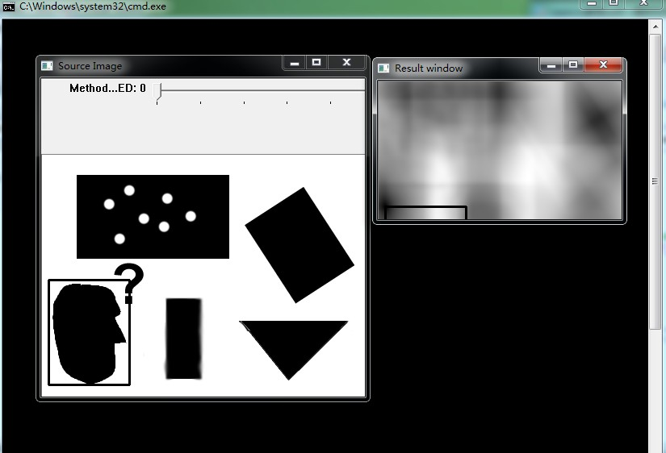

# opencv-模板匹配




```cpp
    #include "opencv2/highgui/highgui.hpp"
    #include "opencv2/imgproc/imgproc.hpp"
    #include <iostream>
    #include <stdio.h>

    using namespace std;
    using namespace cv;

    //全局变量
    Mat img; Mat templ; Mat result;
    char* image_window = "Source Image";
    char* result_window = "Result window";

    int match_method;
    int max_Trackbar = 5;

    //函数声明
    void MatchingMethod( int, void* );

    int main( int argc, char** argv )
    {
      //加载原图像和匹配模板图像
      img = imread( argv[1], 1 );
      templ = imread( argv[2], 1 );

      //创建窗口
      namedWindow( image_window, CV_WINDOW_AUTOSIZE );
      namedWindow( result_window, CV_WINDOW_AUTOSIZE );

      //创建跟踪条用于选择匹配算法
      char* trackbar_label = "Method: \n 0: SQDIFF \n 1: SQDIFF NORMED \n 2: TM CCORR \n 3: TM CCORR NORMED \n 4: TM COEFF \n 5: TM COEFF NORMED";
      createTrackbar( trackbar_label, image_window, &match_method, max_Trackbar, MatchingMethod );

      MatchingMethod( 0, 0 );

      waitKey(0);
      return 0;
    }


    void MatchingMethod( int, void* )
    {
      //复制原图像到用于显示的图像对象
      Mat img_display;
      img.copyTo( img_display );

      //创建结果矩阵
      int result_cols =  img.cols - templ.cols + 1;
      int result_rows = img.rows - templ.rows + 1;

      result.create( result_cols, result_rows, CV_32FC1 );

      //应用匹配和归一化
      matchTemplate( img, templ, result, match_method );
      normalize( result, result, 0, 1, NORM_MINMAX, -1, Mat() );

      /// Localizing the best match with minMaxLoc
      double minVal; double maxVal; Point minLoc; Point maxLoc;
      Point matchLoc;

      minMaxLoc( result, &minVal, &maxVal, &minLoc, &maxLoc, Mat() );


      /// For SQDIFF and SQDIFF_NORMED, the best matches are lower values. For all the other methods, the higher the better
      if( match_method  == CV_TM_SQDIFF || match_method == CV_TM_SQDIFF_NORMED )
        { matchLoc = minLoc; }
      else
        { matchLoc = maxLoc; }

      //显示结果
      rectangle( img_display, matchLoc, Point( matchLoc.x + templ.cols , matchLoc.y + templ.rows ), Scalar::all(0), 2, 8, 0 );
      rectangle( result, matchLoc, Point( matchLoc.x + templ.cols , matchLoc.y + templ.rows ), Scalar::all(0), 2, 8, 0 );

      imshow( image_window, img_display );
      imshow( result_window, result );

      return;
    }
```


  
  


  


  


  


  


  


  


  
```