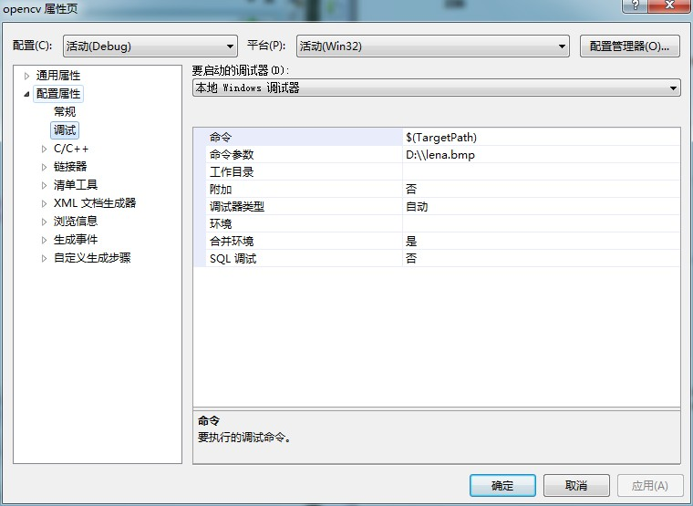
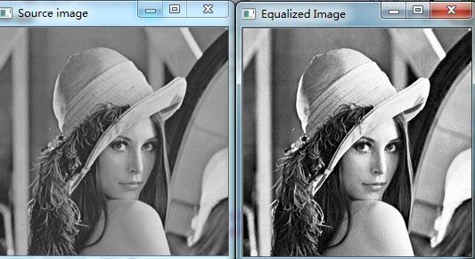

# opencv-直方图均衡化

图像进行直方图均衡化可以增强图像的对比度效果！！！


```cpp
    #include "opencv2/highgui/highgui.hpp"
    #include "opencv2/imgproc/imgproc.hpp"
    #include <iostream>
    #include <stdio.h>

    using namespace cv;
    using namespace std;

    int main( int argc, char** argv )
    {
      Mat src, dst;

      char* source_window = "Source image";
      char* equalized_window = "Equalized Image";

      //加载彩色图像
      src = imread( argv[1], 1 );

      if( !src.data )
        { cout<<"Usage: ./Histogram_Demo <path_to_image>"<<endl;
          return -1;
        }

      //把彩色图像转换为灰度图像
      cvtColor( src, src, CV_BGR2GRAY );

      //应用直方图均衡化函数
      equalizeHist( src, dst );

      //创建窗口并显示输出结果
      namedWindow( source_window, CV_WINDOW_AUTOSIZE );
      namedWindow( equalized_window, CV_WINDOW_AUTOSIZE );

      imshow( source_window, src );
      imshow( equalized_window, dst );

      //等待程序运行结束
      waitKey(0);

      return 0;

    }
```


  
  


  


  


  


  
```