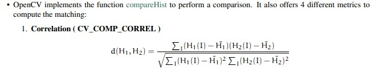
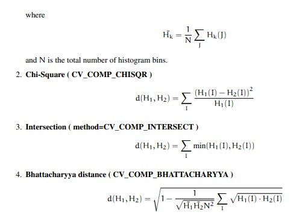
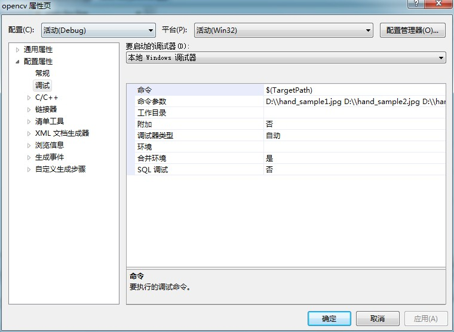
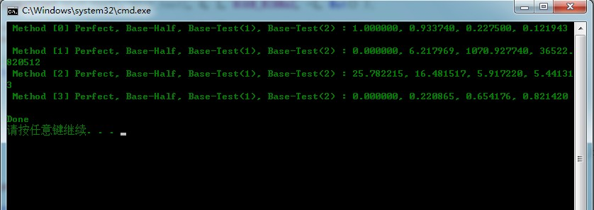

# opencv-直方图比较



  


```cpp
    #include "opencv2/highgui/highgui.hpp"
    #include "opencv2/imgproc/imgproc.hpp"
    #include <iostream>
    #include <stdio.h>

    using namespace std;
    using namespace cv;

    int main( int argc, char** argv )
    {
        Mat src_base, hsv_base;
        Mat src_test1, hsv_test1;
        Mat src_test2, hsv_test2;
        Mat hsv_half_down;

       //加载三幅不同场景的图像
       if( argc < 4 )
         { printf("** Error. Usage: ./compareHist_Demo <image_settings0> <image_setting1> <image_settings2>\n");
           return -1;
         }

       src_base = imread( argv[1], 1 );
       src_test1 = imread( argv[2], 1 );
       src_test2 = imread( argv[3], 1 );

       //把输入图像转换为HSV格式
       cvtColor( src_base, hsv_base, CV_BGR2HSV );
       cvtColor( src_test1, hsv_test1, CV_BGR2HSV );
       cvtColor( src_test2, hsv_test2, CV_BGR2HSV );

       hsv_half_down = hsv_base( Range( hsv_base.rows/2, hsv_base.rows - 1 ), Range( 0, hsv_base.cols - 1 ) );

       //用50个箱子表示色度，60个箱子表示饱和度
        int h_bins = 50; int s_bins = 60;
        int histSize[] = { h_bins, s_bins };

        // hue varies from 0 to 256, saturation from 0 to 180
        float s_ranges[] = { 0, 256 };
        float h_ranges[] = { 0, 180 };

        const float* ranges[] = { h_ranges, s_ranges };

        // Use the o-th and 1-st channels
        int channels[] = { 0, 1 };


        //用MatND存储直方图
        MatND hist_base;
        MatND hist_half_down;
        MatND hist_test1;
        MatND hist_test2;

        //计算HSV图像直方图并归一化
        calcHist( &hsv_base, 1, channels, Mat(), hist_base, 2, histSize, ranges, true, false );
        normalize( hist_base, hist_base, 0, 1, NORM_MINMAX, -1, Mat() );

        calcHist( &hsv_half_down, 1, channels, Mat(), hist_half_down, 2, histSize, ranges, true, false );
        normalize( hist_half_down, hist_half_down, 0, 1, NORM_MINMAX, -1, Mat() );

        calcHist( &hsv_test1, 1, channels, Mat(), hist_test1, 2, histSize, ranges, true, false );
        normalize( hist_test1, hist_test1, 0, 1, NORM_MINMAX, -1, Mat() );

        calcHist( &hsv_test2, 1, channels, Mat(), hist_test2, 2, histSize, ranges, true, false );
        normalize( hist_test2, hist_test2, 0, 1, NORM_MINMAX, -1, Mat() );

        //应用直方图比较算法
        for( int i = 0; i < 4; i++ )
           { int compare_method = i;
             double base_base = compareHist( hist_base, hist_base, compare_method );
             double base_half = compareHist( hist_base, hist_half_down, compare_method );
             double base_test1 = compareHist( hist_base, hist_test1, compare_method );
             double base_test2 = compareHist( hist_base, hist_test2, compare_method );

             printf( " Method [%d] Perfect, Base-Half, Base-Test(1), Base-Test(2) : %f, %f, %f, %f \n", i, base_base, base_half , base_test1, base_test2 );
           }

        printf( "Done \n" );

        return 0;
    }
```


  
  


  


  


  


  
```