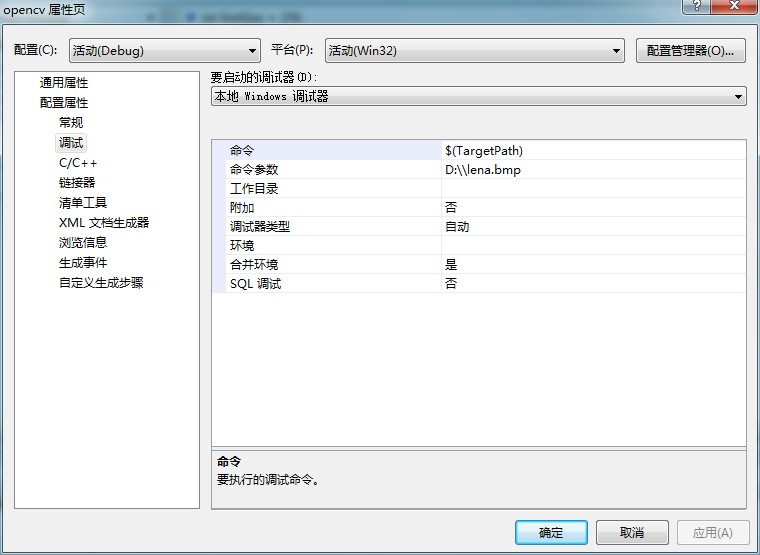
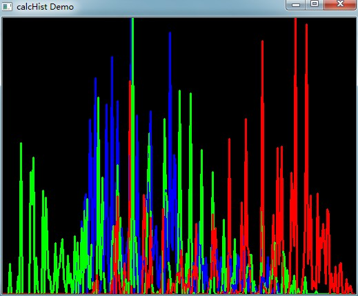

# opencv-直方图计算R,G,B

图像的直方图不单单可以表示强度值（即像素值）分布情况，还可以表示图像像素点的梯度，运动方向等信息。

dims：表示要处理的参数数目，可以是强度值，梯度值，方向值等。本文只对像素点的强度值进行计算直方图操作，故dim=1.

bins：每一个dim下亚分割的箱子个数。本文中的bins=16.

range：像素值的测量范围。本文中range=[0,255]

具体的实现过程参考一下代码，及部分注释内容，未注释的部分已经在之前的文章中有所注释。本文下面给出了原图像和程序运行结果图像。


```cpp
    #include "opencv2/highgui/highgui.hpp"
    #include "opencv2/imgproc/imgproc.hpp"
    #include <iostream>
    #include <stdio.h>

    using namespace std;
    using namespace cv;

    int main( int argc, char** argv )
    {
      Mat src, dst;

      //加载彩色图像
      src = imread( argv[1], 1 );

      if( !src.data )
        { return -1; }

      //分割图像为3个通道即：B, G and R
      vector<Mat> bgr_planes;
      split( src, bgr_planes );

      //创建箱子的数目
      int histSize = 256;

      //设置范围 ( for B,G,R) )
      float range[] = { 0, 256 } ;//不包含上界256
      const float* histRange = { range };

      //归一化，起始位置直方图清除内容
      bool uniform = true; bool accumulate = false;

      Mat b_hist, g_hist, r_hist;

      //计算每个平面的直方图
      //&bgr_planes[]原数组，1原数组个数，0只处理一个通道，
      //Mat()用于处理原来数组的掩膜，b_hist将要用来存储直方图的Mat对象
      //1直方图的空间尺寸，histsize每一维的箱子数目，histrange每一维的变化范围
      //uniform和accumulate箱子的大小一样，直方图开始的位置清除内容

      calcHist( &bgr_planes[0], 1, 0, Mat(), b_hist, 1, &histSize, &histRange, uniform, accumulate );
      calcHist( &bgr_planes[1], 1, 0, Mat(), g_hist, 1, &histSize, &histRange, uniform, accumulate );
      calcHist( &bgr_planes[2], 1, 0, Mat(), r_hist, 1, &histSize, &histRange, uniform, accumulate );

      //画直方图（ B, G and R）
      int hist_w = 512; int hist_h = 400;
      int bin_w = cvRound( (double) hist_w/histSize );

      Mat histImage( hist_h, hist_w, CV_8UC3, Scalar( 0,0,0) );

      //归一化结果为 [ 0, histImage.rows ]
      //b_hist输入数组，b_hist输出数组，
      //0和histImage.rows归一化的两端限制值，
      //NORM_MINMAX归一化类型 -1输出和输入类型一样，Mat()可选掩膜
      normalize(b_hist, b_hist, 0, histImage.rows, NORM_MINMAX, -1, Mat() );
      normalize(g_hist, g_hist, 0, histImage.rows, NORM_MINMAX, -1, Mat() );
      normalize(r_hist, r_hist, 0, histImage.rows, NORM_MINMAX, -1, Mat() );

      //为每个通道画图
      for( int i = 1; i < histSize; i++ )
      {
          line( histImage, Point( bin_w*(i-1), hist_h - cvRound(b_hist.at<float>(i-1)) ) ,
                           Point( bin_w*(i), hist_h - cvRound(b_hist.at<float>(i)) ),
                           Scalar( 255, 0, 0), 2, 8, 0  );
          line( histImage, Point( bin_w*(i-1), hist_h - cvRound(g_hist.at<float>(i-1)) ) ,
                           Point( bin_w*(i), hist_h - cvRound(g_hist.at<float>(i)) ),
                           Scalar( 0, 255, 0), 2, 8, 0  );
          line( histImage, Point( bin_w*(i-1), hist_h - cvRound(r_hist.at<float>(i-1)) ) ,
                           Point( bin_w*(i), hist_h - cvRound(r_hist.at<float>(i)) ),
                           Scalar( 0, 0, 255), 2, 8, 0  );
      }

      //显示输出结果
      namedWindow("calcHist Demo", CV_WINDOW_AUTOSIZE );
      imshow("calcHist Demo", histImage );

      waitKey(0);

      return 0;

    }
```


  
  


  


  


  


  


  
```