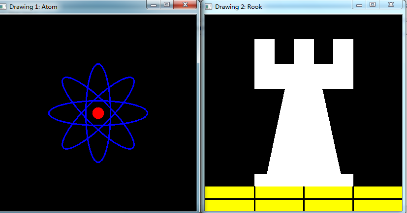

# opencv-线，椭圆，长方形（矩形），圆，填充多边形绘制


```cpp
    #include <opencv2/core/core.hpp>
    #include <opencv2/highgui/highgui.hpp>

    #define w 400

    using namespace cv;

    /// Function headers
    void MyEllipse( Mat img, double angle );
    void MyFilledCircle( Mat img, Point center );
    void MyPolygon( Mat img );
    void MyLine( Mat img, Point start, Point end );

    /**
     * @function main
     * @brief Main function
     */
    int main( int argc, char **argv ){

      /// Windows names
      char atom_window[] = "Drawing 1: Atom";
      char rook_window[] = "Drawing 2: Rook";

      /// Create black empty images
      Mat atom_image = Mat::zeros( w, w, CV_8UC3 );
      Mat rook_image = Mat::zeros( w, w, CV_8UC3 );

      /// 1. Draw a simple atom:
      /// -----------------------

      /// 1.a. Creating ellipses
      MyEllipse( atom_image, 90 );
      MyEllipse( atom_image, 0 );
      MyEllipse( atom_image, 45 );
      MyEllipse( atom_image, -45 );

      /// 1.b. Creating circles
      MyFilledCircle( atom_image, Point( w/2.0, w/2.0) );

      /// 2. Draw a rook
      /// ------------------

      /// 2.a. Create a convex polygon创建一个凸多边形
      MyPolygon( rook_image );

      /// 2.b. Creating rectangles
      rectangle( rook_image,
             Point( 0, 7*w/8.0 ),
             Point( w, w),//长方形中两个相反的顶部
             Scalar( 0, 255, 255 ),//BGR中的黄色
             -1,//这个长方形将被填充
             8 );

      /// 2.c. Create a few lines
      MyLine( rook_image, Point( 0, 15*w/16 ), Point( w, 15*w/16 ) );
      MyLine( rook_image, Point( w/4, 7*w/8 ), Point( w/4, w ) );
      MyLine( rook_image, Point( w/2, 7*w/8 ), Point( w/2, w ) );
      MyLine( rook_image, Point( 3*w/4, 7*w/8 ), Point( 3*w/4, w ) );

      /// 3. Display your stuff!
      imshow( atom_window, atom_image );
      cvMoveWindow( atom_window, 0, 200 );
      imshow( rook_window, rook_image );
      cvMoveWindow( rook_window, w, 200 );

      waitKey( 0 );
      return(0);
    }

    /// Function Declaration

    /**
     * @function MyEllipse
     * @brief Draw a fixed-size ellipse with different angles
     */
    void MyEllipse( Mat img, double angle )
    {
      int thickness = 2;
      int lineType = 8;

      ellipse( img,
           Point( w/2.0, w/2.0 ),//椭圆中心位置
           Size( w/4.0, w/16.0 ),//围绕一个大小为w/4.0,w/16.0的盒子
           angle,                 //角度旋转
           0,
           360,                     //0~360弧度
           Scalar( 255, 0, 0 ),  //BGR中的蓝色
           thickness,            //线条宽度
           lineType );
    }

    /**
     * @function MyFilledCircle
     * @brief Draw a fixed-size filled circle
     */
    void MyFilledCircle( Mat img, Point center )
    {
      int thickness = -1;
      int lineType = 8;

      circle( img,
          center,//圆中心作为指针的中心
          w/32.0,//圆半径
          Scalar( 0, 0, 255 ),//BGR中的红色
          thickness,//线条厚度值-1表示圆将被填充
          lineType );
    }

    /**
     * @function MyPolygon
     * @function Draw a simple concave polygon (rook)
     */
    void MyPolygon( Mat img )
    {
      int lineType = 8;

      /** Create some points */
      Point rook_points[1][20];
      rook_points[0][0] = Point( w/4.0, 7*w/8.0 );
      rook_points[0][1] = Point( 3*w/4.0, 7*w/8.0 );
      rook_points[0][2] = Point( 3*w/4.0, 13*w/16.0 );
      rook_points[0][3] = Point( 11*w/16.0, 13*w/16.0 );
      rook_points[0][4] = Point( 19*w/32.0, 3*w/8.0 );
      rook_points[0][5] = Point( 3*w/4.0, 3*w/8.0 );
      rook_points[0][6] = Point( 3*w/4.0, w/8.0 );
      rook_points[0][7] = Point( 26*w/40.0, w/8.0 );
      rook_points[0][8] = Point( 26*w/40.0, w/4.0 );
      rook_points[0][9] = Point( 22*w/40.0, w/4.0 );
      rook_points[0][10] = Point( 22*w/40.0, w/8.0 );
      rook_points[0][11] = Point( 18*w/40.0, w/8.0 );
      rook_points[0][12] = Point( 18*w/40.0, w/4.0 );
      rook_points[0][13] = Point( 14*w/40.0, w/4.0 );
      rook_points[0][14] = Point( 14*w/40.0, w/8.0 );
      rook_points[0][15] = Point( w/4.0, w/8.0 );
      rook_points[0][16] = Point( w/4.0, 3*w/8.0 );
      rook_points[0][17] = Point( 13*w/32.0, 3*w/8.0 );
      rook_points[0][18] = Point( 5*w/16.0, 13*w/16.0 );
      rook_points[0][19] = Point( w/4.0, 13*w/16.0) ;

      const Point* ppt[1] = { rook_points[0] };
      int npt[] = { 20 };

      fillPoly( img,
            ppt,//一个多边形的顶点数为点集ppt个数
            npt,//将要绘制的顶点数目
                1,//将要绘制的多边形数目只有一个
            Scalar( 255, 255, 255 ),//BGR值白色
            lineType );
    }

    /**
     * @function MyLine
     * @brief Draw a simple line
     */
    void MyLine( Mat img, Point start, Point end )
    {
      int thickness = 2;
      int lineType = 8;//8点连接线
      line( img,
        start,
        end,
        Scalar( 0, 0, 0 ),//线条颜色为RGB中的黑色
        thickness,
        lineType );
    }
```


  
```