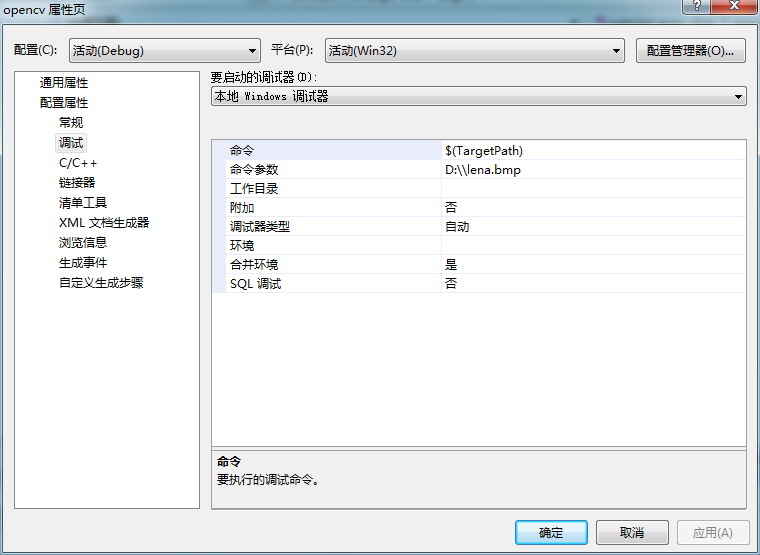

# opencv-线性滤波器filer2D


```cpp
    #include "opencv2/imgproc/imgproc.hpp"
    #include "opencv2/highgui/highgui.hpp"
    #include <stdlib.h>
    #include <stdio.h>
    using namespace cv;

    int main ( int argc, char** argv )
    {
      //变量声明
      Mat src, dst;

      Mat kernel;
      Point anchor;
      double delta;
      int ddepth;
      int kernel_size;
      char* window_name = "filter2D Demo";

      int c;

      //加载图像
      src = imread( argv[1] );

      if( !src.data )
        { return -1; }

      //创建窗口
      namedWindow( window_name, CV_WINDOW_AUTOSIZE );

      //为滤波器初始化
      anchor = Point( -1, -1 );//anchor点默认位置在处理核窗口中心
      delta = 0;               //卷积操作时加在图像每个像素点上的值，默认为0
      ddepth = -1;             //负数表示，处理结果图像和原始图像深度一样

      // Loop - Will filter the image with different kernel sizes each 0.5 seconds
      int ind = 0;
      while( true )
           {
             c = waitKey(500);
             // Press 'ESC' to exit the program
             if( (char)c == 27 )
               { break; }

             // Update kernel size for a normalized box filter
             kernel_size = 3 + 2*( ind%5 );//保证处理核大小为[3,11]的奇数
             kernel = Mat::ones( kernel_size, kernel_size, CV_32F )/ (float)(kernel_size*kernel_size);

             //使用滤波器处理
             filter2D(src, dst, ddepth , kernel, anchor, delta, BORDER_DEFAULT );
             imshow( window_name, dst );
             ind++;
           }

      return 0;
    }
```




  


  


  
```