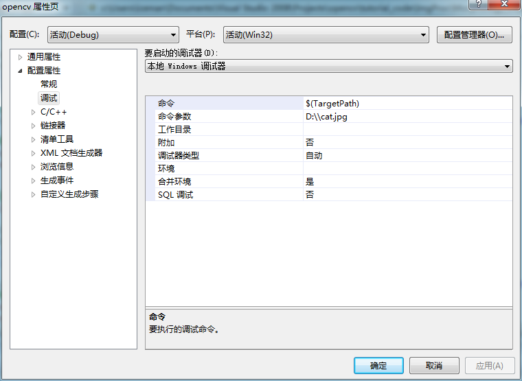
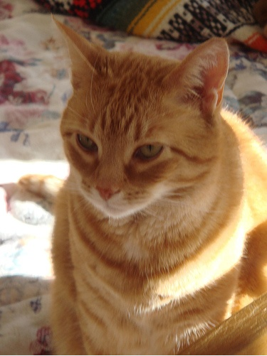
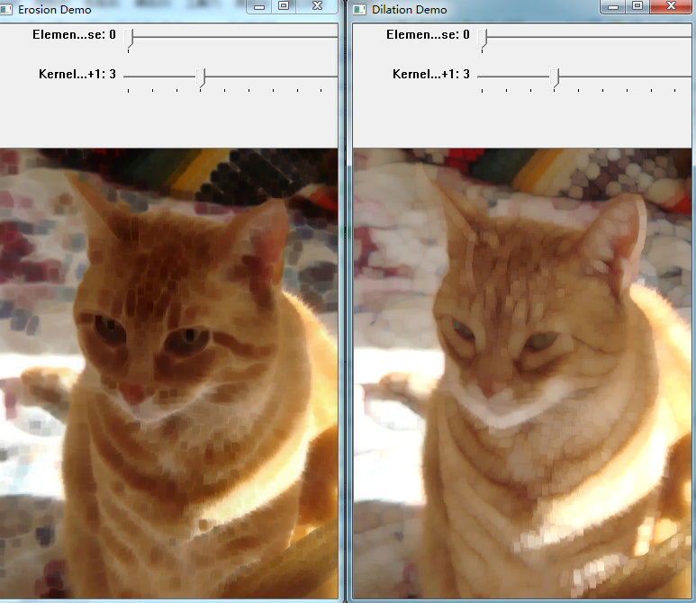

# opencv-腐蚀和膨胀

两个基本的形态学操作：腐蚀和膨胀！其作用如下所述：

1.去除噪声

2.孤立图像中的元素，向图像中添加独立的元素

3.查找图像中的强度空洞

实现代码如下：


```cpp
    #include "opencv2/imgproc/imgproc.hpp"
    #include "opencv2/highgui/highgui.hpp"
    #include "highgui.h"
    #include <stdlib.h>
    #include <stdio.h>

    using namespace cv;

    //全局变量
    Mat src, erosion_dst, dilation_dst;

    int erosion_elem = 0;
    int erosion_size = 0;
    int dilation_elem = 0;
    int dilation_size = 0;
    int const max_elem = 2;
    int const max_kernel_size = 21;

    //函数头声明
    void Erosion( int, void* );
    void Dilation( int, void* );

    int main( int argc, char** argv )
    {
      //加载图像
      src = imread( argv[1] );
      if( !src.data )
        { return -1; }

      //创建显示窗口
      namedWindow( "Erosion Demo", CV_WINDOW_AUTOSIZE );
      namedWindow( "Dilation Demo", CV_WINDOW_AUTOSIZE );
      cvMoveWindow( "Dilation Demo", src.cols, 0 );


      //创建腐蚀跟踪条
      createTrackbar( "Element:\n 0: Rect \n 1: Cross \n 2: Ellipse", "Erosion Demo", &erosion_elem, max_elem,Erosion );
      createTrackbar( "Kernel size:\n 2n +1", "Erosion Demo",  &erosion_size, max_kernel_size, Erosion );


      //创建膨胀跟踪条
      createTrackbar( "Element:\n 0: Rect \n 1: Cross \n 2: Ellipse", "Dilation Demo", &dilation_elem, max_elem, Dilation );
      createTrackbar( "Kernel size:\n 2n +1", "Dilation Demo",&dilation_size, max_kernel_size,Dilation );

      //默认重置开始
      Erosion( 0, 0 );
      Dilation( 0, 0 );

      waitKey(0);
      return 0;
    }

    //腐蚀函数
    void Erosion( int, void* )
    {
      int erosion_type;
      if( erosion_elem == 0 ){ erosion_type = MORPH_RECT; }//长方形
      else if( erosion_elem == 1 ){ erosion_type = MORPH_CROSS; }//十字形
      else if( erosion_elem == 2) { erosion_type = MORPH_ELLIPSE;}//椭圆

      //erosin_type腐蚀类型，size处理核窗口大小，point锚点，即定位处理像素点
      Mat element = getStructuringElement( erosion_type,Size( 2*erosion_size + 1, 2*erosion_size+1 ), Point( erosion_size, erosion_size ) );

      //应用腐蚀操作element默认使用3*3的处理核窗口
      erode( src, erosion_dst, element );
      imshow( "Erosion Demo", erosion_dst );
    }

    //膨胀函数
    void Dilation( int, void* )
    {
      int dilation_type;
      if( dilation_elem == 0 ){ dilation_type = MORPH_RECT; }
      else if( dilation_elem == 1 ){ dilation_type = MORPH_CROSS; }
      else if( dilation_elem == 2) { dilation_type = MORPH_ELLIPSE; }

      Mat element = getStructuringElement( dilation_type,Size( 2*dilation_size + 1, 2*dilation_size+1 ), Point( dilation_size, dilation_size ) );
      //应用膨胀操作
      dilate( src, dilation_dst, element );
      imshow( "Dilation Demo", dilation_dst );
    }
```




  




  


  
  
```