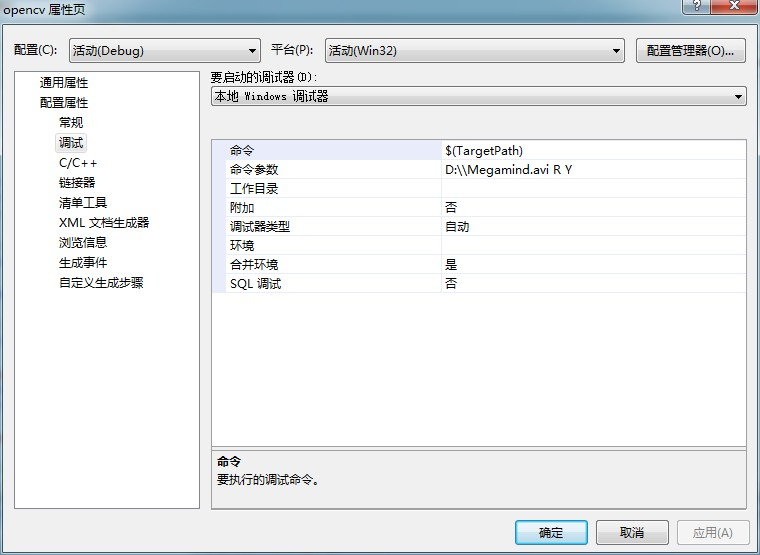
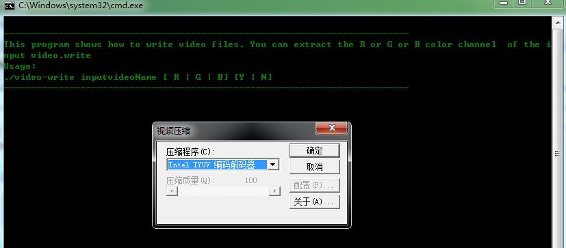
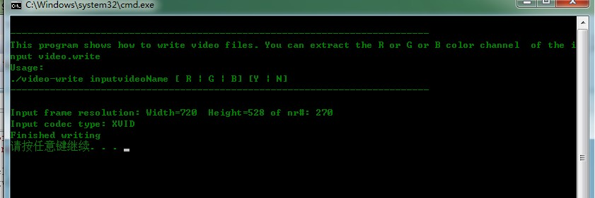
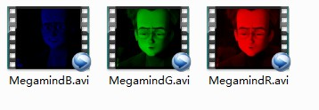

# opencv-视频输出


```cpp
    #include <iostream>    // for standard I/O
    #include <string>   // for strings

    #include <opencv2/core/core.hpp>        // Basic OpenCV structures (cv::Mat)
    #include <opencv2/highgui/highgui.hpp>  // Video write

    using namespace std;
    using namespace cv;

    void help()
    {
        cout
            << "\n--------------------------------------------------------------------------" << endl
            << "This program shows how to write video files. You can extract the R or G or B color channel "
            << " of the input video.write "  << endl
            << "Usage:"                                                               << endl
            << "./video-write inputvideoName [ R | G | B] [Y | N]"                   << endl
            << "--------------------------------------------------------------------------"   << endl
            << endl;
    }
    int main(int argc, char *argv[], char *window_name)
    {
        help();
        if (argc != 4)
        {
            cout << "Not enough parameters" << endl;
            return -1;
        }

        const string source      = argv[1];           // 输入视频名字
        const bool askOutputType = argv[3][0] =='Y';  // If false it will use the inputs codec type

        VideoCapture inputVideo(source);        //打开输入视频
        if ( !inputVideo.isOpened())
        {
            cout  << "Could not open the input video." << source << endl;
            return -1;
        }

        string::size_type pAt = source.find_last_of('.');   // 查找扩展点
        const string NAME = source.substr(0, pAt) + argv[2][0] + ".avi";   // 生成存储器的新名字
        int ex = static_cast<int>(inputVideo.get(CV_CAP_PROP_FOURCC));     // 获得编解码类型

        // 比特操作把int转换为char
        char EXT[] = {ex & 0XFF , (ex & 0XFF00) >> 8,(ex & 0XFF0000) >> 16,(ex & 0XFF000000) >> 24, 0};

        Size S = Size((int) inputVideo.get(CV_CAP_PROP_FRAME_WIDTH),    //获得输入视频大小
                      (int) inputVideo.get(CV_CAP_PROP_FRAME_HEIGHT));

        VideoWriter outputVideo;                                        //打开输出视频
        if (askOutputType)
                outputVideo.open(NAME  , ex=-1, inputVideo.get(CV_CAP_PROP_FPS),S, true);
        else
            outputVideo.open(NAME , ex, inputVideo.get(CV_CAP_PROP_FPS),S, true);

        if (!outputVideo.isOpened())
        {
            cout  << "Could not open the output video for write: " << source << endl;
            return -1;
        }

        union { int v; char c[5];} uEx ;
        uEx.v = ex;                              // 通过union函数，把char转换为int
        uEx.c[4]='\0';

        cout << "Input frame resolution: Width=" << S.width << "  Height=" << S.height
            << " of nr#: " << inputVideo.get(CV_CAP_PROP_FRAME_COUNT) << endl;
        cout << "Input codec type: " << EXT << endl;

        int channel = 2;    // 选择保存通道 B,R,G
        switch(argv[2][0])
        {
        case 'R' : {channel = 2; break;}
        case 'G' : {channel = 1; break;}
        case 'B' : {channel = 0; break;}
        }
        Mat src,res;
        vector<Mat> spl;

        while( true) //Show the image captured in the window and repeat
        {
            inputVideo >> src;              // read
            if( src.empty()) break;         // check if at end

           split(src, spl);                 // process - extract only the correct channel
           for( int i =0; i < 3; ++i)
            if (i != channel)
               spl[i] = Mat::zeros(S, spl[0].type());
           merge(spl, res);

           //outputVideo.write(res); //save or
           outputVideo << res;
        }

        cout << "Finished writing" << endl;
        return 0;
    }
```


  


  


  


  


  


  


  


  


  


  


  


  


  
```