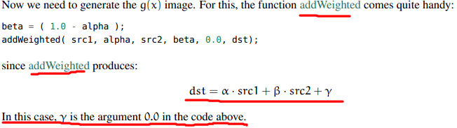

# opencv-输入两幅图像实现线性融合


```cpp
    #include <cv.h>
    #include <highgui.h>
    #include <iostream>
    using namespace cv;
    using namespace std;

    int main()
    {
        double alpha = 0.5;double beta;double input;

        Mat src1,src2,dst;

        cout<<"Simple linear blender"<<endl;
        cout<<"---------------------"<<endl;
        cout<<"*Enter alpha [0-1]: "<<endl;
        cin>>input;

        if (alpha>=0&&alpha<=1)
        {
            alpha=input;
        }

        src1 = imread("G:\\LinuxLogo.jpg");
        src2 = imread("G:\\WindowsLogo.jpg");

        namedWindow("src1",WINDOW_AUTOSIZE);
        namedWindow("src2",WINDOW_AUTOSIZE);
        namedWindow("Linear Blend",1);

        beta = (1.0 - alpha);
        addWeighted(src1,alpha,src2,beta,0.0,dst);

        imshow("src1",src1);
        imshow("src2",src2);
        imshow("Linear Blend",dst);
        waitKey(0);

        return 0;

    }
```


  
```