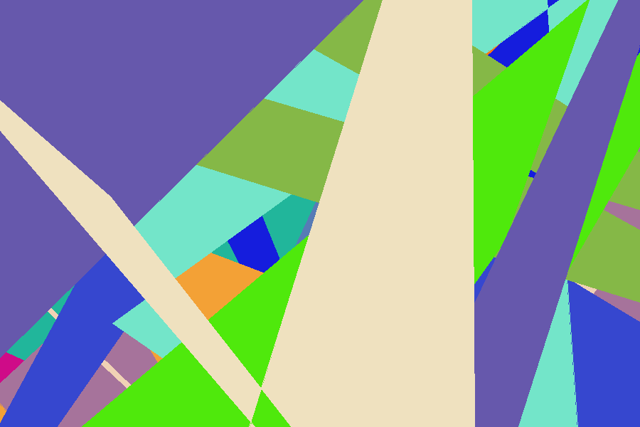
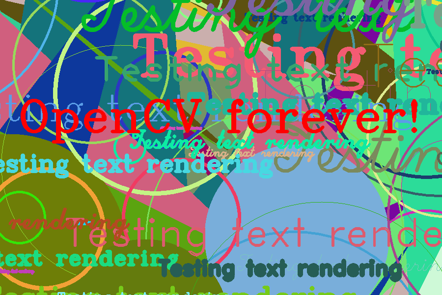

# opencv-随机生成器和文本操作

**本文主要用opencv2.4.3随机函数实现生成线条，矩形，椭圆，折线，填充多边形，以及在运行窗口中显示文本的功能。**


```cpp
****


    #include <opencv2/core/core.hpp>
    #include <opencv2/highgui/highgui.hpp>
    #include <iostream>
    #include <stdio.h>

    using namespace cv;

    //全局变量
    const int NUMBER = 100;
    const int DELAY = 5; //静态变量

    const int window_width = 900;
    const int window_height = 600;//静态变量

    int x_1 = -window_width/2;
    int x_2 = window_width*3/2;
    int y_1 = -window_width/2;
    int y_2 = window_width*3/2;

    //函数头声明
    static Scalar randomColor( RNG& rng );
    int Drawing_Random_Lines( Mat image, char* window_name, RNG rng );
    int Drawing_Random_Rectangles( Mat image, char* window_name, RNG rng );
    int Drawing_Random_Ellipses( Mat image, char* window_name, RNG rng );
    int Drawing_Random_Polylines( Mat image, char* window_name, RNG rng );
    int Drawing_Random_Filled_Polygons( Mat image, char* window_name, RNG rng );
    int Drawing_Random_Circles( Mat image, char* window_name, RNG rng );
    int Displaying_Random_Text( Mat image, char* window_name, RNG rng );
    int Displaying_Big_End( Mat image, char* window_name, RNG rng );


    /**
     * @function main
     */
    int main( int argc, char** argv )
    {
      int c;

      //创建一个窗口
      char window_name[] = "Drawing_2 Tutorial";

      //创建一个随机对象rng
      RNG rng( 0xFFFFFFFF );

      //用零初始化矩阵，即窗口背景为黑色
      Mat image = Mat::zeros( window_height, window_width, CV_8UC3 );
      //在窗口显示并延时
      imshow( window_name, image );
      waitKey( DELAY );

      //===开始画图===
      //先画一些线条
      c = Drawing_Random_Lines(image, window_name, rng);
      if( c != 0 ) return 0;

      //再画一个矩形
      c = Drawing_Random_Rectangles(image, window_name, rng);
      if( c != 0 ) return 0;

      //画一些椭圆
      c = Drawing_Random_Ellipses( image, window_name, rng );
      if( c != 0 ) return 0;

      //现在画一些折线
      c = Drawing_Random_Polylines( image, window_name, rng );
      if( c != 0 ) return 0;

      //画填充多边形
      c = Drawing_Random_Filled_Polygons( image, window_name, rng );
      if( c != 0 ) return 0;

      //画圆
      c = Drawing_Random_Circles( image, window_name, rng );
      if( c != 0 ) return 0;

      //在随机位置显示文本
      c = Displaying_Random_Text( image, window_name, rng );
      if( c != 0 ) return 0;

      //显示结束
      c = Displaying_Big_End( image, window_name, rng );
      if( c != 0 ) return 0;

      waitKey(0);
      return 0;
    }

    //函数定义

    /**
     * @function randomColor
     * @brief Produces a random color given a random object
     */
    static Scalar randomColor( RNG& rng )
    {
      int icolor = (unsigned) rng;
      //Scalar函数里面的三个参数对应R,G,B
      return Scalar( icolor&255, (icolor>>8)&255, (icolor>>16)&255 );
    }


    /**
     * @function Drawing_Random_Lines
     */
    int Drawing_Random_Lines( Mat image, char* window_name, RNG rng )
    {
      int lineType = 8;
      Point pt1, pt2;

      for( int i = 0; i < NUMBER; i++ )
      {
        //rng.unifor(a,b)在即在闭区间[a,b]内随机分配一个数值
        pt1.x = rng.uniform( x_1, x_2 );
        pt1.y = rng.uniform( y_1, y_2 );
        pt2.x = rng.uniform( x_1, x_2 );
        pt2.y = rng.uniform( y_1, y_2 );

        //randomColor(rng)随机为rng分配一种颜色
        line( image, pt1, pt2, randomColor(rng), rng.uniform(1, 10), 8 );

        imshow( window_name, image );

        //延时等待循环
        if( waitKey( DELAY ) >= 0 )
          { return -1; }
      }

      return 0;
    }

    /**
     * @function Drawing_Rectangles
     */
    int Drawing_Random_Rectangles( Mat image, char* window_name, RNG rng )
    {
      Point pt1, pt2;
      int lineType = 8;
      int thickness = rng.uniform( -3, 10 );

      for( int i = 0; i < NUMBER; i++ )
      {
        pt1.x = rng.uniform( x_1, x_2 );
        pt1.y = rng.uniform( y_1, y_2 );
        pt2.x = rng.uniform( x_1, x_2 );
        pt2.y = rng.uniform( y_1, y_2 );

        rectangle( image, pt1, pt2, randomColor(rng), MAX( thickness, -1 ), lineType );

        imshow( window_name, image );
        if( waitKey( DELAY ) >= 0 )
          { return -1; }
      }

      return 0;
    }

    /**
     * @function Drawing_Random_Ellipses
     */
    int Drawing_Random_Ellipses( Mat image, char* window_name, RNG rng )
    {
      int lineType = 8;

      for ( int i = 0; i < NUMBER; i++ )
      {
        Point center;
        center.x = rng.uniform(x_1, x_2);
        center.y = rng.uniform(y_1, y_2);

        Size axes;
        axes.width = rng.uniform(0, 200);
        axes.height = rng.uniform(0, 200);

        double angle = rng.uniform(0, 180);

        ellipse( image, center, axes, angle, angle - 100, angle + 200,
                 randomColor(rng), rng.uniform(-1,9), lineType );

        imshow( window_name, image );

        if( waitKey(DELAY) >= 0 )
          { return -1; }
      }

      return 0;
    }

    /**
     * @function Drawing_Random_Polylines
     */
    int Drawing_Random_Polylines( Mat image, char* window_name, RNG rng )
    {
      int lineType = 8;

      for( int i = 0; i< NUMBER; i++ )
      {
        Point pt[2][3];
        pt[0][0].x = rng.uniform(x_1, x_2);
        pt[0][0].y = rng.uniform(y_1, y_2);
        pt[0][1].x = rng.uniform(x_1, x_2);
        pt[0][1].y = rng.uniform(y_1, y_2);
        pt[0][2].x = rng.uniform(x_1, x_2);
        pt[0][2].y = rng.uniform(y_1, y_2);
        pt[1][0].x = rng.uniform(x_1, x_2);
        pt[1][0].y = rng.uniform(y_1, y_2);
        pt[1][1].x = rng.uniform(x_1, x_2);
        pt[1][1].y = rng.uniform(y_1, y_2);
        pt[1][2].x = rng.uniform(x_1, x_2);
        pt[1][2].y = rng.uniform(y_1, y_2);

        const Point* ppt[2] = {pt[0], pt[1]};
        int npt[] = {3, 3};

        polylines(image, ppt, npt, 2, true, randomColor(rng), rng.uniform(1,10), lineType);

        imshow( window_name, image );
        if( waitKey(DELAY) >= 0 )
          { return -1; }
      }
      return 0;
    }

    /**
     * @function Drawing_Random_Filled_Polygons
     */
    int Drawing_Random_Filled_Polygons( Mat image, char* window_name, RNG rng )
    {
      int lineType = 8;

      for ( int i = 0; i < NUMBER; i++ )
      {
        Point pt[2][3];
        pt[0][0].x = rng.uniform(x_1, x_2);
        pt[0][0].y = rng.uniform(y_1, y_2);
        pt[0][1].x = rng.uniform(x_1, x_2);
        pt[0][1].y = rng.uniform(y_1, y_2);
        pt[0][2].x = rng.uniform(x_1, x_2);
        pt[0][2].y = rng.uniform(y_1, y_2);
        pt[1][0].x = rng.uniform(x_1, x_2);
        pt[1][0].y = rng.uniform(y_1, y_2);
        pt[1][1].x = rng.uniform(x_1, x_2);
        pt[1][1].y = rng.uniform(y_1, y_2);
        pt[1][2].x = rng.uniform(x_1, x_2);
        pt[1][2].y = rng.uniform(y_1, y_2);

        const Point* ppt[2] = {pt[0], pt[1]};
        int npt[] = {3, 3};

        fillPoly( image, ppt, npt, 2, randomColor(rng), lineType );

        imshow( window_name, image );
        if( waitKey(DELAY) >= 0 )
           { return -1; }
      }
      return 0;
    }

    /**
     * @function Drawing_Random_Circles
     */
    int Drawing_Random_Circles( Mat image, char* window_name, RNG rng )
    {
      int lineType = 8;

      for (int i = 0; i < NUMBER; i++)
      {
        Point center;
        center.x = rng.uniform(x_1, x_2);
        center.y = rng.uniform(y_1, y_2);

        circle( image, center, rng.uniform(0, 300), randomColor(rng),
                rng.uniform(-1, 9), lineType );

        imshow( window_name, image );
        if( waitKey(DELAY) >= 0 )
          { return -1; }
      }

      return 0;
    }

    /**
     * @function Displaying_Random_Text
     */
    int Displaying_Random_Text( Mat image, char* window_name, RNG rng )
    {
      int lineType = 8;

      for ( int i = 1; i < NUMBER; i++ )
      {
        Point org;
        org.x = rng.uniform(x_1, x_2);
        org.y = rng.uniform(y_1, y_2);

        //把"Testing text rendering"放在图片上，文本的左下角确定在点org,
        //字体大小在[0,8]整数范围随机分配，可扩展范围[0.1,5,1]
        //文本颜色随机分配，文字厚度在[1,10]随机分配，可扩展范围[1,10].
        putText( image, "Testing text rendering", org, rng.uniform(0,8),
                 rng.uniform(0,100)*0.05+0.1, randomColor(rng), rng.uniform(1, 10), lineType);

        imshow( window_name, image );
        if( waitKey(DELAY) >= 0 )
          { return -1; }
      }

      return 0;
    }

    /**
     * @function Displaying_Big_End
     */
    int Displaying_Big_End( Mat image, char* window_name, RNG rng )
    {
      //getTextSize函数获得文本参数的大小
      Size textsize = getTextSize("OpenCV forever!", CV_FONT_HERSHEY_COMPLEX, 3, 5, 0);
      Point org((window_width - textsize.width)/2, (window_height - textsize.height)/2);
      int lineType = 8;

      Mat image2;

      for( int i = 0; i < 255; i += 2 )
      {
        //imge2为原始图像和Scalar::all(i)对应像素点的差值，常用语饱和操作的中间变量
        image2 = image - Scalar::all(i);
        putText( image2, "OpenCV forever!", org, CV_FONT_HERSHEY_COMPLEX, 3,
                 Scalar(i, i, 255), 5, lineType );

        imshow( window_name, image2 );
        if( waitKey(DELAY) >= 0 )
           { return -1; }
      }

      return 0;
    }
```


  
  


  


  


  
```