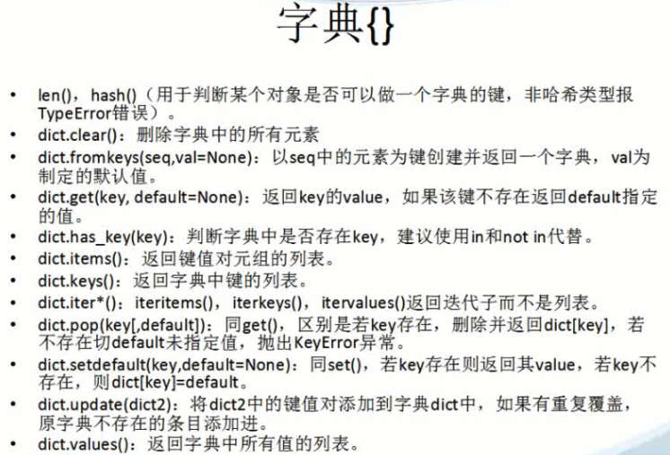

# python--数据类型

**python数据类型**

Type()：查看数据类型

数字：整型(int范围-2147483648到2147483647)、长整型(123l或者123L)、浮点型、复数型(3.14j)


```
    user1@ubuntu:~$ su
    Password:
    root@ubuntu:/home/user1# cd ~
    root@ubuntu:~# cd csvtpy/
    root@ubuntu:~/csvtpy# python
    Python 2.7.3 (default, Apr 10 2013, 06:20:15)
    [GCC 4.6.3] on linux2
    Type "help", "copyright", "credits" or "license" for more information.
    >>> exit()
    root@ubuntu:~/csvtpy# ls
    1.py  1.pyc  1.pyo  2.py  3.py
    root@ubuntu:~/csvtpy# python
    Python 2.7.3 (default, Apr 10 2013, 06:20:15)
    [GCC 4.6.3] on linux2
    Type "help", "copyright", "credits" or "license" for more information.
    >>> num1=123
    >>> type(123)
    <type 'int'>
    >>> type(num1)
    <type 'int'>
    >>> num2=99999999999999999999999999
    >>> type(num2)
    <type 'long'>
    >>> num3=123l
    >>> type(num3)
    <type 'long'>
    >>> num3=123L
    >>> type(num3)
    <type 'long'>
    >>>
```


  


字符串、元组和列表都是序列！！！

字符串和元组不可变，即不能修改其内部元素的值。

序列两个特点就是索引操作和切片操作。

索引操作符：[0]取第一个，[-1]取倒数第一个

切片操作符：[a:b:c]数字a、b和c可选，冒号必须的。a和b为切片范围，c为步长，默认为1.

序列基本操作：

Len():求序列长度

\+ :连接两个序列

*:重复序列元素

in:判断元素是否在序列中

max():返回序列中最大值

min():返回序列中最小值

cmp(tuple1,tuple2):比较两个序列值是否相同，1:前者大于后者，-1:前者小于后者，0:两个相等。

字符串：使用引号定义的一组可以包含数字、字母、符号(非特殊系统符号)的集合。

A=’i love u’

B=”I love you”,B1=”it’s ok!”

C=”””I LOVE YOU!”””

三重引号(docstring)通常用来制作字符串。

转义字符：\”\n等


```
    user1@ubuntu:~$ su
    Password:
    root@ubuntu:/home/user1# cd ~
    root@ubuntu:~# cd csvtpy/
    root@ubuntu:~/csvtpy# python
    Python 2.7.3 (default, Apr 10 2013, 06:20:15)
    [GCC 4.6.3] on linux2
    Type "help", "copyright", "credits" or "license" for more information.
    >>> f1=12
    >>> type(f1)
    <type 'int'>
    >>> f1=12.0
    >>> type(f1)
    <type 'float'>
    >>> 5/1
    5
    >>> 5/2
    2
    >>> 5.0/2
    2.5
    >>> c=3.14
    >>> type(c)
    <type 'float'>
    >>> c=3.14j
    >>> type(c)
    <type 'complex'>
    >>>
    >>> a=123
    >>> stra="123"
    >>> print a
    123
    >>> print stra
    123
    >>> a+stra
    Traceback (most recent call last):
      File "<stdin>", line 1, in <module>
    TypeError: unsupported operand type(s) for +: 'int' and 'str'
    >>> type(stra)
    <type 'str'>
    >>> type(a)
    <type 'int'>
    >>> str1='hello world'
    >>> type(str1)
    <type 'str'>
    >>> str2="hello world"
    >>> type(str2)
    <type 'str'>
    >>> str1
    'hello world'
    >>> str2
    'hello world'
    >>> say='let's go.'
      File "<stdin>", line 1
        say='let's go.'
                 ^
    SyntaxError: invalid syntax
    >>> say="let's go."
    >>> say
    "let's go."
    >>> print say
    let's go.
    >>> say="let's \" go.\""
    >>> say
    'let\'s " go."'
    >>>
    >>> mail='tom: hello i am jack'
    >>> print mail
    tom: hello i am jack
    >>> mail='tom:\n hello\n i am jack'
    >>> print mail
    tom:
     hello
     i am jack
    >>> mail
    'tom:\n hello\n i am jack'
    >>> mail="""tom:
    ...    i am jack
    ...    goodbye
    ... """
    >>> print mail
    tom:
       i am jack
       goodbye

    >>> mail
    'tom:\n   i am jack\n   goodbye\n'
    >>> a='abcde'
    >>> a[0]
    'a'
    >>> a[1]
    'b'
    >>> a[0]+a[1]
    'ab'
    >>> a
    'abcde'
    >>> a[1:4]
    'bcd'
    >>> a[:4]
    'abcd'
    >>> a[4:]
    'e'
    >>> a[2:]
    'cde'
    >>> a[::1]
    'abcde'
    >>> a[::2]
    'ace'
    >>>
    >>> a[-1]
    'e'
    >>> a[-4:-1]
    'bcd'
    >>> a[1:4]
    'bcd'
    >>> a[4:1]
    ''
    >>> a[-2:-4]
    ''
    >>> a[-2:-4:-1]
    'dc'
    >>> a[::1]
    'abcde'
    >>> a[-2:-5:-1]
    'dcb'
    >>>
```


  


  


```
    user1@ubuntu:~$ su
    Password:
    root@ubuntu:/home/user1# cd ~
    root@ubuntu:~# cd csvtpy/
    root@ubuntu:~/csvtpy# python
    Python 2.7.3 (default, Apr 10 2013, 06:20:15)
    [GCC 4.6.3] on linux2
    Type "help", "copyright", "credits" or "license" for more information.
    >>> str1='abcde'
    >>> srt1[1]
    Traceback (most recent call last):
      File "<stdin>", line 1, in <module>
    NameError: name 'srt1' is not defined
    >>> str1[1]
    'b'
    >>> str1[1:4]
    'bcd'
    >>> str1[:]
    'abcde'
    >>> str1[::]
    'abcde'
    >>> str1[::2]
    'ace'
    >>> len(str1)
    5
    >>> str2='12345'
    >>> str1
    'abcde'
    >>> str1+str2
    'abcde12345'
    >>> str1*5
    'abcdeabcdeabcdeabcdeabcde'
    >>> "#"*40
    '########################################'
    >>> str1
    'abcde'
    >>> 'c' in str1
    True
    >>> 's' in str1
    False
    >>> a='abc'
    >>> print a
    abc
    >>> print 'a'
    a
    >>> 'a' in str1
    True
    >>> a=100
    >>> 'a' in str1
    True
    >>> a in str1
    Traceback (most recent call last):
      File "<stdin>", line 1, in <module>
    TypeError: 'in <string>' requires string as left operand, not int
    >>> str2
    '12345'
    >>> max(str2)
    '5'
    >>> min(str2)
    '1'
    >>> str1
    'abcde'
    >>> str2
    '12345'
    >>> cmp(str1,str2)
    1
    >>> str1='1'
    >>> cmp(str1,str2)
    -1
    >>> str1='12345'
    >>> cmp(str1,str2)
    0
    >>> str2
    '12345'
    >>> str2='abcde'
    >>> str2
    'abcde'
    >>> id(str2)
    34836528
    >>> str2='12345'
    >>> id(str2)
    39143200
    >>> str2
    '12345'
    >>> id(str2)
    39143200
    >>> str2='12335'
    >>> id(str2)
    34836528
    >>> st2='abcde'
    >>> id(str2)
    34836528
    >>> userinfo="tianzhaixing 26 male"
    >>> userinfo[:12]
    'tianzhaixing'
    >>> userinfo="tian 24 female"
    >>> userinfo[:5]
    'tian '
    >>> t=("tianzhaixing",26,"male")
    >>> t[0]
    'tianzhaixing'
    >>> t[1]
    26
    >>> t[2]
    'male'
    >>> t1=()
    >>> t2=(2,)
    >>> type(t1)
    <type 'tuple'>
    >>> type(t2)
    <type 'tuple'>
    >>> t3=(3)
    >>> type(t3)
    <type 'int'>
    >>> t1
    ()
    >>> t
    ('tianzhaixing', 26, 'male')
    >>> t[1]
    26
    >>> t[1]=27
    Traceback (most recent call last):
      File "<stdin>", line 1, in <module>
    TypeError: 'tuple' object does not support item assignment
    >>> t
    ('tianzhaixing', 26, 'male')
    >>> name,age,gender=t
    >>> name
    'tianzhaixing'
    >>> age
    26
    >>> gender
    'male'
    >>> a,b,c=1,2,3
    >>> a
    1
    >>> b
    2
    >>> c
    3
    >>> a,b,c=(1,2,3)
    >>> a
    1
    >>> b
    2
    >>> c
    3
    >>>
```


  


  


元组：()

1\. 空元组:iempty=()

2\. 含有单个元素的元组:isingle=(2,)

3\. 一般元组定义：ilove=(‘I’,’love’,’you’)

列表：[]列表本身是可变类型的数据。可包含多个以逗号分隔的数字或者字符串。

\--取值：索引和切片操作

\--添加：list.append()

\--删除：del(list[]) list.remove(list[])

\--修改：list[]=x

\--查找：varin list


`


```
    user1@ubuntu:~$ su
    Password:
    root@ubuntu:/home/user1# cd ~
    root@ubuntu:~# cd csvtpy/
    root@ubuntu:~/csvtpy# python
    Python 2.7.3 (default, Sep 26 2013, 20:03:06)
    [GCC 4.6.3] on linux2
    Type "help", "copyright", "credits" or "license" for more information.
    >>> listtian=[]
    >>> type(listtian)
    <type 'list'>
    >>> listtian=['tianzhaixing',26,'male']
    >>> t=('tianzhaixing',26,'male')
    >>> t[0]
    'tianzhaixing'
    >>> listtian[0]
    'tianzhaixing'
    >>> t[0:2]
    ('tianzhaixing', 26)
    >>> list[0:2]
    Traceback (most recent call last):
      File "<stdin>", line 1, in <module>
    TypeError: 'type' object has no attribute '__getitem__'
    >>> listtian[0:2]
    ['tianzhaixing', 26]
    >>> t3=('abc')
    >>> l3=['abc']
    >>> type(l3)
    <type 'list'>
    >>> l3
    ['abc']
    >>> listtian
    ['tianzhaixing', 26, 'male']
    >>> listtian[0]
    'tianzhaixing'
    >>> listtian[0]='wang'
    >>> listtian[0]
    'wang'
    >>> listtian
    ['wang', 26, 'male']
    >>> listtian[1]+listtian[2]=26+'female'
      File "<stdin>", line 1
    SyntaxError: can't assign to operator
    >>> listtian[0]='tianzhaixing'
    >>> id(listtian)
    140398197406464
    >>> t=("123",12,30)
    >>> t
    ('123', 12, 30)
    >>> id(t)
    140398197487088
    >>>
    >>> t[1]=20
    Traceback (most recent call last):
      File "<stdin>", line 1, in <module>
    TypeError: 'tuple' object does not support item assignment
    >>> t=("123",20,30)
    >>> t
    ('123', 20, 30)
    >>> id(t)
    140398197486928
    >>> listtian
    ['tianzhaixing', 26, 'male']
    >>> listtian[1]=27
    >>> listtian
    ['tianzhaixing', 27, 'male']
    >>> listtian[3]
    Traceback (most recent call last):
      File "<stdin>", line 1, in <module>
    IndexError: list index out of range
    >>> listtian[3]=15857426240
    Traceback (most recent call last):
      File "<stdin>", line 1, in <module>
    IndexError: list assignment index out of range
    >>> listtian
    ['tianzhaixing', 27, 'male']
    >>> listtian.append("15857426240")
    >>> listtian
    ['tianzhaixing', 27, 'male', '15857426240']
    >>> listtian.remove("15857426240")
    >>> listtian
    ['tianzhaixing', 27, 'male']
    >>> listtian.append("15857426240")
    >>> listtian
    ['tianzhaixing', 27, 'male', '15857426240']
    >>> listtian.remove('15857426240')
    >>> listtian
    ['tianzhaixing', 27, 'male']
    >>> listtian.append("15857426240")
    >>> listtian
    ['tianzhaixing', 27, 'male', '15857426240']
    >>> listtian.remove(listtian[3])
    >>> listtian
    ['tianzhaixing', 27, 'male']
    >>> help(list.append)

    >>> help(list.remove)

    >>> help(len)

    >>> 27 in listtian
    True
    >>> listtian
    ['tianzhaixing', 27, 'male']
    >>> del(listtian[1])
    >>> listtian
    ['tianzhaixing', 'male']
    >>> l=[1,2,3,4,5]
    >>> l.append(6)
    >>> l.append(7)
    >>> l
    [1, 2, 3, 4, 5, 6, 7]
    >>> l.remove(7)
    >>> l.remove(4)
    >>> l
    [1, 2, 3, 5, 6]
    >>> lstr=['a','b','c']
    >>> lstr
    ['a', 'b', 'c']
    >>> lstr.append('d')
    >>> lstr
    ['a', 'b', 'c', 'd']
    >>>
```


`  


字典：{}python中唯一的映射类型(哈希表，不顺序的)

字典对象是可变的，但字典的键值必须是不可变对象，并且一个字典中可以使用不同类型的键值。

key()或者values()返回键列表或者值列表

items()返回包含键值对的元组

创建字典方法：

\--{}

\--使用工厂方法dict().eg:fdict=dict([[‘x’,1],[‘y’,2]])

\--内建方法：fromkeys()，字典中元素具有相同的值，默认为None

eg:ddict={}.fromkeys((‘x’,’y’),-1)

访问字典中的值：

\--直接使用key访问：key不存在报错，可以使用had_key()或者in和not in判断

\--循环遍历：

eg: for key indict1.keys():

\--使用迭代器：

eg: for key in dict1:

更新和删除：

\--直接用键值访问更新：内建的update()方法可以将整个字典的内容拷贝到另一个字典中

\--del dict1[‘a’]删除字典中的a元素

dict1.pop(‘a’)删除并返回键为’a’的元素

dict1.clear()删除字典中所有的元素

del dict1删除整个字典

  


下图来自Python中谷教育视频截图！

  