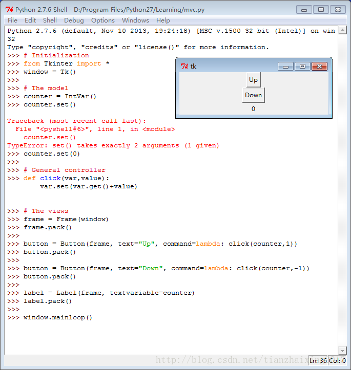

# python GUI --Model, View, Controller

GUI中Tkinter模块应用.  


GUI关键：模型model、视图view和控制器controller


```
    Python 2.7.6 (default, Nov 10 2013, 19:24:18) [MSC v.1500 32 bit (Intel)] on win32
    Type "copyright", "credits" or "license()" for more information.
    >>> # Initialization
    >>> from Tkinter import *
    >>> window = Tk()
    >>>
    >>> # The model
    >>> counter = IntVar()
    >>> counter.set()

    Traceback (most recent call last):
      File "<pyshell#6>", line 1, in <module>
        counter.set()
    TypeError: set() takes exactly 2 arguments (1 given)
    >>> counter.set(0)
    >>>
    >>> # General controller
    >>> def click(var,value):
        var.set(var.get()+value)


    >>> # The views
    >>> frame = Frame(window)
    >>> frame.pack()
    >>>
    >>> button = Button(frame, text="Up", command=lambda: click(counter,1))
    >>> button.pack()
    >>>
    >>> button = Button(frame, text="Down", command=lambda: click(counter,-1))
    >>> button.pack()
    >>>
    >>> label = Label(frame, textvariable=counter)
    >>> label.pack()
    >>>
    >>> window.mainloop()
```


  
  