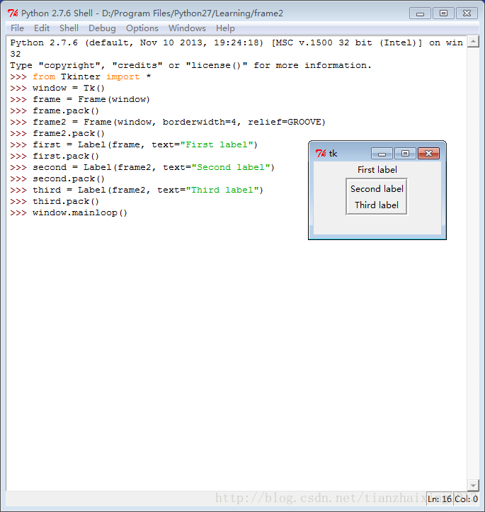
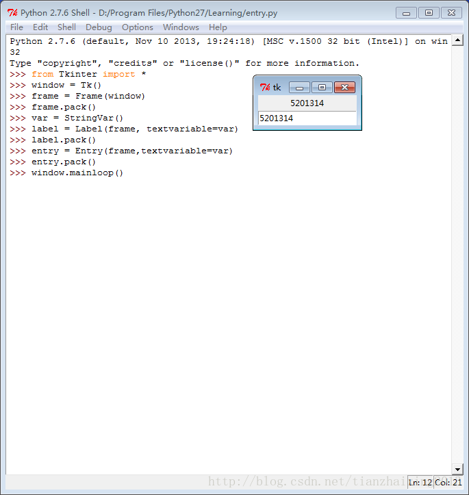

# python GUI Tkinter 模块

利用Python 自带 Tkinter 模块 构建简单的GUI界面

1.0 frame  


```
    Python 2.7.6 (default, Nov 10 2013, 19:24:18) [MSC v.1500 32 bit (Intel)] on win32
    Type "copyright", "credits" or "license()" for more information.
    >>> from Tkinter import *
    >>> window = Tk()
    >>> frame = Frame(window)
    >>> frame.pack()
    >>> frame2 = Frame(window, borderwidth=4, relief=GROOVE)
    >>> frame2.pack()
    >>> first = Label(frame, text="First label")
    >>> first.pack()
    >>> second = Label(frame2, text="Second label")
    >>> second.pack()
    >>> third = Label(frame2, text="Third label")
    >>> third.pack()
    >>> window.mainloop()
```


  




2.0 entry


```
    Python 2.7.6 (default, Nov 10 2013, 19:24:18) [MSC v.1500 32 bit (Intel)] on win32
    Type "copyright", "credits" or "license()" for more information.
    >>> from Tkinter import *
    >>> window = Tk()
    >>> frame = Frame(window)
    >>> frame.pack()
    >>> var = StringVar()
    >>> label = Label(frame, textvariable=var)
    >>> label.pack()
    >>> entry = Entry(frame,textvariable=var)
    >>> entry.pack()
    >>> window.mainloop()
    >>>
```


  
  