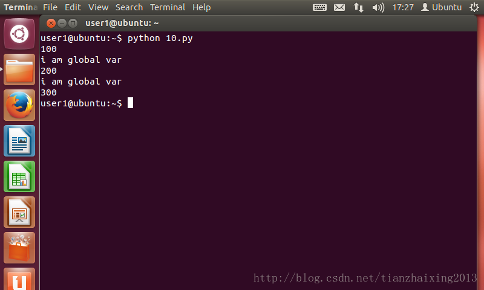

# python函数全局变量和局部变量


```
    #!/usr/bin/python
    #coding:utf8
    x = 'i am global var'#全局变量

    def fun():
        x = 100          #局部变量
        global y         #强制声明全局变量
        y = 200
        print x

    fun()                #局部变量 x=100
    print x              #全局变量 x='i am global var'
    print y              #调用函数时才可以打印200

    def fun1():
        global x
        x=300

    print x              #x='i am global var'
    fun1()
    print x              #x=300
```


  
  


  


  


  


  


  


  


  